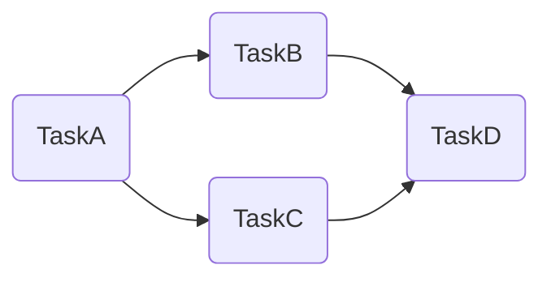
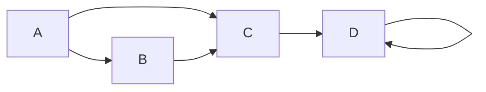
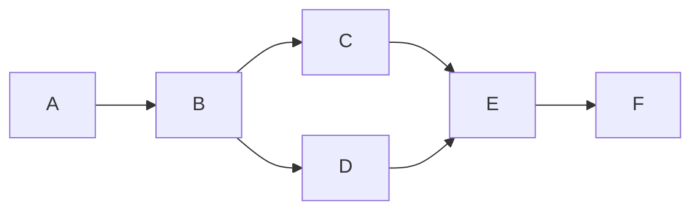

# Airflow (Apache Python Platform for Automation Workflows)

## Introduction

>**Apache Airflow** is an open-source workflow management platform for
>data engineering pipelines.
>It started at Airbnb in October 2014 as a solution to
>manage the company's increasingly complex workflows.
>Creating Airflow allowed Airbnb to programmatically author and
>schedule their workflows and monitor them via
>the built-in Airflow [user interface][-gui].
>From the beginning, the project was made open source,
>becoming an Apache Incubator project in March 2016 and
>a top-level Apache Software Foundation project in January 2019.
>Airflow is written in [Python][-py], and workflows are created via Python scripts.
>Airflow is designed under the principle of *"configuration as code"*.
>While other *"configuration as code"* workflow platforms exist using
>markup languages like [XML][-xml],
>using Python allows developers to import libraries and
>classes to help them create their workflows.
>
>--[(Wikipedia 2023)][wiki-airflow]

***TODO:*** Include the module notes in module 22.

>***TODO***: There should be a data engineering topics index.
>The PCDE course outline is a good place to pull from.
>Create one with some conceptual outlines and
>new documents with core concepts and
>include a lot of the links relevant from the PCDE outline therein.
>Note that this document mentions it and should be linked as such.

## Why Airflow?

Airflow is a batch workflow orchestration platform.
The Airflow framework contains operators to connect with many technologies and
is easily extensible to connect with a new technology.
If you workflows have a clear start and end, and run at regular intervals,
they can be programmed as an Airflow DAG.

If you prefer coding over clicking, Airflow is the tool for you.
Workflows are defined as Python code which means:

* Workflows can be stored in version controls so that
  you can roll back to previous versions.
* Workflows can be developed by multiple people simultaneously.
* Tests can be written to validate functionality.
* Components are extensible and you can build on a wide collection of
  existing components.

Rich scheduling and execution semantics enable you to easily define complex pipelines,
running at regular intervals.
Backfilling allows you to run (*or re-run*) pipelines on
historical data after making changes to the logic.
Also, the ability to rerun partial pipelines after
resolving an error helps maximize efficiency.

The [user interface][-ui] provides both in-depth views of
pipelines and individual tasks,
and an overview of pipelines over time.
From the interface, you can inspect logs and manage tasks,
for example retrying a task in case of failure.

It's [Open-Source Community][-foss] ensures that
components being worked on are developed, tested and deployed by
many other organizations around the world.
It also means there's tons of resources to get started with the platform.

## Why NOT Airflow?

Airflow was designed for finite batch workflows.
While the CLI and REST API allows triggering workflows,
Airflow is not a streaming solution.
However, a streaming system such as [Apache Spark][-spark] or
[Kafka][-kafka] can be used in tandem to add realtime streaming capabilities.
There's even [Operators for both Spark][airflow-docs-spark]
[and Kafka in Airflow][airflow-docs-kafka].

## Basics

### Workflows as Code

The main characteristic of Airflow workflows is that all
workflows are defined in Python code.
*"Workflows as code"* serves several purposes:

* **Dynamic**: Airflow pipelines are configured as python code,
  allowing for dynamic pipeline generation.
* **Extensible**: The Airflow framework contains operators to connect with
  numerous technologies.
  All Airflow components are extensible to easily adjust to your environment.
* **Flexible**: Workflow parameterization is built-in leveraging the
  [Jinja templating engine][-jinja].

### Directed Acyclic Graphs (DAG)

>A **DAG** (**Directed Acyclical Graph**) is the core concept of Airflow,
>collecting *tasks* together, organized with dependencies and
>relationships to say how they should run.
>[(Apache Airflow 2023)][airflow-docs-dags]

Here's a basic example of a DAG, note there is no looping back to any task:



To demonstrate a **DAG** let's examine the below code.

```python
from datetime import datetime

from airflow import DAG
from airflow.decorators import task
from airflow.operators.bash import BashOperator

# A DAG represents a workflow, a collection of tasks
with DAG(dag_id="demo", start_date=datetime(2022, 1, 1), schedule="0 0 * * *") as dag:

    # Tasks are represented as operators
    hello = BashOperator(task_id="hello", bash_command="echo hello")

    @task()
    def airflow():
        print("airflow")

    # Set dependencies between tasks
    hello >> airflow()
```

* A **DAG** named `demo`,
  starting on 2022-01-01 and running once day.
* A **DAG** is airflow's representation of a workflow.
* Two tasks, a `BashOperator` running a Bash script and
  a Python function defined using the `@task` decorator.
* `>>` between the tasks defines dependency and controls in which
  order the tasks will be executed.

## DAGs

### What are DAGs?

**DAGs** or **Directed Acyclic Graphs** are, as the name implies,
a *directed graph*.
Mathematically, *directed graphs* are any graph where
the vertices and edges have an order or direction associated with them.
That is, generally they end up in the same edges.
In the example below, no matter what edge you start in,
the vertices will guide you to one edge, `D`.



There is a variation of the *directed graph*,
the **directed acyclic graph**,
that adds an important property.
That is, there are no *cycles*,
so it doesn't ever loop-back to any previous edge at any point.
The `D` edge in the example above breaks this rule and thus it isn't a **DAG**.
In the example below it is both a *directed* and *acyclic* *graph*.



Note that this example, both always ends up in one edge no matter the start.
It also never loops back to another node.
This opens up some interesting properties as a [data-structure][-ds],
specific to Airflow's task scheduling.

* It allows to define dependencies in tasks.
  * Looping makes it impossible to determine end nodes in dependency graphs.
  * Their directionality allows to define complex networks of dependencies.
* Scheduling
  * If tasks were allowed to be continuous, the scheduling becomes complex.

### Defining DAGs

Python scripts define Airflow DAGs through the use of **Operators**.
Below are the three most commonly used *Operators*.

* `PythonOperator`: Call arbitrary python functions
* `BashOperator`: Execute bash commands and capture results if specified.
* `EmailOperator`: Send emails

These operators are essentially collections of predefined tasks and
logic that needs to be performed in sequences and may have dependencies on
other operators.

>**Note:** To see a list and references of all the default and
>included hooks and operators,
>see the [Operators and Hooks Reference][airflow-docs-ops-ref]

A *task* or *operator* requires dependencies to be defined in relation to
any other task in a *DAG*.
Defining these dependencies is what define the DAG structure,
*i.e.* the edges of the directed acyclic graph.

There are two main ways to declare individual *Task* dependencies.
The preferred approach uses the `>>` and `<<` operators.
For example, with a task `first_task` & `second_task`,
the following code makes the `second_task` dependant on the `first_task`.

```python
first_task >> second_task
```

If you want to define a `fourth_task` and `fifth_task` to occur after
a `third_task` you can use an array literal (`[a, b]`) with the `>>` or `<<` operator.

```python
third_task >> [fourth_task, fifth_task]
```

### Example DAG

#### Example DAG: Import Libraries

This DAG will use a Python function to print a string to screen.
First, import the necessary libraries.

```python
from datetime import timedelta, datetime
from airflow import DAG
from airflow.operators.python_operator import PythonOperator
from airflow.utils.dates import days_ago
```

#### Example DAG: DAG Arguments

DAGs require arguments to specify metadata about how it will be run,
who wrote it, dependencies, etc.
This is done with a dictionary that watches expected configuration keys.
Here are a few.

* `owner`
  * This argument is the name of the workflow.
  * It should be alphanumeric and underscores only.
* `depends_on_past`
  * This argument is a boolean that defines whether or not
    the DAG depends on the previous DAG to complete.
* `start_date`
  * This argument is the date and time to start the DAG.
  * It can be a `datetime`
* `email`
  * An email address where an admin or developer can receive an email whenever
    the task fails for any reason.
* `interval`
  * This argument is a `timedelta` that defines the interval at which
    the DAG should be run.
  * It can be a `timedelta` or a [cron][-cron] expression.

```python
default_args = {
  'owner': 'me'
  'depends_on_past': False,
  'start_date': days_ago(2),
  'email': 'me@example.com',
  'email_on_failure': False,
  'email_on_retry': False,
  'retries': 1,
  'interval': '0 12 * * *',
}
```

### Example DAG: First Python Operator

Next, define a Python function that will print a string using an argument.
This function will later be used by the `PythonOperator`.

```python
def my_function(x):
    return x + ' is a must have tool for Data Engineers.'
```

### Example DAG: Define the DAG

Now a `DAG` object needs to be constructed.
You pass the arguments defined previously in the `default_args` variable,
or directly as a dictionary literal.

```python
with DAG(default_args) as dag:
    python_task = PythonOperator(task_id='my_function', python_callable=my_function)
```

### Example DAG: Trigger the DAG

With a python file holding this code in
the `dags` directory,
it should now show up in the `DAGs` tab of the UI.
First it needs to be enabled using the toggle next to the DAG in the list.
Without trigger the DAG, the interval should start the DAG at noon every day.
To trigger it manually, use the (`...`, or three dots menu) of the DAG to
select the `Manually Trigger` action.

With it running, the logs section of the DAG should show a log with the
expected `Airflow is a must have tool for Data Engineers`.

## Deploy in Containers

One of the easiest ways to deploy Airflow for
developing, testing and even production is via a [container][-cont].
In this example [Docker][-docker] is used with
a [Docker-Compose File][-cont-compose].

### Create a Workspace Directory

First create a workspace for the container's *DAGs*, logs, and configurations to
be persisted.

```sh
mkdir airflow-container
```

### Download the Official Docker Compose File

Fortunately Apache maintains an excellent and well documented and
commented `docker-compose` file in their [docker repository][airflow-gh-docker].
This can be done easily through the command line with
a utility like [cURL][-curl] or taking the URL below and potentially editing the
version portion of it.

```sh
curl \
'https://airflow.apache.org/docs/apache-airflow/2.1.1/docker-compose.yaml' \
-o docker-compose.yaml
```

### Edit the Compose File

>**TODO:** When the bin service is ready,
>get a copy of a recent airflow docker compose file, put it there, and
>link to it here.

There are a lot of configurations that have been broken out into variables and
the `airflow-common` section that simplifies configuring the containers.
Here are some notable configurations to consider away from the defaults.

* `AIRFLOW__CORE__LOAD_EXAMPLES`: `false`
  * This disables the example DAGs provided to help learn the platform.
  * These can take up a lot of space and a lot of time to initialize.
* `AIRFLOW__CORE__EXECUTOR`: `LocalExecutor`
  * This is the default executor, but it's worth noting that
    the `CeleryExecutor` is also available.
  * The `LocalExecutor` is a good place to start.
* `AIRFLOW__CORE__SQL_ALCHEMY_CONN`: `sqlite:////usr/local/airflow/airflow.db`
  * This is the default database, but it's worth noting that
    other databases are available.
  * The `sqlite` database is a good place to start.
* `AIRFLOW__CORE__FERNET_KEY`: ``
  * This is the encryption key used to encrypt passwords and
    connections in the database.

### Docker Compose Up

Then use `docker-compose up` to bring the containers up,
from within the workspace directory.
The `-d` or `--detach` flag can be used to run the containers in
the background in a *detached* state.

```sh
# This should be done from within the airflow container workspace directory
docker-compose up -d
```

### Inspect the Workspace Directory

Give the containers some time to initialize.
If they haven't been given enough resources it can sometimes take over 5 minutes to
initialize containers.
Once the containers are initialized there should be three new directories in
the airflow container workspace directory where
the docker-compose file was downloaded.
There should be a `dags`, `logs`, and `plugins` directory.
An `ls` command should look something like this:

```sh
ls
# output: dags/ logs/ plugins/ docker-compose.yml
```

* `dags/`
  * This is where the DAGs are stored.
  * If you want to add DAGs to the container,
    this is the directory to put them in.
* `logs/`
  * This is where the logs are stored.
* `plugins/`
  * This is where plugins are stored.
  * If you want to add plugins to the container,
    this is the directory to put them in.

### Login to Airflow Web Server

Once it's all up and running the default username and password can be given as
`airflow` for both fields.
The first view that should be visible is the `DAGs` overview where
all the currently available DAGs should be visible.
From here it's possible to toggle whether a DAG is active.

## References

### Web Links

* [Wikipedia.org. "Apache Airflow". Accessed 2023-06-26][wiki-airflow]
* [Apache Foundation. airflow.apache.org/docs. 2023. "DAGs"][airflow-docs-dags]
* [Apache Foundation. airflow.apache.org/docs. 2023. "Running Airflow in Docker"][airflow-gh-docker]
* [Apache Foundation. airflow.apache.org/docs. 2023. "Apache Spark Operators][airflow-docs-spark]
* [Apache Foundation. airflow.apache.org/docs. 2023. "Apache Kafka Operators][airflow-docs-kafka]
* [Apache Foundation. airflow.apache.org/docs. 2023. "Operators and Hooks References"][airflow-docs-ops-ref]

<!-- Hidden References -->
[wiki-airflow]: https://en.wikipedia.org/wiki/Apache_Airflow "Wikipedia.org. Apache Airflow"
[airflow-docs-dags]: https://airflow.apache.org/docs/apache-airflow/stable/core-concepts/dags.html "Airflow/docs. DAGs"
[airflow-gh-docker]: https://airflow.apache.org/docs/apache-airflow/stable/howto/docker-compose/index.html "Airflow Docs: Running Airflow in Docker"
[airflow-docs-spark]: https://airflow.apache.org/docs/apache-airflow-providers-apache-spark/stable/operators.html "Airflow Docs: Apache Spark Operators"
[airflow-docs-kafka]: https://airflow.apache.org/docs/apache-airflow-providers-apache-kafka/stable/operators/index.html "Airflow Docs: Apache Kafka Operators"
[airflow-docs-ops-ref]: https://airflow.apache.org/docs/apache-airflow/stable/operators-and-hooks-ref.html "Airflow Docs: Operators and Hooks Reference"

### Note Links

* [Graphical User Interface (GUI)][-gui]
* [Python][-py]
* [eXtensible Markup Language (XML)][-xml]
* [Jinja Templating Engine][-jinja]
* [Container (Software Runtime)][-cont]
* [Docker (Container Runtime)][-docker]
* [Container Compose File Format][-cont-compose]
* [cURL (C-URL HTTP/REST client)][-curl]
* [User Interface (UI)][-ui]
* [Free Open Source Software (FOSS)][-foss]
* [Spark (Apache Big Data Platform)][-spark]
* [Kafka (Apache Streaming Event Platform)][-kafka]
* [Data Structure][-ds]
* [Cron (UNIX Task Scheduler)][-cron]

<!-- Hidden References -->
[-gui]: gui.md "Graphical User Interface (GUI)"
[-py]: python.md "Python"
[-xml]: xml.md "eXtensible Markup Language (XML)"
[-jinja]: jinja.md "Jinja Templating Engine"
[-cont]: container.md "Container (Software Runtime)"
[-docker]: docker.md "Docker (Container Runtime)"
[-cont-compose]: container-compose.md "Container Compose File Format"
[-curl]: curl.md "cURL (C-URL HTTP/REST client)"
[-ui]: ui.md "User Interface (UI)"
[-foss]: foss.md "Free Open Source Software (FOSS)"
[-spark]: spark.md "Spark (Apache Streaming Data Platform)"
[-kafka]: kafka.md "Kafka (Apache Streaming Event Platform)"
[-ds]: data-structure.md "Data Structure"
[-cron]: cron.md "Cron (UNIX Task Scheduler)"
