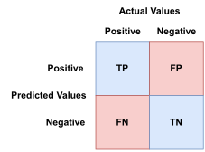

# Bayes Theorem

## Introduction

Used to calculate conditional [probabilities][-prob],
**Bayes Theorem** is a fundamental concept in probability theory.
This includes machine learning.
Bayes theorem is used to calculate the probability of an event
occurring given that a related event has already occurred.
This is called *conditional probability*, and given two events $A$ & $B$,
it can be expressed by using the notation $P(A|B)$.
The theory is useful when a series of events exists with
outcomes that partially depend on the occurrence of another event.
In $P(A|B)$, $A$ is the event of interest and $B$ is the event that has occurred.

Imagine that you have three bags that are filled with different coins.
You randomly select a coin out of a random bag, and it's a quarter.
What is the probability that the coin came from the first bag?
If you can determine the probability of choosing a quarter,
then you can calculate the probability the coin you picked came from the first bag.

When used properly,
Bayes theorem is effectively a [machine learning][-ml] [algorithm][-algo].
It can be used to calculate the probability of an event occurring given
that another event has already occurred.
And *priori* features in data can be used to create a model that
predicts the *posteriori* probability of an event occurring.

## Formal Definition of Bayes Theorem

$P(A|B) = \frac{P(B|A)P(A)}{P(B)}$

* $P(A|B)$ is the conditional probability of event $A$ occurring given that
event $B$ has already occurred.
  * $P(A|B)$ is also called the *posterior probability*.
* $P(B|A)$ is the *conditional probability* of event $B$ occurring given that
event $A$ has already occurred.
  * $P(B|A)$ is also called the *likelihood*.
    * As in the *likelihood* of event $B$ occurring given that
    event $A$ has already occurred.
* $P(A)$ is the *prior probability* of event $A$ occurring.
  * $P(A)$ is also called the *marginal probability*.
  * The *prior probability* is the probability of
  event $A$ occurring without any additional information,
  * Essentially it is based on *prior* knowledge of the event.

## Proof of Bayes Theorem

### Proof Step 1

Begin by defining the probability of two events, $A$ & $B$,
happening simultaneously.
This is represented by $P(A \cap B)$.
The $\cap$ symbol is used to denote the intersection of two events,
or when the two events occur simultaneously.
$P(A \cap B)$ can be derived by multiplying the probability of $A$ by
the probability that event $B$ will happen,
given that event $A$ has occurred or $P(A) * P(B|A)$.

To demonstrate proof of this theory,
consider the following example.
Suppose that you want to compute the probability of finishing an ice cream cone.
This can be calculated by computing the probability that
the store has ice cream in stock multiplied by the probability that
you can eat the entire ice cream cone given that the ice cream is in stock.
In this example, define $P(A)$ as the probability that
the store has ice cream in stock.
$P(A|B)$ will be the probability that
you eat the entire ice cream cone,
given that the ice cream was in stock.

Therefore,
the probability that you can finish the ice cream and
that the ice cream is in stock can be computed by using the following formula:

$$P(A \cap B) = P(A) * P(B|A)$$

### Proof Step 2

Similarly to what you learned in Step 1,
the probability of events $A$ and $B$ happening simultaneously is also
equal to the probability of $B$ multiplied by the probability of $A$,
given $B$ has occurred or $P(B) * P(A|B)$.
This is illustrated in the following equation:

$$P(A \cap B) = P(B) * P(A|B)$$

### ProofStep 3

Because the left hand sides of Steps 1 & 2 are exactly the same,
you can also set the right hand sides equal to each other:

$$P(B) * P(A|B) = P(A) * P(B|A)$$

### Proof Step 4

Dividing both sides by $P(B)$ yields the following equation:

$$P(A|B) = \frac{P(A) * P(B|A)}{P(B)}$$

### Proof Conclusion

Therefore you have proven Bayes Theorem of conditional probability.
This means that given the probability of two events occurring,
you can calculate the probability of
one event occurring given that another event has already occured.

## Extension of Bayes Theorem

### Explanation of Bayes Extension

In many implementations,
you may see Bayes Theorem written a bit differently because
there are more than just two events occurring.
Next,
you will work to adjust your Bayes equation to
account for multiple events by reformatting the theory.
You will be seeking the probability of some event, $E_i$,
given the probability of another event, $A$.
This will be written as $P(E_i|A)$.
If you plug this into the original Bayes equation,
the result is:

$$P(E_i|A) = \frac{P(E_i) * P(A|E_i)}{P(A)}$$

However,
often you will not know the denominator in this equation,
which is the probability of $A$.
In the next steps,
you will work to identify a common substitute for $P(A)$.

Let $E_i$ to represent a partition of the sample space $S$,
and let $S$ represent the set of all possible outcomes.
Let $A$ represent some event that has occured.
Because $S$ holds all possible outcomes,
$A$ must belong to the set $S$ that is derived from the first step.
See the example below ot illustrate this theory:

### Proof of Bayes Extension

#### Step 1 of Bayes Extension Proof

$A = A \cap S$

#### Step 2 of Bayes Extension Proof

For this example, $S$ represents the set all events $E_i$, thus

$$S = E_1 \cup E_2 \cup E_3 \cup ... \cup E_n$$

$$A = A \cup {E_1, E_2, E_3, ... E_n}$$

#### Step 3 of Bayes Extension Proof

Then use the property of distribution to distribute the intersection,
as shown below:

$$A = (A \cup E_1) \cap (A \cup E_2) \cap (A \cup E_3) \cap ...
(A \cup E_n)$$

#### Step 4 of Bayes Extension Proof

Take the probability of both sides,
as show by the equation below:

$$P(A) = P((A \cup E_1) \cap (A \cup E_2) \cap (A \cup E_3) \cap ...
(A \cup E_n))$$

#### Step 5 of Bayes Extension Proof

Because $A$ and $E_i$ are disjoint sets,
you know that $P(A \cup B) = P(A) + P(B)$, thus.

$$P(A) = P(A \cap E_1) + P(A \cap E_2) + P(A \cap E_3) + ... P(A \cap E_n)$$

#### Step 6 of Bayes Extension Proof

According to the multiplication of independent events theorem,

$$P(A) = P(E) * [P(\frac{A}{E_1}) + P(\frac{A}{E_2}) + P(\frac{A}{E_3}) + ...
P(\frac{A}{E_n})]$$

#### Step 7 of Bayes Extension Proof

Thus you can use the summation to get this:

$$P(A) = P(E) * \sum_{k}^{n} P(E_i) * P(A | E_i)$$

#### Step 8 of Bayes Extension Proof

While this appears differently, you can now derive Bayes to be:

$$P(E_i|A) = \frac{P(E_i)P(A|E_i)}{\sum_{k}^{n} P(E_i) * P(A|E_i)}$$

## Example of Bayes in Action

You have two bags full of poker chips.
Bag one has seven red and two blue chips while
bag two has five red and nine blue chips.
You draw a chip at random and it turns out to be red.
Compute the probability that the chip was drawn from bag one.

First, define your known probabilities.

* Let $X$ represent the event that the chip was chosen from bag one.
* Let $Y$ represent the event that the chip was chosen from bag two.
* Let $A$ represent the event that the chip is red.
* $P(X) = P(Y) = \frac{1}{2}$
* There are seven red chips out of total nine in bag one, thus...
  * $P(drawing a red chip from bag one) = P(A | X) = \frac{7}{9}$
* $P(drawing a red chip from bag two) = P(A | Y) = \frac{5}{14}$

The goal of this problem is to find the probability that
the chip came from bag one,
given that it is red.
Thus, you must find $(X|A)$ using Bayes theorem.
See the example below to work through this problem.

### Example - Part One

 $$P(X|A) = \frac{P(A|X) * P(X)}{P(P(X)P(A|X)+P(Y)P(A|Y))}$$

### Example - Part Two

$$P(X|A) = \frac{\frac{7}{9} * \frac{1}{2}}{\frac{1}{2} * \frac{7}{9} +
\frac{1}{2} * \frac{5}{14}}$$

### Example - Part Three

$$P(X|A) = \frac{\frac{7}{18}}{\frac{7}{18} + \frac{5}{28}}$$

### Example - Part Four

$$\frac{98}{143} = 0.685 = 68.5\%$$

You have now determined that after drawing a red chip,
the probability that it was drawn from the first bag is 68.5%.
This example illustrates how to apply Bayes theorem to
a real world problem.

## Naive Bayes Theorem

Based on *Bayes Theorem*,
the **Naive Bayes Theorem** or **(NBT)** is a classification algorithm that
is primarily used on large datasets.
*NBT* uses the same algorithm as *Bayes Theorem* to
attempt to classify a feature in a given dataset.
*NBT* can often replace more sophisticated classification algorithms because
it is easier to implement while still providing a high accuracy rate.

*NBT* is considered *naive* because it assumes the presence of
a particular feature in a class is unrelated to the presence of
other features.
An example of an algorithm would be a classification of a tomato:
it is round, it has a diameter of less than 8cm, and it is red.
In this example, all three characteristics may be related,
but NBT does not assume this when calculating probabilities.
Considering these assumptions, *NBT* is more accurate than you may suppose.
*NBT* may not be quite as accurate as some more complex classification tools,
but its easy implementation and
relatively low computing costs are advantages which
make *NBT* a viable tool for many applications.

## Formal Definition of Naive Bayes Theorem

The formula for Naive Bayes Theorem is:

$$P(c|x) = \frac{P(x|c)P(c)}{P(x)}$$

Where:

* $P(c|x)$ is the **posterior** probability of the class ($c$, target),
given the probability of a predictor ($x$, attribute).
* $P(c)$ is the **prior** probability of the class.
* $P(x|c)$, also called the **likelihood**.
  * It's the probability of the predictor given the probability of the class.
* $P(x)$ is the **prior** probability of the *predictor*.

## Example of Naive Bayes Theorem

The following example includes two weeks' worth of data for
weather conditions and a football team's schedule.
The goal is to determine the *likelihood* that
the football team will play given that it is sunny outside.
In the dataset, the $3^{rd}$ column, "Played",
represents whether or not the team played on a given day.
See the dataset below:

### Example - Frequency of Play Dataset

| Day       | Condition | Played |
| --------- | --------- | ------ |
| Monday    | Sunny     | No     |
| Tuesday   | Rainy     | Yes    |
| Wednesday | Sunny     | Yes    |
| Thursday  | Cloudy    | Yes    |
| Friday    | Sunny     | No     |
| Saturday  | Rainy     | No     |
| Sunday    | Rainy     | Yes    |
| Monday    | Sunny     | Yes    |
| Tuesday   | Rainy     | No     |
| Wednesday | Cloudy    | No     |
| Thursday  | Sunny     | Yes    |
| Friday    | Sunny     | Yes    |
| Saturday  | Rainy     | Yes    |
| Sunday    | Cloudy    | Yes    |

### Solution to Naive Bayes Theorem Example

The first step to solving this problem is to convert this dataset into
a frequency table.
When implementing *NBT* in practice,
this is usually the most computationally expensive step,
because real-world datasets are much larger than this simple example.
See the associated Frequency Table below:

| Weather   | Yes | No  | Total Days |
| --------- | --- | --- | ---------- |
| Sunny     | 4   | 2   | 6          |
| Rainy     | 3   | 2   | 5          |
| Cloudy    | 2   | 1   | 3          |
| **Total** | *9* | *5* | ***14***   |

Given the data in the frequency table above,
you can now compute the probability that
the football team will play if the weather is sunny,
represented by $P(play|sunny)$, by writing the following equation:

$$P(play|sunny) = \frac{P(sunny|play)P(play)}{P(sunny)}$$

Now it just becomes a matter of populating the *likelihood* probability,
the *prior* probability of the *class*,
and the *prior* probability of the *predictor*.

The term $P(sunny|play)$ can be computed by dividing the number of
sunny days that a match was played, or the *likelihood* of event,
by the total number of matches played.

$$P(sunny|play) = \frac{\# of sunny matches}{\# of matches} = \frac{4}{9}$$

The probability $P(play)$ is given by
dividing the total number of sunny days,
or the *class prior* event count,
by the total number of days in the dataset.
The *class prior probability* is the result.

$$P(play) = \frac{\# of sunny days}{\# of total days} = \frac{9}{14}$$

*Finally*, the probability $P(sunny)$ is given by
dividing the total number of of sunny days,
or the *predictor prior* event count,
by the total number of days in the dataset.
The result is the *predictor prior probability*.

$$P(sunny) = \frac{\# of sunny days}{\# of total days} = \frac{6}{14}$$

Now we plug the numbers into the equation and then solve the problem:

$$P(play|sunny) = \frac{P(sunny|play)P(play)}{P(sunny)} =
\frac{\frac{4}{9} * \frac{9}{14}}{\frac{6}{14}} = \frac{2}{3} $$

As illustrated in this example,
there's about a 67% chance that the football team will
play given the weather is sunny.
This may seem like a simple solution to a relatively easy question.
However, in real-world practice,
these initial datasets will be much more complex,
often with terabytes of data.
By performing classification and
considering conditional probability,
you can gain insights that are often difficult to achieve with large datasets.

## Naive Bayes Theorem and Multiple Predictors

The example above is a simple example of *NBT*.
You often want more *predictors* or *features* to
make more sophisticated predictions.
One example of this is a spam filter.
A message can be legitimate or spam predicted on labels $L$ based on
many words or features $f_1, f_2, ..., f_n$.

$$P(L|features) = \frac{P(features|L)P(L)}{P(features)}$$

Where:

* $P(L|features)$ is the probability of a label given the features.
  * In this case whether a message is spam or legitimate.
  * And whether that label is likely given the features or words in the message.
* $P(features|L)$ is the probability of the features given the label.
  * In this case, the probability of the words in the message given the label.
  * This is where we'd count occurrences of words in messages of that label.
* $P(L)$ is the probability of the label.
  * This is where we'd count the number of spam and legitimate messages.
* $P(features)$ is the probability of the features.
  * This is where we'd consider the probability of
  these words occurring in any message.
  * This is more nuanced
    * We might need to decide whether a message is spam or legitimate

$$\frac{P(L_1)|features}{P(L_2)|features} =
\frac{P(features|L_1)P(L_1)}{P(features|L_2)P(L_2)}$$

This arises from the fact that $P(features)$ is the same for both labels.
So we end up with this simplified equation involving both labels.

## Multiple Predictors Example - Spam Filter

So let's examine the driving equation for multiple predictors.

$$\frac{P(N)|features}{P(S)|features} =
\frac{P(features|N)P(N)}{P(features|S)P(S)}$$

Where:

* $P(N|features)$ is the probability of a message being legitimate given the features.
* $P(S|features)$ is the probability of a message being spam given the features.
* $P(features|N)$ is the probability of the features given the message is legitimate.
* $P(features|S)$ is the probability of the features given the message is spam.
* $P(N)$ is the probability of a message being legitimate.
* $P(S)$ is the probability of a message being spam.

Below are some examples that show real-world applications of *NBT*.

Suppose that you are working with a total of 50 emails.
Suppose further that 30 of those emails are classified as *normal* or $N$,
Then the remaining 20 emails are classified as *spam* or $S$.

In this scenario, the *prior probability* of a message being *normal* is:

$$P(N) = \frac{30}{50} = 0.6$$

Based on this information,
it can be assumed that the *prior probability* of a message being *spam* is:

$$P(S) = \frac{20}{50} = 0.4$$

The 30 *normal* messages have been classified as normal due to
the presence of some words, such as "dear" and "money",
that are common in normal messages.
From the data,
you can observe that the word "dear" appears 30 times and the word "money" appears 5 times.
Given this data, you can compute the probability that
an email contains a common "normal" word, such as "dear" or "money",
given that the email is *normal*.

$$P("dear" | N) = \frac{30}{30} = 1$$
$$P("money" | N) = \frac{5}{30} = \frac{1}{6}$$

On the other hand, the 20 *spam* messages have been classified as spam due to
the presence of words such as "password" and "money".
From the data, you can see that
the word "password" appears 10 times and the word "money" appears 20 times.
Given this data, you can compute the probability that
a message contains a common "spam" word, such as "password" or "money",
given that the message is *spam*.

$$P("password" | S) = \frac{10}{20} = \frac{1}{2}$$
$$P("money" | S) = \frac{20}{20} = 1$$

Now suppose that you receive an additional email with the word "money" in it,
and you want to calculate the probability that
the new email is *normal*.

By applying the *NBT* formula, you get:

$$\frac{P(N|"money")}{P(S|"money")} =
\frac{P("money"|N)P(N)}{P("money"|S)P(S)} =
\frac{\frac{1}{6} * 0.6}{1 * 0.4} = \frac{3}{10} = 0.3$$

Therefore, given your initial data,
you can conclude that there is a 30% chance that
a message containing the word "money" is *normal*.

### Multiple Predictors

So far we've only discussed some theory of multiple predictors and
an example using the same form but only one word.
Let's see what happens when we have multiple words, or *predictors*.

$$
\frac{P(N|f_1,f_2)}{P(S|f_1,f_2)} =
\frac{P(f_1,f_2|N)P(N)}{P(f_1,f_2|S)P(S)} =
\frac{P(f_1|N)P(f_2|N)}{P(f_1|S)P(f_2|S)} \frac{P(N)}{P(S)}
$$

The possibly millions of words being accounted for $f_i$,
are drawn from an **independent identically distributed** (**IID**) distribution.
So if they are independent then we can just multiply the probabilities together.

>**Note:** Naive Bayes assumes that all the features are independent of each other.
>This means we can just multiply the features together.

Because we assume all the features are independent,
we can rewrite the equation as:

$$
\frac{P(N|f_1,f_2, \dots, f_n)}{P(S|f_1,f_2, \dots, f_n)} =
\frac{\prod_i{P(f_i|N)P(N)}}{\prod_i{P(f_i|S)P(S)}}
$$

Because we're multiplying a lot of normalized probabilities,
*(i.e. probabilities that are between 0 and 1)*,
there can be an *underflow* problem.
That is the product of all these probabilities can be so small that
the computer can't represent it or
that it's so small that it's not useful.
We fix this by taking the *log* of the probabilities.

$$
\log_e(a \cdot b) = \log_e(a) + \log_e(b)
$$
$$\therefore$$
$$
P(N|f_1, f_2, \dots, f_n) =
\sum_i{\log_e(P(f_i|N))} + \log_e(P(N))
$$

## Confusion Matrix

### What is a Confusion Matrix?

A [confusion matrix][-confusion] is a graphical representation that
is used to summarize the performance of a classification algorithm.
In fact,
only looking at the accuracy score of an algorithm might be misleading if
there are an unequal number of observations or more than two classes in the dataset.

For this reason,
using a confusion matrix can give a better idea of
how a classification model is performing.

A confusion matrix is visually represented as a table with two rows and columns that
contains the combinations of predicted and actual values possible.
Below is a diagram of a confusion matrix.

In the confusion matrix above, `TP` stands for *true positive*,
`TN` stands for *true negative*,
`FP` stands for *false positive*, and
`FN` stands for *false negative*.

Using the spam message example from earlier,

* `TP` is the number of messages that were correctly classified as spam.
* `TN` or *true negative* is the messages correctly classified as normal.
* `FP` or *false positive* is the messages incorrectly classified as spam.
  * As in it was a legitimate message, but was identified as spam.
* `FN` or *false negative* is the messages incorrectly classified as normal.
  * As in it was a spam message, but was identified as legitimate.

## Gaussian Naive Bayes

### What is a Gaussian Distribution?

This has been covered in the [Gaussian Distribution][-gauss-dist] document,
for more details read it.
**Gaussian distribution**,
also known as a **normal distribution**,
is a useful way to calculate probability.
In order to apply a normal distribution to *Bayes Theorem*,
you must calculate the *Gaussian distribution* for each feature in each class.
This can be done easily once the *class* feature's mean and variance are calculated.
The height, weight, and foot size dataset below
will be used to demonstrate mean and variance calculations.

### Gaussian Naive Bayes Example Data

| Sex    | Height | Weight | Foot Size |
| ------ | ------ | ------ | --------- |
| Male   | 6      | 180    | 12        |
| Male   | 5.92   | 190    | 11        |
| Male   | 5.58   | 170    | 12        |
| Male   | 5.91   | 165    | 10        |
| Female | 5.0    | 100    | 6         |
| Female | 5.5    | 150    | 8         |
| Female | 5.42   | 130    | 7         |
| Female | 5.75   | 150    | 9         |

### Gaussian Naive Bayes Example Data Mean and Variance

#### Gaussian Naive Bayes Example Data Mean

Given a dataset with $n$ entries $x_i$ for $i = 1, 2, \dots, n$,
the mean $\mu$ can be calculated by taking the sum of all the entries and
dividing by the number of entries.

$$
\mu = \frac{\sum_{i=1}^{n}{x_i}}{n}
$$

The table below shows the means for each feature:

| Sex    | $\mu_h$ | $\mu_w$ | $\mu_{fs}$ |
| ------ | ------- | ------- | ---------- |
| Male   | 5.85    | 176.25  | 11.25      |
| Female | 5.42    | 132.50  | 7.5        |

#### Gaussian Naive Bayes Example Data Variance

Given a dataset with $n$ entries $x_i$ for $i = 1, 2, \dots, n$,
and the mean $\mu$,
the variance $\sigma$ can be calculated like so:

$$
\sigma = \frac{\sum_{i=1}^{n}(x_i - \mu)^2}{n - 1}
$$

>**Note:** The denominator is $n - 1$ instead of $n$ because
>the mean is calculated from the dataset and
>the variance is calculated from the mean.
>This is a statistical adjustment called [Bessel's correction][wiki-bessel].

To demonstrate,
we'll calculate the variance of weight in males:

$$
\sigma_w = \frac{\sum_{i=1}^{n}(x_{w_i} - \mu_w)^2}{n - 1}
= \frac{(180 - 176.25)^2 + (190 - 176.25)^2 + (170 - 176.25)^2 + (165 - 176.25)^2}{4 - 1}
= 122.92
$$

The table below shows the variances for each feature:

| Sex    | $\sigma_h$ | $\sigma_w$ | $\sigma_{fs}$ |
| ------ | ---------- | ---------- | ------------- |
| Male   | 0.035      | 122.92     | 0.917         |
| Female | 0.097      | 558.33     | 1.667         |

### Creating the Gaussian Normal Distribution

Using the previous section's example and calculations for mean and variance,
we can now create the Gaussian normal distribution for each feature.
This can be done in many ways.
For example,
in [Python][-py] we can use `scikit-learn`'s `GaussianNB` class.
To better illustrate the underlying mathematics,
for now you will use a web based [interactive normal distribution tool][normal-dist-applet]

Plugging in the normal distribution values for each characteristic's mean and variance,
you will see the expected curves.
Next you can plug in some values for each characteristic and
see how much of the curve is covered by the values.

#### Case Study of Gaussian Naive Bayes

Let's take the height of `5.8`, weight of `185`, foot size of `11` and
calculate the **Gaussian Naive Bayes** for the odds of that person being `male`.

When do the math on those normal distributions by any means,
the answer for the probability of each feature for a male is:

* $P(h=5.8) = 0.077$
* $P(w=185) = 0.47$
* $P(fs=11) = 0.39$

To find the probability that this particular person is male,
use the following equation.

$$
P(male) = 0.5 \cdot (\log(0.077) + \log(0.47) \cdot \log(0.39)) = -1.51
$$

A key step in the above equation is to multiply by 0.50 because
there's an initial 50% probability that a person is male.

Then,
do the same for all data representing female height, weight and foot size.

* $P(h=5.8) = 0.00004$
* $P(w=185) = 0.46$
* $P(w=11) = 0.01787$

Because $P(male)$ is greater than $P(female)$,
you can now classify the person who fits the sample data values as
being likely to represent a male.

Gaussian Naive Bayes theorem is currently used in countless applications.

### Further Reading on Naive Bayes Theorem

* Learning how to manage probability distributions in machine learning
  * [Gentle Introduction to Maximum a Posteriori (MAP) for Machine Learning][mlmastery-map19]

## Smoothing

### Laplace Smoothing

TODO: write some notes here on laplace smoothing

### Further Reading on Laplace Smoothing

* [Kandala. 2023. From Zero to Hero: Laplace Smoothing for Naive Bayes Classifiers][kandala-smooth-nb]

## Implementation

### Python Implementation

One way to quickly and easily implement Naive Bayes in Python is to
use the [SciKit-Learn][-sklearn] library.
It's great for analysis and prototyping and
might even be sophisticated and generalized enough for
some more basic production applications.

## References

### Web Links

* [Wikipedia. 'Bayes Theorem'][wiki-bayes]
* [Brilliant.org. 'Bayes Theorem & Conditional Probability'][brilliant-bayes]
* [MachineLearningMastery.com 'Gentle Introduction to Maximum a Posteriori (MAP) for Machine Learning'][mlmastery-map19]
* [Wikipedia. 'Bessel Correction'. From 2023-06-05][wiki-bessel]
* [Normal Distribution Interactive Tool][normal-dist-applet]
* [Gamal. Bassant. 2023-12-17. Medium. 'Naive Bayes Algorithm'][gamal-naive-bayes]
* [Kandala. Anupama. Medium. 'From Zero to Hero: Laplace Smoothing for Naive Bayes Classifiers' 2023][kandala-smooth-nb]

<!-- Hidden References -->
[wiki-bayes]: https://en.wikipedia.org/wiki/Bayes%27_theorem "Wikipedia. 'Bayes Theorem'"
[brilliant-bayes]: https://brilliant.org/wiki/bayes-theorem/ "Brilliant.org. 'Bayes Theorem & Conditional Probability'"
[mlmastery-map19]: https://machinelearningmastery.com/maximum-a-posteriori-estimation/ "MachineLearningMastery.com 'Gentle Introduction to Maximum a Posteriori (MAP) for Machine Learning'"
[wiki-bessel]: https://en.wikipedia.org/wiki/Bessel%27s_correction "Wikipedia. 'Bessel Correction'. From 2023-06-05"
[normal-dist-applet]: https://homepage.divms.uiowa.edu/~mbognar/applets/normal.html "Normal Distribution Interactive Tool"
[gamal-naive-bayes]: https://medium.com/analytics-vidhya/naïve-bayes-algorithm-5bf31e9032a2 "Gamal. Bassant. 2023-12-17. Medium. 'Naive Bayes Algorithm'"
[kandala-smooth-nb]: https://anupamakandala1111.medium.com/from-zero-to-hero-laplace-additive-smoothing-for-naive-bayes-classifier-40828d35c6a7 "Kandala. Anupama. Medium. 'From Zero to Hero: Laplace Smoothing for Naive Bayes Classifiers'"

### Note Links

* [Probability Theory][-prob]
* [Machine Learning][-ml]
* [Algorithm][-algo]
* [Confusion Matrix][-confusion]
* [Gaussian Distribution][-gauss-dist]
* [Python][-py]
* [SciKit-Learn][-sklearn]

<!-- Hidden References -->
[-prob]: probability.md "Probability Theory"
[-algo]: algorithm.md "Algorithm"
[-ml]: machine-learning.md "Machine Learning"
[-confusion]: confusion-matrix.md "Confusion Matrix"
[-gauss-dist]: normal-distribution.md "Gaussian Distribution"
[-py]: python.md "Python"
[-sklearn]: scikit-learn.md "SciKit-Learn"
