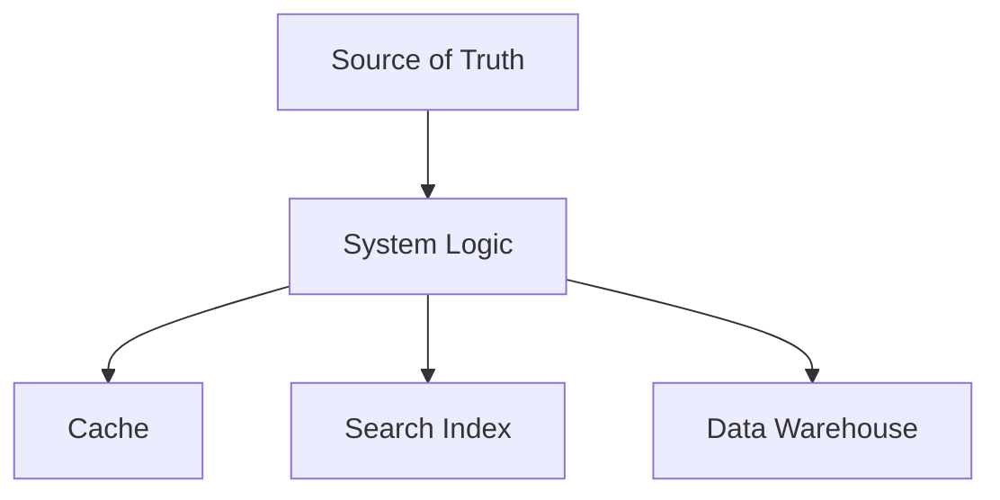
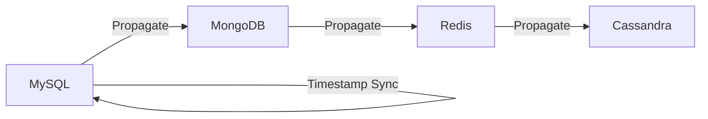
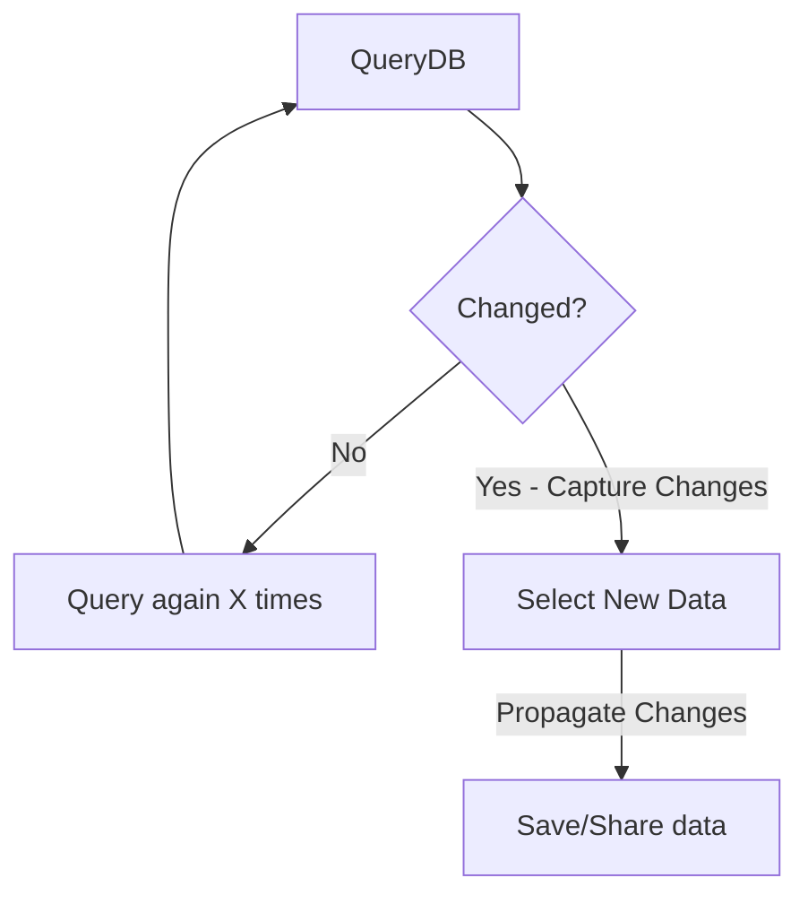
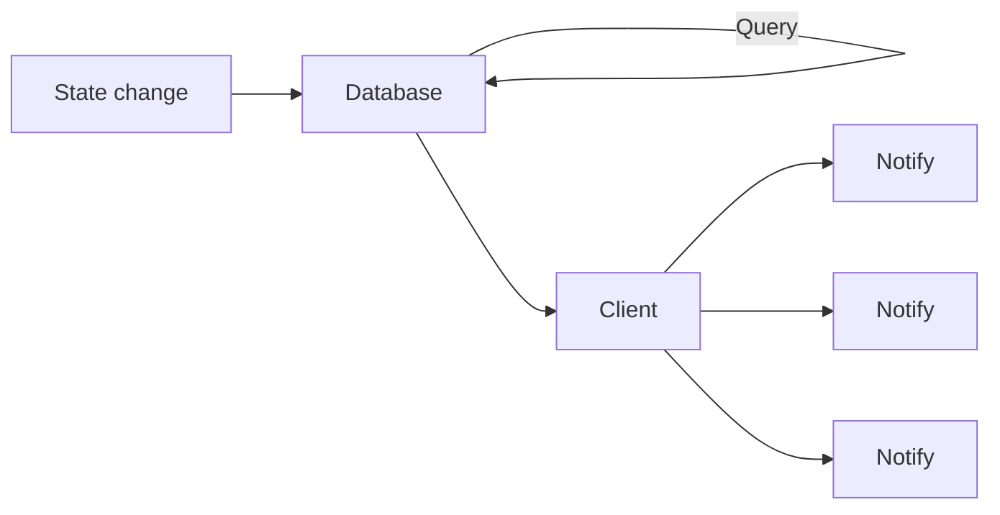

# Change Data Capture (CDC)

## Introduction

**Change Data Capture (CDC)** refers to all of the techniques used to
identify and capture changes needed in a [database][dbs-zk].
This process is fundamental as data often changes at a high speed,
and this may cause your database to change or grow.
Therefore, being able to address these changes in an effective way is important to
ensure that your code, application and software work in an efficient way.

By using *CDC*,
organizations are able to identify and integrate the changes in
a database more quickly and with fewer resources.
In other words, *CDC* reduces both the time required to analyze data and
the cost of resources.

### Requirements of Database Systems

* As data systems grow, requirements grow as well
* When transaction volumes increase, caches become necessary
* When lookup queries increase, search indexes become necessary
* As more analysis and historical data is needed, data warehouses become necessary
* This is all backed by a [database][dbs-zk] that acts as a single source of truth
* However, it is backed by several other systems to make it scale to its needs
* Once you have all this derived data, separate from the source of truth...
  * You need to synchronize it with the source of truth



After database data gets propagated past the *source of truth*,
it's effectively *derived data*.
All of the blocks in the diagram that are results of
the system logic beyond `system logic` are *derived data*.

These components allow expanding the capabilities of the system and
addressing many *(non-exhaustive)* requirements of database systems.

## CDC Methods

* **Dual writes**
* **Network level sniffing**
* **Database triggers**
* **Periodic Queries**

### Dual Writes

* This might be the first reaction to the problem
* **Dual writes** updates the sources of data in multiple places
* This could mean writing to a cache, source database and warehouse at the same time
* There are some problems with this approach
  * It requires updating business logic
  * It might not be transferrable between systems
  * Harder to maintain integrity between parts of the data system

### Network Level Sniffing

* Similar to how search engines index the internet
* **Network level sniffing** is a method of capturing data changes by
observing the network traffic or requests made by different systems
* Its drawback are...
  * That it can miss intermediate changes of state that happen inside databases
  * All un-captured data will be lost if the sniffing application crashes

### Database Triggers

* **Database triggers** updates data in other parts of the system by
observing changes on the database logging table, possibly even a message queue
* Its drawback are...
  * As the application scales, you might add additional load to the source of truth
  * Addition of multiple roles to multiple sources slows the application further
  * Failing transactions leads to a loss of all updates
  * It has the same transferability issues as dual writes

### Periodic Queries

* **Periodic queries** leverages timestamps in the source of truth database to
spread out the load of capturing data changes over time
* Changes in data are captured by querying the database for
changes since the last time the periodic query was run
* Since data change activities are generally not evenly distributed over time...
  * This method can take advantage of the lulls in activity to capture changes
* The disadvantage of this approach is largely based on dispatchability
  * The changes are not captured in real time
  * It also can can miss intermediate changes of state that happen inside databases

## CDC Core Components

* The *CDC* process is mainly composed of these three tasks
  * *Change detection* - detecting changes in the source of truth
  * *Change capture* - capturing what actually changes in the source of truth
  * *Change propagation* - propagating the changes to the derived data
    * Think caches, warehouses, backups, search indices, etc.

## Propagating Changes

There are several ways to implement change tracking,
a lot of the **CDC methods** mentioned before will work with
all, some or none of the following methods.

### Audit Columns

Audit columns are some of the most common *CDC techniques*.
To implement this method,
you need to add columns to all tables that are tracked to
timestamp the moment when a row was created or updated.
In [SQL parlance][sql-zk],
this is generally any time the `INSERT` or `UPDATE` statements are run.
Think adding a column called `last_changed` `created_time`. [(Kutay 2021)][cdc-kutay]

### Implementing Audit Column Tracking

This technique can be implemented by these steps:

1. Add columns named something like `last_changed` & `created_time` to the tables.
2. Get the maximum value of both the target tables' `last_changed` and
`created_time` columns.
3. Select rows where `created_time` is greater than final final table's `created_time`
4. Select all rows from original table that have an `updated_time`,
but less than its maximum `created_time` value.
5. Insert new rows from third step or modify existing rows from
the fourth step. [(Kutay 2021)][cdc-kutay]

The advantage of this method is that it's easy to implement using simple *queries*.
The main disadvantage is that it's easy to make errors that cause inconsistencies.

### Table Deltas

**Table deltas** are one of the easiest techniques to implement *CDC*.

Suppose this table:

| customer_id | last_purchase |
| :---------- | :------------ |
| 1           | 2021-03-13    |
| 2           | 2021-05-07    |
| 3           | 2021-10-24    |

Now suppose the customer with ID equal to `1` makes a new purchase on `2021-10-31`.
Another customer of ID `4` is added makes their first purchase on `2021-11-02`.
Using **table deltas**, the table becomes:

| customer_id | last_purchase |
| :---------- | :------------ |
| 1           | **2021-10-31**|
| 2           | 2021-05-07    |
| 3           | 2021-10-24    |
| 4           | **2021-11-02**|

The advantage of this approach is that it provides an accurate view of
the changed data using simple *queries*.
The disadvantage of this approach is related to memory.
The demand for data storage increases because you need three copies of
the data sources being used in this technique:
the original data, the previous snapshot, and the current snapshot.
[(Kutay 2021)][cdc-kutay]

## Basic CDC Workflow

### Practical Example Introduction

Let's try and implement such a system.

0. We'll start with a *MySQL* [relational database][rel-db-zk] as the *source of truth*.
1. *Timestamp* tracked changes will be captured and propagated by
periodic queries to first *MongoDB*.
2. Then perform *CDC* from [document database][doc-db-zk] [MongoDB][mongodb-zk] to
[key-value database][kv-db-zk] [Redis][redis-zk].
3. Then perform *CDC* from [Redis][redis-zk] to
the [Data Warehouse][data-warehouse-zk] [Cassandra][cassandra-zk].

Each database performs a different function to service different needs.
Ultimately though
it's important the *MySQL* database is the *source of truth* or *system of record*.
To demonstrate the flow of propagating changes, here's a diagram of the workflow.



### Periodic Queries Practical Example

Here we will use the *periodic queries* method to capture changes in
the source of truth, the MySQL database.
Here is a flowchart showing the workflow.



This process gets repeated for each database in the system,
starting with the *system of record*, MySQL.
First, a timed event triggers the `QueryDB` task.
Then some method of detecting changes since the previous timestamp is checked.
If there's no change intermediary checks are queued to check again before the next one.
If changes are detected,
then the data gets selected, *i.e. the changes are captured*.
Then those changes are saved and shared to the next system in the chain,
*i.e. the changes are propagated*.

### Practical CDC Example Implementation Overview

1. Create *containers*
2. Check on logic
3. Create a change tracking system
4. Write an automated system
5. Break it down into components
6. Check for intended functionality

* *Creating containers*:
  * Because we need a highly modular system with repeatable environments,
*containers* will be used.
* *Checking on logic*:
  * We'll use [Python][py-zk] to check on the system logic.
  * Trying to break it and verify integrity.
* *Create a change tracking system*:
  * Using [python][py-zk] and a system for
finding records with timestamps to capture.
  * Between timestamps, the next chronological timestamp is checked on records.
  * If a new timestamp is found, the record is captured.
* *Write an automated system*:
  * Using [Python][py-zk], create a system that automates periodic queries
* *Break it down into components*
  * To make the system easier to maintain and test,
each part of the system will be made into its own separate reusable component.
* *Check for intended functionality*
  * Testing each component to make sure it works to a specification.

## Event-Based Approach to CDC

When creating a CDC system,
you have to detect changes, capture them, then propagate them.
There can be a lot of moving parts behind these seemingly simple three steps.
Below is a summarizing diagram of this.



A better approach can be the **event-driven** approach to CDC.
Most data stores keeps a *transaction-log*, which can help with:

* Recover from failure
* Track changes

And although this isn't necessarily what *transaction logs* are meant for
these factors can be leveraged to
create an **event-driven** architecture for *CDC*.

Some advantages of this approach:

* It captures all changes
* Low overhead
* It doesn't require database or application modifications

But there are some disadvantages to keep in mind:

* You might have to write an app from scratch for every type of database vendor

That would be equally challenging in some cases.
And you might want to have:

* Message ordering guarantees:
  * The order of changes must be preserved for accurate propagation.
* Publication and Subscription:
  * Asynchronous, pub/sub styles can change propagation to consumers.
* Reliable and resilient delivery:
  * Consistency of delivery is essential.
* Message transformation support:
  * Lightweight message transformations are needed.

But if you can get away with that,
this is a really nice way to go about it.

### Practical Overview of Event-Driven CDC

#### MySQL

First start the container.

```sh
docker run -p 3306:3306 --name some-mysql -e MYSQL_ROOT_PASSWORD=root -d mysql
```

Then somehow run this SQL:

```sql
DROP DATABASE IF EXISTS `education`;
CREATE DATABASE IF NOT EXISTS `education`;
USE `education`;

-- TABLE STUDENTS

CREATE TABLE `students`
(
    `email` varchar(50),
    `name` varchar(50),
    `city` varchar(50),
    PRIMARY KEY (`email`)
);
```

Here we create a `students` table with `email` *(PK)*, `name`, `city` fields.

You could also do this as part of this [Python driver script][py-zk] below.

First install these:

```sh
pip install PyMSQL==0.10.1
pip install mysql-replication==0.22
```

Then we can create a driver script to setup database replication for use with CDC.

```python
from pymysqlreplication import BinLogStreamReader

MYSQL_SETTINGS = {
  'host': '127.0.0.1',
  'port': 3306,
  'user': 'root',
  'passwd' 'root',
}

def call_mysql():
    # server_id is your slave identifier, it should be unique.
    # set blocking to True if you want to block and wait for
    # the next event at the end of the stream
    stream = BinLogStreamReader(
      connection_settings=MYSQL_SETTINGS,
      server_id=3,
      blocking=True)
  
    for binlogevent in stream:
        binlogevent.dump()
    
    stream.close()
```

This script will connect to the MySQL database and start listening for changes.
When a change is detected, it will print the change to the console.

This is a whole step in a CDC system.
Thanks to the community now we just configure and deploy the script and
we now have an event-driven CDC system.

Now let's add some data to the database.

```sql
INSERT INTO `education`.`students` (`email`, `name`, `city`) VALUES (
  'peter@mit.edu', 'Peter Parker', 'Cambridge, MA'
);
```

## CDC Using Debezium

[Debezium][debezium-zk] is a distributed platform for change data capture.
To read more about it, read the [Debezium document][debezium-zk].

## References

### Web Links

* [Change Data Capture (CDC): What it is and How it Works][cdc-kutay]
* [A Generic Change Data Capture Framework][dblog-netflix]
* [Delta: A Data Synchronization and Enrichment Platform][dblog-netflix-sync]

<!-- Hidden References -->
[cdc-kutay]: https://www.striim.com/change-data-capture-cdc-what-it-is-and-how-it-works/ "Change Data Capture (CDC): What it is and How it Works"
[dblog-netflix]: http://techblog.netflix.com/dblog-ageneric-change-data-capture-framework-69351fb9099b "A Generic Change Data Capture Framework"
[dblog-netflix-sync]: http://techblog.netflix.com/delta-a-data-synchronization-and-enrichment-platform--e82c36a79aee "Delta: A Data Synchronization and Enrichment Platform"

### Note Links

* [Types of Databases][dbs-zk]
* [Relational Databases][rel-db-zk]
* [Document Databases][doc-db-zk]
* [MongoDB][mongodb-zk]
* [Key-Value Databases][kv-db-zk]
* [Redis][redis-zk]
* [Distributed Databases][dist-db-zk]
* [Cassandra][cassandra-zk]
* [Data Warehouse][data-warehouse-zk]
* [Python][py-zk]
* [SQL][sql-zk]
* [Debezium][debezium-zk]

<!-- Hidden References -->
[dbs-zk]: ./database.md "Types of Databases"
[rel-db-zk]: ./relational-databases.md "Relational Databases"
[doc-db-zk]: ./document-databases.md "Document Databases"
[mongodb-zk]: ./mongodb.md "MongoDB"
[redis-zk]: ./redis.md "Redis"
[kv-db-zk]: ./key-value-databases.md "Key-Value Databases"
[dist-db-zk]: ./distributed-databases.md "Distributed Databases"
[cassandra-zk]: ./cassandra.md "Cassandra"
[data-warehouse-zk]: ./data-warehouse.md "Data Warehouse"
[py-zk]: ./python.md "Python"
[sql-zk]: ./sql.md "SQL"
[debezium-zk]: ./debezium.md "Debezium"
