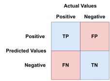

# Confusion Matrix (Machine Learning)

## Introduction

A **confusion matrix** is a table or matrix that
allows analysis of the accuracy of an ML algorithm in
more nuanced ways than simply scoring overall accuracy as a single ratio.
The table lays out on each axis all possible classifications of the data.
Then *usually* the horizontal axis represents the predicted values and
the vertical axis represents the actual values.
Then each cell represents the frequency of the predicted values against
their actual values as given by the data.

## Basics

In a confusion matrix,
the number of correct and incorrect predictions are tabluated so
you can see the actual values versus the predicted values.
You can also compare true positives/true negatives with
false positives/false negatives.

Suppose that you are training an algorithm to predict if a credit card transaction is is fraudulent or not.
Below is an image of a 2 x 2 *confusion matrix* for
this **binomial classification problem**:



To interpret the results of the model, consider the following:

* **Positive**: If your observation is positive,
  that indicates in this case that the transaction is fraudulent.
* **Negative**: If your observation is negative,
  that indicates in this case that the transaction is legitimate.
* **True Positive (TP)**: If your observation is a true positive,
  in this case if it is fraudulent and you predict that it is fraudulent.
* **True Negative (TN)**: If your observation is a true negative,
  in this case if it is legitimate and you predict that it is legitimate.
* **False Positive (FP)**: If your observation is a false positive,
  in this case if it is legitimate but you predict that it is fraudulent.
* **False Negative (FN)**: If your observation is a false negative,
  in this case if it is fraudulent but you predict that it is legitimate.

## Metrics

There are several metrics that you can derive from a *confusion matrix*.
They can help analyze the model.
These metrics are:
**accuracy**, **precision**, **recall**, **specificity** and **F1 score**.

### Accuracy

**Accuracy** is the ratio of correct predictions to total predictions.
Kind of like the **counting principle** from [probability][-prob].
*Accuracy* answers the question:
what percentage of of predictions were correct?

Accuracy can be calculating using the following formula [(Shin 2020)][shin20]:

$$
Accuracy = \frac{TP + TN}{TP + TN + FP + FN}
$$

Or basically counting the *true* predictions and
the total predictions and dividing the former by the latter.

### Precision

**Precision** is the ratio of correctly identified positive results to
the total number of positive results.
*Precision* answers the question:
What is the ratio of positive predictions against all positive results?

Precision can be calculated using the formula [(Shin 2020)][shin20]:

$$
Precision = \frac{TP}{TP + FP}
$$

To put it simply, it's the ratio of *true* positives against
all *positive* predictions
*(which includes true positives and false positives)*.

### Recall

**Recall** measures the number of false negatives predicted.
*Recall* can be calculated using this formula [(Shin 2020)][shin20]:

$$
Recall = \frac{TP}{TP + FN}
$$

Basically, the number of *true* negatives against
the total number of negatives predicted
*(which includes true negatives and false negatives)*.

### Precision vs. Recall

Precision and recall go hand in hand to analyze a model,
and they will have varying levels of importance depending on
the model that is being analyzed.
For instance,
if you are analyzing a model that classifies emails as spam or legitimate,
although you are likely interested in high precision,
it would be tolerable for your model to have a low *recall*.
*Recall, meaning it would occasionally incorrectly classify spam as legitimate*.

In contrast,
if your model is is predicting whether
a patient tests positive or negative for COVID-19,
a high *recall* would be more important than a high *precision*.
For public health, it's far more dangerous to
give people a *false* sense of security than
to occasionally give people a *false* positive;
because a *false* negative could lead to
the spread of the virus to others since the carrier is unaware.

### Specificity

**Specificity** measures the proportion of
negatives that are correctly identified.
*Specificity* can be calculated using this formula [(Shin 2020)][shin20]:

$$
Specificity = \frac{TN}{TN + FP}
$$

Basically, the number of *true* negatives against
the total number of negatives predicted.

### F1 Score

**F1 Score** is a measure of a test's accuracy.
The *f1 score* is a value between 0 and 1,
where 0 represents the lowest accuracy.

The *f1 score* can be calculated using this formula [(Shin 2020)][shin20]:

$$
F1 = 2 \times \frac{Precision \times Recall}{Precision + Recall}
$$

## Python Implementation of a Confusion Matrix

Use the code below to create a confusion matrix,
given true positive and true negative values.
[(Shin 2020)][shin20]

```python
# Confusion Matrix
from sklearn.metrics import confusion_matrix
confusion_matrix(y_true, y_pred)
```

Use the code below to compute the *accuracy*, *recall*, *specificity* and *precision*.
[(Shin 2020)][shin20]

```python
# Accuracy
from sklearn.metrics import accuracy_score
accuracy_score(y_true, y_pred)

# Recall
from sklearn.metrics import recall_score
recall_score(y_true, y_pred)

# Precision
from sklearn.metrics import precision_score
precision_score(y_true, y_pred)

# Specificity - You can obtain it from the confusion matrix
from sklearn.metrics import confusion_matrix
y_true = [0, 0, 0, 0, 1, 1, 1, 1]
y_pred = [0, 1, 0, 1, 0, 1, 0, 1]
true_negative, false_positive, false_negative, true_positive =
  confusion_matrix(y_true, y_pred).ravel()
specificity = true_negative / (true_negative + false_positive)

# F1 Score
from sklearn.metrics import f1_score
f1_score(y_true, y_pred, average=None)
```

## References

### Web Links

* [Shin, Terence. 'Understanding the Confusion Matrix and How to Implement It in Python.' Towards Data Science. 2020.][shin20]

<!-- Hidden References -->
[shin20]: https://towardsdatascience.com/understanding-the-confusion-matrix-and-how-to-implement-it-in-python-319202e0fe4d "Understanding the Confusion Matrix and How to Implement It in Python"

### Note Links

* [Probability Theory][-prob]

<!-- Hidden References -->
[-prob]: probability.md "Probability Theory"
