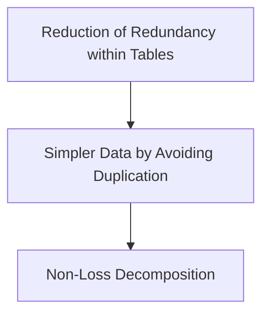

# Database Design

**TODO** When the PCDE course gets here,
start looking through the notes in the course repo already written and put them here.
Then start to go through the course as intended and refine the notes and add to them.

## Relational Database Design

### Pros vs Cons

#### Pros

* You do not define physical storage,
  * You let the platform handle the particularities of individual bits, metadata, etc
* You do not need to define the logical access paths to data
  * NO hardcording paths or access, etc.
  * We are creating a data model,
or schema instead and the platform takes care of the rest

#### Cons

* NO built in protections against bad decisions about schema and
their relationships, they're everything.

## Process of Creating a Database Model

1. Understand what you are modeling
2. Identify the separate *entities* that need to be captured
3. Identify the *properties* of said *entities*
4. Identify what unique identifiers exist for those *entities*
5. Identify relationships between *entities* and *properties*.

### Understand the Entity or Domain

#### Get info about the domain, it takes time & effort.

* What is the environment
* What are the sources of info?
* How will the input be done? By Whom?
* Actions to learn about data model to be made in an organization:
  * Review files & forms
  * Track how data moves through the organization
  * Interview people who owk in different departments & perform different functions.
  * Talk about data consumers & producers
  * Think about how this data is consumed.
    * Reports, purchase orders, statistical information, etc.
* Understan that gettting the data model wrong can be paintful.
* It's important to understand that the design process is highly iterative
* First results should be early so feedback can be made early

### Identify Entities & Properties

* An **entity** is an object that has *properties*.
  * Typically these become database tables
  * As an example
  * *Entity*: person
  * *Properties*:
    * Name
    * DOB
    * Weight
    * Email
    * etc.
* Each entity has corresponding *properties*
* *Entities* are the potential tables
* *Properties* are the potential columns
* Questions to ask yourself:
  * Did I miss any *entities* or *properties*?
  * Are the *properties* attached to the right *entity*?
    * *This is easy to get wrong*

### Identify Primary Keys, or What Makes an Entity Unique

* Why do you need a unique identifier?
  * To look through tons of records and recall any one of them
  * Also to tie different entities and properties together by their relationships
* Check if it already exists in the table
  * For example, a GUID (Globally Unique Identifier) or UUID (Universally Unique Identifier)
* Take a look at the *properties* of a `Student` *entity*:
  * FirstName
  * LastName
  * BirthDate
  * City
  * Region
  * Country
  * Which of these are unique?
    * The answer is none
    * FirstNames and LastNames frequently get reused.
      * So does every other *property*.
    * Not even combining FirstName and LastName results in true uniqueness
* Maybe combining everything creates a unique identifier,
  * but this is often overcomplicated.
* Attaching a *primary* key `StudentID` is much simpler and provides uniqueness
* *Primary Keys* are the unique identifier of an entity.
* When creating relations to other entities or properties,
*Foreign Keys* are the unique identifiers as a property on an entity
pointing to another entity

### Relationships Between Tables

* **Cardinality** is how one table relates to another.
  * Typically *cardinality* breaks down into these 3 types:
    * 1-to-1 *(1:1)*
      * The simplest relationship but with some serious implications
      * A student can only be in one college
      * A patient can only be in one hospital
      * If any other relationship is possible this can't be the *cardinality*
      * This is why 1:1 relationships are actually somewhat rare in data modeling
    * 1-to-many *(1:m)*
      * Think a shopping cart full of products
      * Or a mother's person number corresponding to the person numbers of her kids
      * Quite common, possibly the most common relationship, usually a safe bet
    * many-to-many *(m:m)*
      * Requires seperate joint tables to track the `M * N` relationships that exist
* **TODO** Give diagrams or images showing these 3 relationships

## Design Summary & Naming Practices

### Sample Book Database

Let's walk through creating an actual database design with a real world domain.
Let's create a book database.
How do we come up with the entities, properties and the relationships.
There's a number of ?s that can be posed to design this data model:

* Which cities are the authords from?
* What number of books are above or below a certain price?
* Which authors have written the most books?
* Which authors have sold the most books?
* Which publishers have sold the most books?
* Which stores have sold the most books?

These are the sorts of questions that can
arise when considering the nature of data.
This is a good starting point when it comes to design,
the questions you might want answered from the data.

#### Hard Coded Policies

As well as asking those questions,
you might want to ask yourself:
What fixed rules are you capturing within your design?

*Ie* can an author have more than one book?
Perhaps not initially,
but eventually many authors in the database will write their second book.

*Ie* Can a book have more than one author?
Yes, many books are co-authored by many writers.

*Ie* Can a sales order be for more than one book?
Normally in a shop you might want to buy many books.

*Ie* Can an editor edit multiple books?
Yes, very likely, this is a book business, they usually edit many books.

*Ie* Can a book have more than one editor?
Again, yes, this does happen.

So track these kinds of questions because they become clues in how
the data model aught to be designed through these hardcoded rules.

#### Entities & Relationships in the Data Model

So, let's think here about the entities and relations we want to capture.
And the data model we want to create.

Once again, these are our:

1. Tables
2. Columns
3. Relationships between tables, through columns 

#### Active Learning

Identify the *entities* and the *properties* for the book business data model

There are many possibile solutions.
Let's start with a subset.
You can think of *entities* like:

* Authors
* Books
* Editors
* Publishers

...as being core parts of the design.

#### Authors

##### Properties

* AuthorId *(PK)*
* First name
* Last name
* BookId *(FK) (m:m)*

#### Books

##### Properties

* BookId *(PK)*
* Title
* AuthorId *(FK)* *(m:m)*
* EditorId *(FK)* *(m:m)*
* PublisherId *(FK)* *(1:1)*

#### Editors

##### Properties

* EditorId *(PK)*
* First Name
* Last Name
* BookId *(FK) (m:m)*
* PublisherId *(FK) (1:m)*

#### Publishers

##### Properties

* PublisherId *(PK)*
* PublisherName
* BookId *(FK) (m:m)*
* EditorId *(FK) (m:m)*

## Naming Conventions

* Plurals for table names
* Singular for column names
* Names in Pascal case
* *Primary keys*
* Use consistent naming conventions
  * *Ie* `DateOfBirth` in one table, `DOB` in another is bad
* Avoid abbreviations if possible
  * There's some industry standards that are well known that can be made exceptions
    * *Ie* ID, DOB, etc.
* Transparent naming schemes avoid confusion for other teammembers and yourself
  * When revisiting code it's important to communicate intent to others & yourself
* Consider user expectations & knowledge
  * *Ie* UI Design
  * *Ie* ISBN is a *UUID* for a book, use it as the industry convention does
* For more info read about [naming conventions in SQLShack's article][naming-conventins-sqlshack]

## Cardinality for Sample Database

### Cardinality of the Book Database

* We're looking at how:
  * **1-to-1**: *One row* in table A relates to one row in table B
  * **1-to-N**: *One row* in table A relates to *many rows* in table B
  * **N-to-N**: *Many rows* in table A relate to *many rows* in table B

### The Book Database so Far

Here are the four tables so far and the properties to consider.
They all have *primary keys (PK)*.
What of their *foreign keys (FK)*?

* Authors Table Properties:
  * AuthorID *(PK)*
  * Name
  * Address
  * Phone
* Books Table Properties:
  * BookID *(PK)*
  * Name
  * Price
  * Date
* Publishers Table Properties:
  * PublisherID *(PK)*
  * Name
  * Address
* Editors Table Properties:
  * EditorID *(PK)*
  * Name
  * Address
  * Contact

### Implementation of 1-to-N Relationships

How would you enter multiple books for the same publisher?
To answer that let's write out some initial data.

| BookID | Name     | Price  | Date       |
| ------ | -------- | ------ | ---------- |
| 1      | Eduardo  | $13    | 02/20/2018 |
| 2      | Victoria | $86    | 11/22/2016 |
| 3      | Sapiens  | $20.99 | 02/15/2015 |

| PublisherID | Name         | Address | BookID |
| ----------- | ------------ | ------- | ------ |
| 1           | Random House | NY, NY  | 1      |
| 1           | Random House | NY, NY  | 2      |
| 1           | Random House | NY, NY  | 3      |

Note how because of the *1-to-N* relationship between books and publishers,
while there's three unique book rows in the Books table,
There's three repeating rows in the Publishers table with
the only difference being the BookID.
This is how **this** *1-to-N* relations play out,
the *many* table that's related to the *1* in this relationship
must have a lot of repeated information to express that
*many* books are related to *one* publisher.

This violates some of the key rules of database design.
Namely that you can't have repeat *PKs* and
you do not want to put multiple values in one cell.
Instead we would rather have multiple *FKs* per one *PK* in one table cell.

### Better Approach to Implementing 1-to-N Relationships

Instead of putting the `BookID` in the `Publisher` table like above,
let's sketch out the implications of
only putting the *FK* for `PublisherID` into the `Books` table.

| PublisherID | Name         | Address |
| ----------- | ------------ | ------- |
| 1           | Random House | NY, NY  |

| BookID | Name     | Price  | Date       | PublisherID |
| ------ | -------- | ------ | ---------- | ----------- |
| 1      | Eduardo  | $13    | 02/20/2018 | 1           |
| 2      | Victoria | $9.86  | 11/22/2016 | 1           |
| 3      | Sapiens  | $20.99 | 02/15/2015 | 1           |

Note how because the *one* `PublisherID` is tied to *many* `BookID`s,
placing the *FK* `PublisherID` in the `Books` table deduplicates the data.
And all without destroying any information.
It will also be more performant because the amount of repition is much less.

### Cardinality for Sample Database: N-to-N

How would we represent a *many* to *many* relationship?
For this example in the Book database system,
we'll look at the `Authors` & `Books` tables' relationship as *(m:m)*.

For *Many-to-Many* relationships,
there's no good way to represent the relationship w/o creating an extra table.
This is known as an **intermediate table** between `Books` & `Authors`,
known as `BookAuthors` that will represent the relationship.
It will hold for each row a `BookID` & `AuthorID`
to represent related Books & Authors.

Notice that the relationship from `Authors` to `BookAuthors` is *(1:m)*.
Also, that `Books` to `BookAuthors` is *(1:m)*.
So that we use that **intermediate table** to *map* the two relationships.

#### Some Observations about Intermediate Tables

* It is an *N-to-N* relationship
* It is a table but **not** an independent *entity*
  * A join is required to link the two entities
* Also known as:
  * *Dependent tables* as opposed to the *Independent tables* representing *entities*
  * *Mapping tables* as in it *maps* one *entity* to another
  * *Associations*
  * *Join Tables*
* The participants in an association are the *FKs* that map to *PKs*
* All *N-to-N* relations need a *mapping table*

### Cardinality for Sample Database: 1-to-1

* Mapping of one row to a row in another table...
  * Essentially a continuation of the same table
  * They can be collapsed into one table
* There are instances where they can remain as seperate tables
  * Capturing all the info into a data model
  * Making the main table lightweight
    * This might be bc the data within the row is quite heavy

### More Info on Cardinality

To learn more about the nuances of *cardinality*,
consider reading [this article][cardinality-prepinsta]

## Normalization

Many of the points made about the design of data models
are captured with **noramlization** rules.

We do not want redundant data within the tables,
we want to support and improve integrity by avoiding duplicates.
The other thing is to split up concerns without losing data by
using non-loss decomposition.

### First Normal Form

>Each Row and Column Cell has only One Value

How might you handle one order with multiple books?
We have a `Books` table & `Orders` table.
How would you handle that relationship without
breaking this *normalization rule*?
A naive reaction might be to simply add more `Book` columns in the `Order` table.
You could also add multiple `Books` in one cell.
You can tell this isn't a good solution because
it immediately breaks this *normal form*.

### Second Normal Form

>Every non-key must be dependent on the *primary key*

That is that the key truly is a *primary key*,
even when it is composed of two columns.
Irrelevant when the *primary key* is the only column of a table.
*Ie*, every royalty in `BookAuthors` depends on `Books` & `Authors`

#### Table BookAuthors Example

* `BookID`
* `AuthorID`
* `Royalty`

The `royalty` column is the only non-key of the table.
It depends **entirely** on the *primary key* `BookID` in this table.
It makes sense due to the relation of `Book` & `Author`.
Only one royalty amount would be related to one *association* of
`Book` & `Author`.

### Third Normal Form

>Every non-key must not depend on another non-key column

That is,
there aren't any connections between *dependent* data columns.
Only *independent* data may connect others.
Think of each non-key column as a fact about the *primary key*.
In the `Orders` table, `Book`s can be multiple than an incomplete fact.

### Mini Lesson 4.1: Normalization

The [mini lesson 4.1][pcde-mod4-content-zk] handles the nuances of **normalization forms**.

## References

### Web Links

* [Database Design Basics (from Microsoft Access Docs)][db-design-basics-msft]
* [Data Modeling 101 (from Agile Data by Scott Wambler)][data-modeling-101-agile]
* [Identifying Entities & Attributes (from Embarcadero Documentation)][ents-attrs-embarcadero]
* [What is a Unique Identifier & How Do we Use it?][unique-id-dbbee]
* [Cardinality in Data Modeling Presentation (from Temple University by Adam Alalouf)][cardinality-temple-uni]
* [Learn SQL: Naming Conventions (from sqlshack.com by Emil Drkusic)][naming-conventins-sqlshack]
* [Relationship Cardinality in DBMS (from prepinsta.com)][cardinality-prepinsta]

<!-- Hidden Reference Links Below Here -->
[db-design-basics-msft]: https://support.microsoft.com/en-us/office/database-design-basics-eb2159cf-1e30-401a-8084-bd4f9c9ca1f5 "Database Design Basics (from Microsoft Access Docs)"
[data-modeling-101-agile]: http://www.agiledata.org/essays/dataModeling101.html "Data Modeling 101 (from Agile Data by Scott Wambler)"
[ents-attrs-embarcadero]: https://docwiki.embarcadero.com/InterBase/2020/en/Identifying_Entities_and_Attributes "Identifying Entities & Attributes (from Embarcadero Documentation)"
[unique-id-dbbee]: https://www.dbbee.com/what-is-unique-identifier-and-how-to-use-it- "What is a Unique Identifier & How Do we Use it?"
[cardinality-temple-uni]: https://community.mis.temple.edu/mis3506digitaldesignfall2018/files/2018/10/Adam-Alalouf_Cardinality.pdf "Cardinality in Data Modeling Presentation (from Temple University by Adam Alalouf)"
[naming-conventins-sqlshack]: https://www.sqlshack.com/learn-sql-naming-conventions/ "Learn SQL: Naming Conventions (from sqlshack.com by Emil Drkusic)"
[cardinality-prepinsta]: https://prepinsta.com/dbms/relationship-cardinality/ "Relationship Cardinality in DBMS (from prepinsta.com)"

### Note Links

* [PCDE Module 4: Mini Lesson 4.1 on Normalization][pcde-mod4-content-zk]

<!-- Hidden Reference Links Below Here -->
[pcde-mod4-content-zk]: ./pcde-module4-content.md#Mini Lesson 4.1: Normalization "PCDE Module 4: Mini Lesson 4.1 on Normalization"
