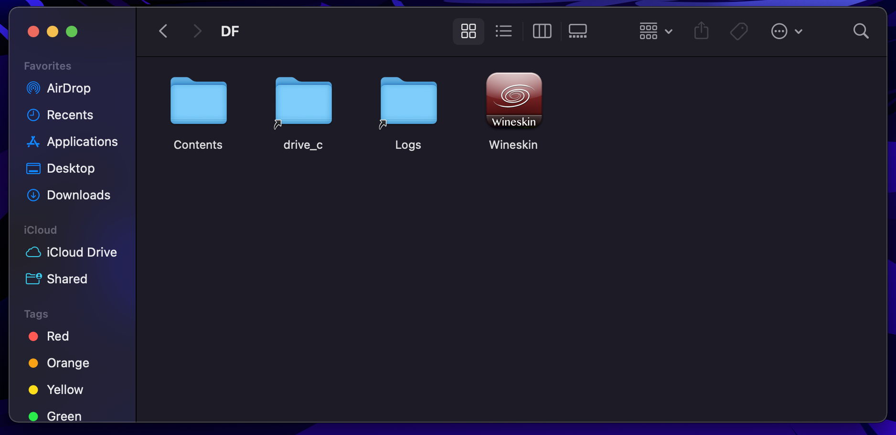

## Install on MacOS

### Download the Dwarf Fortress Game Files

This means having purchased the game somehow and there's two options:

#### Itch.io

The purchase includes a zip file containing the game data & a steam key.

#### Steam (& Modifying MacOS Steam Manifest)

1. Go to `~/Library/Applications\ Support/Steam/steamapps`
2. Create file `appmanifest_975370.acf` and insert the below contents.
3. Restart Steam

```json
"AppState"
{
"appid" "975370"
"Universe" "1"
"installdir" "Dwarf Fortress"
"StateFlags" "1026"
}
```

The number `975370` that appears in the manifest file above &
the `appid` is Steam's ID for the game.
When steam restarts it will find this new app manifest and
then proceed to download the game which is only intended for Windows on MacOS.

### Install Wineskin Winery & Set it up

First, before proceeding, ensure you have [homebrew][homebrew] installed.

Then, install [Wineskin][wineskin-gh]
using this homebrew command in your terminal.

```sh
brew install --no-quarantine gcenx/wine/unofficial-wineskin
```

Once installed, navigate to the `/Applications` directory and
run the application *Wineskin Winery*.

![wineskin-main-screenshot]

1. Press *Update*.
2. Click the `+` icon next to *New Engines Available*.
3. Select an engine,
the latest engine `WS11WineCX64Bit22.0.1` works,
it's possible to also try a newer one.

### Create a Wineskin Wrapper

* Press `Create New Blank Wrapper`
* Pick a name for the wrapper.
I went with `DwarfFortress`.
* A popup will show up, select `Show in Finder`.
* Open your wrapper (whatever your name).


* Click `Install Software`.


* Press `Copy a Folder Inside".
  * Make sure your DF zip is already unzipped.
  * Or point it to the newly steam downloaded dwarf fortress install.
* You'll open a finder window.
  * Locate your dwarf fortress folder.
  * Select the entire folder.


* Add an icon if you want, *entirely optional*.
* Click `Test Run`.
  * It should load up Dwarf Fortress.
* Close out once it loads up.
  * Close the wineskin window afterwards.
  * You can now search up your wrapper *(whatever it's named)*.
  * It will now come up in spotlight/raycast/etc. results.
    * This includes its newly added icon.


* Build some forts!

### Fix MacOS Double Click Issue

* Open *Finder* and search for your wrapper.
  * This will be the name you gave during setup.
  * Right click press `Show Package Contents`.



* Open the wineskin application.
  * Navigate to the `Tools Tab`.
* Click on `Config Utility (winecfg)`.


* In the applications tab,
  * Within the new `Wine configuration menu`.
  * Change the Windows version to Windows 10.


* If that doesn't work,
try enabling `Automatically capture mouse in full-screen window`.


* This should work, but also,
slowing down your clicks and holding down for longer should also work.

### Notice on Upgrading Dwarf Fortress

* You will likely have to repeat this process if Dwarf Fortress updates.
* Need to manually swap save files if you want to transfer between computers.

## References

### Note Links

<!-- Hidden References -->
[wineskin-main-screenshot]: ./2022-12-16-16-53-00.png "Screenshot of Wineskin mainscreen"

### Web Links

* [Dwarf Fortress on MacOS Guide (from SteamCommunity by Convicted Felon)][df-mac-guide]
* [Homebrew - the Missing Package Manager for MacOS (Homepage)][homebrew]
* [WineskinServer: A user friendly tool to port Windows software to macOS. (from Github by Gcenx)][wineskin-gh]

<!-- Hidden References -->
[df-mac-guide]: https://steamcommunity.com/sharedfiles/filedetails/?id=2898353855 "Dwarf Fortress on MacOS Guide (from SteamCommunity by Convicted Felon)"
[homebrew]: https://brew.sh "Homebrew - the Missing Package Manager for MacOS (Homepage)"
[wineskin-gh]: https://steamcommunity.com/linkfilter/?url=https://github.com/Gcenx/WineskinServer "WineskinServer: A user friendly tool to make ports of Windows software to macOS. (from Github by Gcenx)"
