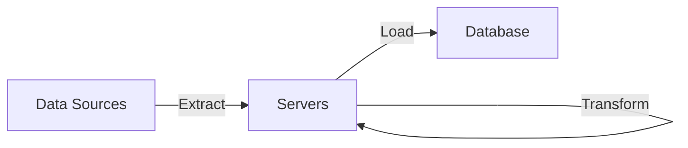
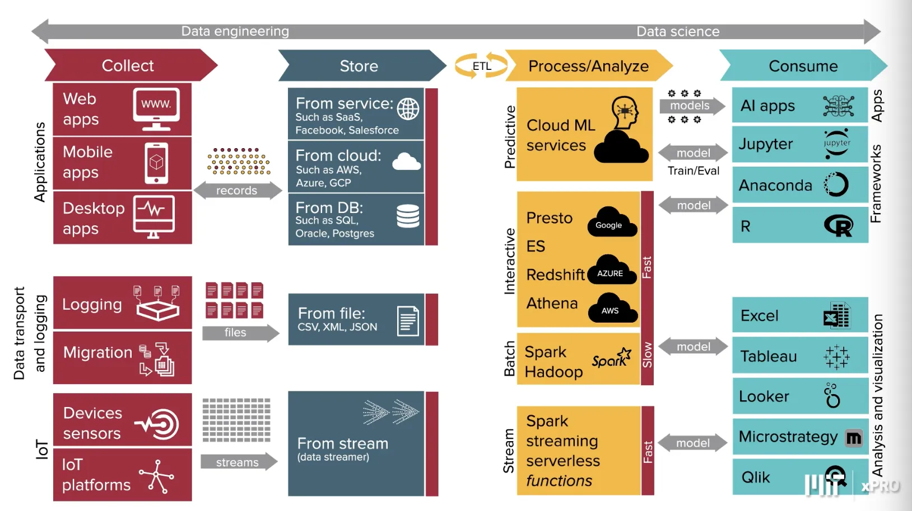

# Extract, Transform, Load (ETL)

## Introduction

According to [Wikipedia][wiki-etl]:

>In computing, extract, transform, load (ETL) is a three-phase process where
>data is extracted, transformed (cleaned, sanitized, scrubbed) and
>loaded into an output data container.
>The data can be collated from one or more sources and it can also be output to
>one or more destinations.
>ETL processing is typically executed using software applications but
>it can also be done manually by system operators.
>ETL software typically automates the entire process and can be run manually or
>on reoccurring schedules either as single jobs or aggregated into a batch of jobs.

## Role of ETL in Data Engineering

### Hierarchy of Data Proceessing

This is the ordered list of proceessing tasks for data applications.
The lowest ones are essentially lower abstractions.

1. Collect: Instrumentation, logging, sensors, external data,
user generated content.
2. Move/Store: Reliable data flow, infrastructure, pipelines, ETL, structured and
unstructured data storage.
3. Explore/Transform: Cleaning, anomaly detection, preperation.
4. Aggregate/Label: Analytics, metrics, segments, aggregates, features,
training data
5. Learn/Optimize: A/B tessting, experimentation, simple ML algorithms
6. AI: AI and Deep Learning Models

When it comes to *ETL* we're going through the bottom layers of the hierarchy.

### ETL Architecture

#### Extract

The **extract** process is any standardized process where
data sources are polled for any new data.
Typically some filtering is performed in this process to save on
the amount of data to download and processing in next steps.
The features of the data are usually already known,
otherwise a more brute force method of downloading most of
the updated data can be used and transforms can attempt to download the rest

#### Transform

Then the data must be **transformed** into a format that works for
the data systems it must be loaded into.
This involves:

* Filtering out what isn't needed.
* *Transforming* data formats to be consisted with rest of data system.
* Repairing/Removing missing data.
* Restructuring data to fit with pre-existing corpus.
* Deriving columns
* Aggregation
* Joins

#### Load

Finally, the data is **loaded** into the database system.
The data should by now be *transformed* into the state it needs to
be able to be stored into the database system.
Maybe some minor changes need to be made between the code and
database insert procedures.
This step then consistently *loads* the data into the database.

### Landscape of ETL Processes

As can be seen in the diagram below,
the entire landscape of ETL is quite expansive.
Here we see many ways to *extract* data from their sources,
*transform* systems to change the data to the format it's expected,
and *load* procedures into various data storage endpoints.
Finally you see on the right the various ways to
consume the ETL data.

## ETL Software

### Apache NiFi

[NiFi by the Apache Software Foundation][-nifi]
is a data pipeline and transformation tool.
It creates scalable directed graphs for data routing,
transformation and system mediation logic.
It creates data pipelines and transformations on the data flowing through
that pipeline.

## References

### Web Links

* [Extract, Transform, Load (from Wikipedia, the free encyclopedia)][wiki-etl]

<!-- Hidden References -->
[wiki-etl]: https://en.wikipedia.org/wiki/Extract,_transform,_load "Extract, Transform, Load (from Wikipedia, the free encyclopedia)"

### Note Links

* [Apache NiFi][-nifi]

<!-- Hidden References -->
[-nifi]: nifi.md "Apache NiFi"
