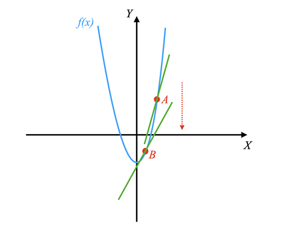

# Gradient Descent

## Basics

Suppose that you are at the top of a hill,
and you want to reach the bottom in the fastest way possible.
Assume further that there are multiple paths visible to you that
lead to the bottom of the hill.
How can you choose which path will be fastest?

If we look at [derivatives][-deriv],
we can find the rates of changes of different functions at a given point.
In other words, the derivative always points in the direction of the steepest
rate of change or the steepest descent.



A gradient behaves in the exact same way as a derivative but for multi-valued funcitons.
As an example, consider the function $f(x, y) = x^2 + y^2$.
Given that this function depends on both $x$ and $y$,
you can compute a derivative of
the function with respect to $x$ and the derivative of $y$.

When taking the derivative of $f(x, y)$ with respect to $x$,
you treat $y$ as a constant.
Therefore you can write the following equation to illustrate this example:

$$ \frac{df}{dx} = 2x $$

On the other hand, when taking the derivative of $f(x, y)$ with respect to $y$,
you treat $x$ as a constant.
This results in the following equation:

$$ \frac{df}{dy} = 2y $$

Therefore, the gradient of $f(x, y)$ will be a vector with components $[2x, 2y]$.
Each component of the gradient indicates the direction of steepest descent for
each of the function's variables.
In other words,
the gradient points to the direction in which the function increases the most.

## Gradient Descent Definition

Now that you know how to define a gradient,
you are ready to build on that knowledge by learning how **gradient descent** works.
Gradient descent is an optimization algorithm used in
ML to minimize the cost of a function.
In other words,
you can use gradient descent to minimize the error of a certain algorithm.

If you return to the previous example of climbing down a hill,
you can think of a gradient descent as the technique for
choosing your next step in order to reach the bottom of the hill in
the fastest way possible.

By assuming that you want to travel from point $w_{n-1}$ to point $w_n$,
and given a function $\boldsymbol{G}$,
the equation for the gradient descent algorithm is as follows:

$$ w_n = w_{n-1} - \eta \nabla \boldsymbol{G} $$

where $\nabla \boldsymbol{G}$ is the gradient of the function $\bold{G}$.
Note that in the equation,
you have introduced the learning rate $\eta$.
The learning rate is an important parameter,
as it determines how big the steps of the gradient descent algorithm will be in
the direction of the local minimum.
Using this terminology,
the local minimum represents the point toward which you want to
perform the gradient descent to minimize the error.
For example,
looking at the figure above, the local minimum is given by
the vertex (lowermost point) of the parabola.

Choosing an appropriate learning rate is fundamental to machine learning.
It determines whether and how fast you can reach the bottom of the hill or
(the local minimum of the function).

## Stochastic Gradient Descent

Another variation of
the gradient descent algorithm is called **stochastic gradient descent**.

The two algorithms are quite similar in the sense that both gradient descent and
stochastic gradient descent update a set of parameters in
an iterative manner to minimize an error function.

The main difference is that while in gradient descent you have to
run through all of the samples in your training set to perform a single iteration,
in stochastic gradient descent you use only
a subset from your training set to an iteration.

Therefore, if the number of training samples is very large,
then using gradient descent may take too long because
in every iteration you are running through the complete training set.
On the other hand,
using stochastic gradient descent can significantly speed up the process because
you only use on training sample.

Additionally, stochastic gradient descent often converges much more quickly than
gradient descent, but
the error function is not a well minimized as in the case of gradient descent.

### Stochastic Gradient Descent - Further Reading

* [Wikipedia. Stochastic Gradient Descent][wiki-sgd]

## Usage in Linear Regression

Now that you have learned about gradient descent,
you can use it to solve a linear regression problem.
Basically you have your **dependent variable** $y$ and
your **independent variable** $x$.
And you iteratively need to solve for the slope $m$ and
the intercept $b$ of the line that best fits the data.

Given the data $\boldsymbol{Y}$ that
satisfies the independent and identically distributed *(I.I.D.)* requirement,
the equation for **ordinary linear regression** is:

$$ \boldsymbol{Y} = \bold{w} \cdot \bold{X} + \bold{e} $$

Where:

* $\boldsymbol{Y}$ is the matrix of dependent variables
* $\boldsymbol{X}$ is the matrix of independent variables
* $\boldsymbol{w}$ is the matrix of weights, or Regression Coefficients
* $\boldsymbol{e}$ is the matrix of errors

The $\boldsymbol{e}$ is there as a matrix of errors because
the data is not perfectly linear.
There may be many errors for each data point.

The equation for ordinary linear regression in (**X**, **Y**) space
*(i.e. in two dimensions)* is:

$$[w_0, w_1] \cdot \begin{bmatrix} 1 & 1 & \ldots & 1
\\ x_0 & x_1 & \ldots &  x_n \end{bmatrix} =
[y_0, y_1, \ldots y_n]$$

The predictive model for $y$ can be written as:

$$ \boldsymbol{w} \cdot \bold{X} = \bold{Y} $$

You can generate any $y_i$ for any given $x_i$ as follows:

$$ y_i = w_0 + w_1 x_i $$

Essentially we keep looking for adjustments to $w_0$ and $w_1$ until
we find the best fit for the data,
as in when the sum of the squares of the errors is minimized.

### Error Function

First we need to decide what the error function is in order to
be able to minimize it.
In machine learning the **loss function** is defined.
In this case,
at least squares loss function is used.
The error $\boldsymbol{E}$ is defined as:

$$ \boldsymbol{E} = \sum |\bold{Y} - \bold{w} \cdot \bold{X}|^2 $$

* $\boldsymbol{Y}$ = Actual Data
* $\boldsymbol{w} \cdot \bold{X}$ = Model Prediction

So we see we basically have the model prediction as the dot product of the weights and
the independent variables.
We then subtract the actual data from the model prediction and
square the result.
What does this look like?

Because it is squared, when we look at different weights on a contour chart we
see that the error is minimized at the bottom of the bowl.
So we take the gradient of the error data points and
find some possible solutions.

### Error Gradient

Now that we know what the error function is,
we can take the gradient of the error function with respect to the weights.
This allows us to find the direction of steepest ascent.
The equation for the gradient of error, $E$, with respect to the weights,
$\boldsymbol{w}$, is:

$$ \frac{\partial E}{\partial w} =
\sum 2(\boldsymbol{Y} - \boldsymbol{w} \cdot \boldsymbol{X}) = G$$

>**Note** that the $2$ comes from the derivative of the square in the error function.

To update the weights, we need to subtract the gradient from the weights.
The equation for updating the weights $w_n$ is:

$$ w_n = w_{n-1} - \eta \nabla \boldsymbol{G} $$

Where:

* $\eta$ is the learning rate
* $\nabla \boldsymbol{G}$ is the gradient of the error function
* $w_{n-1}$ is the previous weight
* $w_n$ is the new weight

### Implementation in Python

#### Initial Setup

```python
import matplotlib.pyplot as plt
import numpy as np
n_pts = 10
x = np.arange(n_pts,1)
ones = np.ones(n_pts)
x = np.arange(0, n_pts)
x = np.vstack((ones, x)) # add row of 1s representing the constant term
w = np.array([0, 0])

y = np.dot(w, x) # y = w*x + w0
y = y + 1
```

Some notes:

* Setup the `x` and `y` data
  * The `y` data is a linear function of the `x` data
  * Has slope of 1 and intercept of 1
* Generate a row of ones
* Stack them with the `x` data

#### Gradient Descent Algorithm in Python

Here we implement the function `gradient_descent`:

```python
import matplotlib.pyplot as plt
import numpy as np
import time
plt.style.use('ggplot')

def gradient_descent(xy, max_iterations, w,
                      obj_func, mse_func, grad_func, extra_param=[],
                      learn_rate=0.05, momentum=0.8):
    (x, y) = xy
    w_history = w
    f_history = obj_func(w, x)
    cost_history = mse_func(w, xy)
    delta_w = np.zeros(2)
    i = 0
    while i < max_iterations:
        delta_w = -learn_rate * grad_func(w, xy)
        w = w + delta_w
        # store the history of w and f
        w_history = np.vstack((w_history, w))
        y_pred = obj_func(w, x)
        f_history = np.vstack((f_history, y_pred))
        cost_history = np.vstack((cost_history, mse_func(w, xy)))
        i = i + 1
    return w_history, f_history, cost_history

def grad_mse(w, xy):
    (x, y) = xy
    y_pred = model(w, x)
    diff = y - y_pred
    grad = -np.dot(x, diff)
    return grad

def mse(w, xy):
    (x, y) = xy
    xt = np.transpose(x)
    y_pred = np.dot(w, x)
    loss = np.sum((y - y_pred)**2)
    m = 2 * len(y)
    loss = loss / m
    return loss

def model(w, x):
    y_pred = np.dot(w, x)
    return y_pred

def plot_GD(xy, w, max_iterations, learn_rate, ax, ax1=None):
    x, y = xy
    y = model(w, x)
    xt = np.transpose(x)
    _ = ax.plot(x[1], y, 'b.')
    tr = 0.5
    for i in range(max_iterations):
      pred_prev = np.dot(w, x)
      w_hist, f_hist, c_hist = gradient_descent(
          xy, max_iterations=1, w, model, mse, grad_mse, [],
          learn_rate=0.05, momentum=0.8)
      pred = model(w, x)
      if ((i % 2 == 0)):
        y_pred = f_hist[i]
        _ = ax.plot(x[1], y_pred, 'b-', alpha=tr)
        if tr < 0.8:
            tr = tr + 0.2
      if not ax1 == None:
          _ = ax1.plot(i, c_hist[i], 'b.')
```

## Visualizing Gradient Descent in Matplotlib

To plot out the *cost/loss space* of a gradient descent function,
we need to plot the loss function as we vary $w_0$ and $w_1$,
at least for a 2D case, we'd need every other pairing for more complex models.
We also need to produce contours for the loss function,
below is `plot_contour` to demonstrate how.

```python
import itertools
import matplotlib.pyplot as plt
import numpy as np
def plot_contour(f, x1bound, x2bound, resolution, ax):
    x1range = np.linspace(x1bound[0], x1bound[1], resolution)
    x2range = np.linspace(x2bound[0], x2bound[1], resolution)
    xg, yg = np.meshgrid(x1range, x2range)
    zg = np.zeros_like(xg)
    w = np.array([2, 0])
    for i, j in itertools.product(range(resolution), range(resolution)):
        zg[i, j] = f([xg[i, j], yg[i, j]])
    ax.contour(xg, yg, zg, 100)
    return ax
```

* We use `linspace` to divide up points by a `resolution`
  * This creates a grid
* `xg` and `yg` are the x and y coordinates of the grid using numpy's `meshgrid`
* We then set `zg` our loss to zero
* `w` is the weight vector
  * Although you might want to pass a parameter for this, here it's hardcoded
* Then we use `itertools`' `product` to iterate over the grid
* `f` is the cost function
  * Usually it is the mean squared error

## References

### Web Links

* [Wikipedia. 'Stochastic Gradient Descent' 2023-06-07][wiki-sgd]

<!-- Hidden References -->
[wiki-sgd]: https://en.wikipedia.org/wiki/Stochastic_gradient_descent "Wikipedia. 'Stochastic Gradient Descent' 2023-06-07"

### Note Links

* [Derivative][-deriv]
* [Python][-py]
* [NumPy][-numpy]
* [MatplotLib][-matplotlib]

<!-- Hidden References -->
[-deriv]: derivative.md "Derivative"
[-py]: python.md "Python"
[-numpy]: numpy.md "NumPy"
[-matplotlib]: matplotlib.md "MatplotLib"
