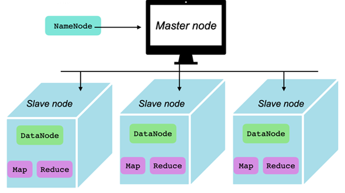

# Hadoop Distributed File System (HDFS)

## Introduction

The **Hadoop Distributed File System** (**HDFS**) is utilized for
storage permission in a [Hadoop cluster][-hadoop].
It's designed for providing a commodity hardware scalable and
highly available storage cluster for
distributing processing and querying workloads.

## Node Types

*HDFS* stores data in administrator definable sized chunks *(default of 128MB)*
that get distributed across the nodes of the HDFS cluster.
This means that a **NameNode** is needed to maintain all the references and
metadata to all the **DataNode**s that store the actual data in chunks.

## Name Node

The **NameNode** is effectively the *master* node of the cluster.
It stores file and data references and their metadata.
Without it there's no way to map files and datasets to the chunks they reside in
and what nodes those chunks are accessible in.
It also holds the transaction log that stores all changes to the data including
modification requests, creation requests and removal requests.
It also plans out changes to the file system and divides up the operations to
the respective nodes where the data is stored.

## Data Nodes

**DataNodes** are mainly utilized for storing data in the Hadoop cluster.
The more *DataNodes* that are present in the cluster,
the more data the Hadoop cluster can store and the faster operations will perform.
Because they are used to store data,
the machines provisioned for them should have large amounts of storage.

As mentioned, data in the *HDFS* is always broken up and stored in 128MB chunks.
So if a 500MB file were stored in the cluster,
it would be broken down into three 128MB chunks and one 116MB chunk.
Those chunks would then be dispersed between all the available clusters based on
the replication factor, which defaults to 3.
That means each chunk will be stored three times on three different nodes.

## References

### Web Links

<!-- Hidden References -->

### Note Links

* [Hadoop][-hadoop]

<!-- Hidden References -->
[-hadoop]: hadoop.md "Hadoop"
