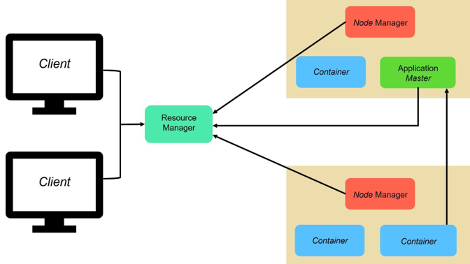

# Hadoop: YARN

## Introduction

**YARN** is a framework that [MapReduce][-mr] works with.
*YARN* performs two operations job scheduling and resource management.
The purpose of the Job Scheduler is to divide a big task into smaller ones so
that each one can be split among many nodes in the [Hadoop cluster][-hadoop].
By splitting workloads into multiple *slave* nodes,
the time it takes to perform tasks is reduced.
And in the case of [HDFS][-hdfs] tasks can be divided out into
*DataNodes* that actually contain the data to reduce input/output bottlenecks.
Below is an example diagram of how the resource manager works at the system level.

## Resource Manager

The main component of YARN's architecture is the **Resource Manager**.
It is responsible for resource allocation,
distributing parts of requests to corresponding *Node Managers*.
It also manages the cluster resources and decides the allocation of
the available resources for competing operations.

## Node Manager

The second main component to *YARN* is the **Node Manager**,
which monitors individual nodes in a Hadoop cluster and
manages user jobs and workflow on the given node of that **Node Manager**.
It works with the *Resource Manager* to ensure that the node is working correctly.
Its primary goal is to manage application containers assigned to it by
the *Resource Manager*.

## Application Master

The **Application Master** works on a single job submitted to the framework.
Each *Application Master* coordinates an application's execution in
the cluster and also manages faults as they arise.
Its task is to negotiate resources from the *Resource Manager* and
work with the *Node Managers* to execute and monitor the component tasks.

## Container

Much like [software container runtimes][-cont],
in Hadoop and YARN specifically,
are a single provisioned unit of physical computing resources such as
RAM, CPU core time and disks on a single node of the cluster.
It grants rights and a common environment for an application to
use a specific amount of resources on a specific host.

## References

### Web Links

<!-- Hidden References -->

### Note Links

* [Hadoop][-hadoop]
* [Hadoop: MapReduce][-mr]
* [Hadoop: HDFS][-hdfs]
* [Container (Software)][-cont]

<!-- Hidden References -->
[-hadoop]: hadoop.md "Hadoop"
[-mr]: hadoop-map-reduce.md "Hadoop: MapReduce"
[-hdfs]: hadoop-dfs.md "Hadoop: HDFS"
[-cont]: container.md "Container (Software)"
