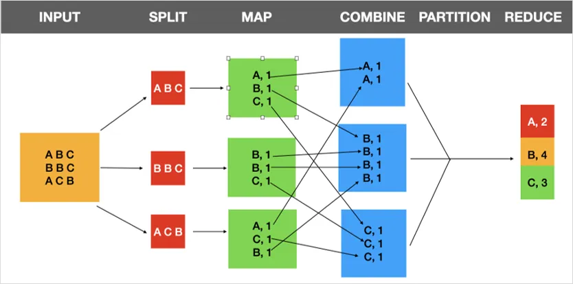

# Hadoop

## Introduction

**Hadoop** is an open-source software platform for
distributed storage and distributed processing for [big data][-big-data].
It consists of several components that work together to
load, process, and store big data.

## MapReduce

**`MapReduce`** is a core component of the Hadoop platform.
The main funtionality of MapReduce is to split large amounts of data into
smaller *chunks* and distribute the smaller *chunks* onto multiple *servers* for
massively parallel processing tasks.
The architecture allows splitting workloads into a massive number of smaller ones that
later get re-combined into singular data sets.

In technical terms MapReduce can split a petabyte,
*(i.e. $10^{15}$ bytes or 1,000 terabytes)*,
of data into chunks as small as 64 megabytes in size and
work on each chunk separately, potentially even in separate machines entirely.
For example,
suppose you have 10 000 *servers* and that each one of
them can process 256MB of data at a time.
If you are working with 5TB of data,
you could use MapReduce to distribute your data among the *servers* and
process all of the data simultaneously in a fraction of the time.

### How Does MapReduce Work?

The MapReduce algorithm contains two main functions:
the afforementioned **`map`** and **`reduce`** functions.

* The `Map` *function* takes a dataset and converts it into another dataset.
  * There individual elements are broken down into *key-value* pairs.
  * During this phase `input` data is split into smaller *blocks*.
    * Each *block* is assigned to the mapper for processing.
    * For example: 500 records to be processed, 500 mappers could be used simultaneously.
    * You could also use a single mapper for any number of records
    * The number of mappers is decided by Hadoop depending on data size and cluster size.
* The `Reduce task takes the output from the Map as an `input`.
  * It shuffles and sorts the data *key-value* pairs into smaller sets of *tuples*.
  * Naturally the `Reduce` task **is always performed after mapping is done**.

Between the `Map` and `Reduce` *functions*, there are two intermediate ones:
the `Combine` and `Partition` functions:

* `Combine` *functions* reduce the data on each mapper to a more simplified form.
  * This step is optional, as it depends on the complexity of the data.
* `Partition` *functions* translate the *key-value* pairs from the mapper to
a different set of *key-value* before feeding it to the reducer.
  * This step is important, as it decides how data will be represented.

The below diagram gives you an idea of how the MapReduce pipeline works,
architecturally speaking:



### MapReduce Example

As a simple example of how MapReduce works,
suppose your Hadoop framework is using three mappers:
`Mapper1`, `Mapper2`, and `Mapper3`.
You will also use the data in the previous diagram for this example.

To begin, the `input` value of each mapper is a record.
The mapper processes this record to produce *key-value* pairs so
the `output` of each mapper will be:

```txt
Mapper1 => <Student A, 1>, <Student B, 1>, <Student C, 1>
Mapper2 => <Student B, 1>, <Student B, 1>,<Student C, 1>
Mapper3 => <Student A, 1>, <Student C, 1>, <Student B, 1>
```

You will further assume that you have one combiner assigned to each mapper,
`Combiner1`, `Combiner2`, and `Combiner3`.
Each of these *combiners* will count each student in each mapper.
So the `output` of the combiners will be:

```txt
Combiner1 => <Student A, 1>, <Student B, 1>, <Student C, 1>
Combiner2 => <Student B, 2>, <Student C, 1>
Combiner3 => <Student A, 1>, <Student B, 1>, <Student C, 1>
```

AFter this phase,
the partitioner allocates and sorts the data for the reducers.
The `output` of the partitioner will be:

```txt
Partitioner1 => <Student A, 1>,{1,1}
Partitioner2 => <Student B, 1>,{1,2,1}
Partitioner3 => <Student C, 1>,{1,1,1}
```

If you chose not to use combiners, the `output` of the partitioner would be:

```txt
Partitioner1 => <Student A, 1>,{1,1}
Partitioner2 => <Student B, 1>,{1,1,1,1}
Partitioner3 => <Student C, 1>,{1,1,1}
```

Finally, the reducer can calculate the count for each student,
giving the following `output`:

```txt
Reducer1 => <Student A>{2}
Reducer2 => <Student B>{4}
Reducer3 => <Student C>{3}
```

## Deployment

Thanks to the EU's Horizon 2020 project, **Big Data Europe**,
offers open source resources to deploy [Big Data][-big-data] tools such as Hadoop.
This will help when deploying Hadoop on a cluster of machines or
a single development one.
This includes their [Hadoop Docker Container][-big-data-eu-docker-hadoop] which
can be used to deploy Hadoop on a single machine.

## References

### Web Links

* [Big Data Europe (from Github by Big Data Europe Project)][-big-data-eu]
* [Big Data Europe Hadoop Docker Container(from Github by Big Data Europe Project)][-big-data-eu-docker-hadoop]

<!-- Hidden References -->
[-big-data-eu]: https://github.com/big-data-europe/README "Big Data Europe (from Github by Big Data Europe Project)"
[-big-data-eu-docker-hadoop]: https://github.com/big-data-europe/docker-hadoop "Big Data Europe Hadoop Docker Container(from Github by Big Data Europe Project)"

### Note Links

* [Big Data][-big-data]

<!-- Hidden References -->
[-big-data]: big-data.md "Big Data"
