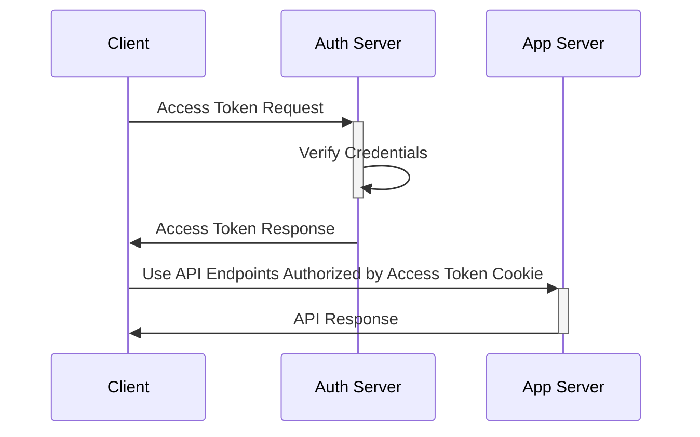
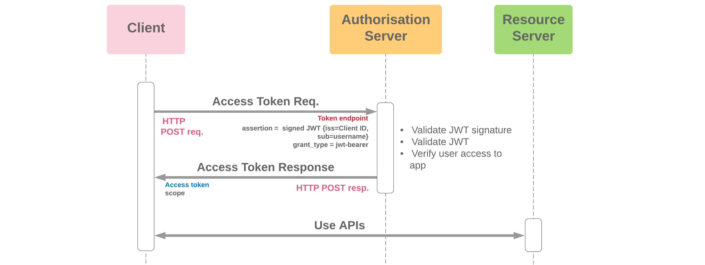

# JSON Web Tokens

## Introduction

>[**JSON**][-json] **Web Token**
>(**JWT**, pronounced /dʒɒt/, same as the word "jot"[1][rfc7519])
>is a proposed Internet standard for creating data with
>optional signature and/or optional encryption whose
>payload holds *JSON* that asserts some number of claims.
>The tokens are signed either using a private secret or a public/private key.
>
>-- [Wikipedia: JWT][jwt-wiki]:

## Architecture

## Architecture (tldr)

To implement a JWT, the following steps need to take place:

1. A user logs into a web application.
2. The server authenticates the user and sends a JWT back to the user.
3. The user can then send messages to the application server attached to
the generated JWT,
and the server will verify the user [(De Jongh 2019)][dejongh2019].

## Architecture In Detail

Conceptually, you can think of two servers being at play during
*JWT* authentication:

* The *Application Server*
* The *Authorization Server*

The *Application Server* is the server that hosts the application.
It will need some way to *authenticate and authorize* that
a user that's claiming it's logged in as an account really is who they claim.

So the first stage is for the *authorization server* to
receive a login request from the user.
The *authorization server* will take a username and password from the requesting user.
The password will be hashed and compared to the hash stored in the database with
the corresponding username, or user id tied to that username.

Then the *Authorization Server* will generate a *JWT* token.
That token will be signed with
an encrypted secret key that only the *Authorization Server* knows.
It will then send that token back to the user and the *application server*.

The user then keeps that token in the form of a [cookie][-cookie].
From now on,
all requests to the *Application Server* will include that cookie.



>***TODO***: This should be removed once mermaid diagrams work



## Deserialized vs. Serialized JWTs

There are two forms in which a JSON *token* can arrive.
The first is a deserialized *token* with just a header & payload.
The header of a deserialized *token* tells the *server* how
the JSON *token* was created and which decryption technique to use.
Most of the time,
the header will include two fields: the message type and the algorithm used.
The type is usually set to *JWT*,
and the algorithms used are most commonly HS256 or SH256 encryption
[(Neekhara 2019)][neekhara2019].
*JWT* deserialized *tokens* are useful in practice where
encryption isn't necessary and speed is the most desirable outcome,
as deserialized *tokens* do not need to be encrypted.
However, the header must always be present in a *JWT token*.

The *payload* of a JWT deserialized *token* holds the user data and
could consist of many fields,
such as user ID, IP address, or system information.
However, the *payload* of a deserialized JWT can be read by anyone,
so it is advisable to withhold any sensitive information from
your deserialized JWT *payload*.
The data within the JWT *payload* is known as a *claim*.
Both the deserialized header and *payload* are objects and
appear as such in code.
Parts of a deserialized *token* appear as follows.

Header:

```json
{
    "typ":"JWT",
    "algo":"SH256"
}
```

Payload:

```json
{
    "user_id":123,
    "iss":"John Doe",
    "sub":"/subDirectory",
    "Exp":"20212512"
}
```

JWT Serialized *tokens* have the additional benefit of signatures,
allowing the secure transfer of data from *client* to application.
For security purposes, in practice,
most JWT will have all three fields and therefore be serialized.
A serialized *token* has the header and *payload* hashed together just like
a deserialized JWT, as talked about above.
The header and *payload* are encoded using Base64URL and
separated by a period [(Neekhara 2019)][neekhara2019].
The signature is then appended onto the back of the encrypted message to
assure the data is delivered uncorrupted.
The serialized web *token* will consist of these three fields:

Header:

```json
{
    "typ":"JWT",
    "alg":"SH256"
}
```

*Payload*:

```json
{
    "user_id":"1234567-abc",
    "name":"bob",
    "iss":"https://myserver.com",
    "admin":true,
    "Exp":"20212512"
}
```

Signature: `myName` encoded

The encrypted *token* will be three *strings* separated by periods,
looking similar to this:

```txt
jsMCAFNidaT2cSknOSda.HkasXnPksHahYsaNQsdTl.PlWecsfaLhGGWBvAxZPLkNbt
```

>**Note**: In practice this *token* can be hundreds of characters depending on
>how much information the web application requests.

The following is an example of the structure of
the full JSON web application *token* architecture:

```python
token = SH256(f'{base64urlEncode(header)}.{base64urlEncode(payload)}.{secret}')
```

In practice,
a JWT is one layer of security on a system with many.
Normally,
web applications will also utilize SSL/TLS encryption,
so JWT authorization can sometimes be repetitive and add overhead.
Depending on the application implementation,
JSON web *tokens* should be utilized to assure user data is accurate and secure.

## References

### Web Links

* [JSON Web Token (from Wikipedia, the free encyclopedia)][jwt-wiki]
* [Jones, Michael B.; Bradley, Bradley; Sakimura, Sakimura (May 2015). JSON Web Token (JWT). IETF. doi:10.17487/RFC7519. ISSN 2070-1721. RFC 7519.][rfc7519]
* [Neekhara, Aman. “JSON Web Token JWT.” GeeksForGeeks. 2019. geeksforgeeks.org/json-web-token-jwt/.][neekhara2019]
* [De Jongh, Joris. “JWT Tutorial for Beginners.” Java Code Geeks. 2019. examples.javacodegeeks.com/enterprise-java/jwt-tutorial-for-beginners/.][dejongh2019]

<!-- Hidden References -->
[jwt-wiki]: https://en.wikipedia.org/wiki/JSON_Web_Token "JSON Web Token (from Wikipedia, the free encyclopedia)"
[rfc7519]: https://datatracker.ietf.org/doc/html/rfc7519 "RFC 7519 IETF"
[neekhara2019]: http://geeksforgeeks.org/json-web-token-jwt/ "JSON Web Token (JWT) - GeeksforGeeks"
[dejongh2019]: https://examples.javacodegeeks.com/enterprise-java/jwt-tutorial-for-beginners/ "JWT Tutorial for Beginners - Java Code Geeks"

### Note Links

* [JavaScript Object Notation (JSON)][-json]
* [Cookie (HTTP)][-cookie]

<!-- Hidden References -->
[-json]: json.md "JSON"
[-cookie]: cookie.md "Cookie (HTTP)"

### Footnotes

1. *Jones, Michael B.; Bradley, Bradley; Sakimura, Sakimura (May 2015).*
*JSON Web Token (JWT). IETF. doi:10.17487/RFC7519. ISSN 2070-1721. RFC 7519.*
