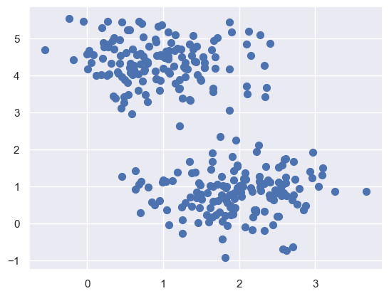
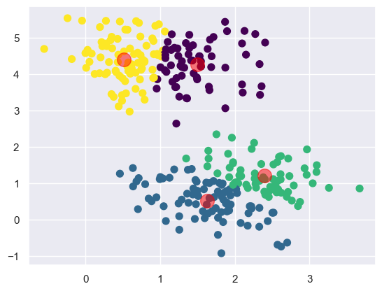
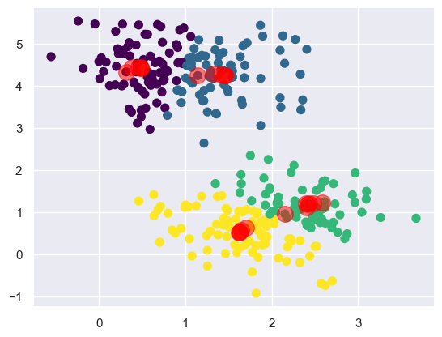
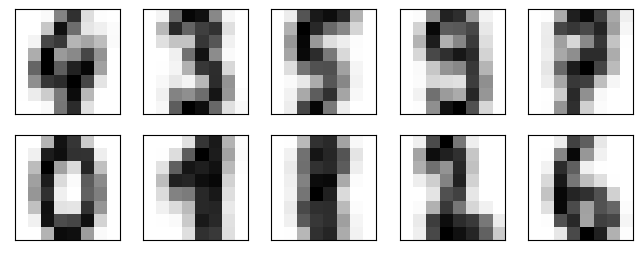
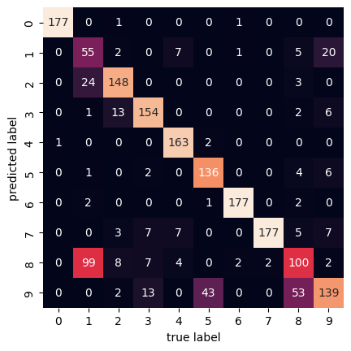

# K-Means Cluster

## Introduction

>**K-means clustering** is a method of [vector][-matrix] quantization,
>originally from signal processing, that aims to partition $n$ observations into
>$k$ *clusters* in which each observation belongs to the *cluster* with
>the nearest mean of the [data][-data]
>(*cluster* centers or *cluster* centroid), serving as a prototype of the *cluster*.
>
>-- [Wikipedia - K-Means Clustering (2023)][wiki-kmeans]

The K-Means Clustering [algorithm][-algo] is an *unsupervised*
[machine learning][-ml] algorithm that is used to identify *clusters* of
data points in a dataset.
There are many different types of clustering methods.
However, K-Means is one of the oldest and most approachable of these methods.
This makes the implementation of k-means clustering using the [Python][-py]
[SciKit-Learn][-sklearn] library a straightforward process.

## What is a Cluster?

**Clustering** is a set of techniques used to partition data into
groups or **clusters**.
**Clusters** can be defined as groups of data points that are more similar to
other data points in the same **cluster** than to data points in other **clusters**.

## Pseudo-Algorithm of K-Means Clustering

Understanding the details of the algorithm is a fundamental step in
the process of writing a k-means clustering pipeline.
Conventionally, the k-means algorithm is requires only these few steps:

1. Specify the number of *clusters* to assign.
2. Randomly specify the starting *centroids* for each *cluster*.
3. Assign the data points to their closest *centroid* *(expectation)*.
4. Calculate new *centroids* for each *cluster* *(maximization)*.
5. Repeat steps 3 and 4 until the *centroids* no longer move.

The core of the algorithm employs a two-step process called *expectation-maximization*.
The *expectation* step *(step 3)* assigns each data point to its nearest *centroid*.
Then, the *maximization* step *(step 4)* computes the mean of all the points for
each *cluster* and sets the new *centroid* to that mean.

## Importance of Standardizing Data

In the real world, datasets usually contain numerical features that
have been measured in different units.
For example, in the same dataset you could have height measurements taken in
inches and weights in pounds.

In this specific case,
a machine learning algorithm would consider weight more important than height
because the values for the weight have higher variability from person to person.
However, in order for the results to be as accurate as possible,
machine learning algorithms need to consider all features equally.
Thus, the values for all features must be transformed into
the same scale of measurement.

The process of transforming numerical features to use the same scale is known as
*feature scaling*.

There are several approaches to implementing *feature scaling*.
A great resource to determine which
technique is appropriate for your dataset is the
[SciKit-Learn Preprocessing Documentation][sklearn-preprocess].

Practically, you can standardize the features in your dataset by
instantiating the `StandardScaler` class from the `sklearn.preprocessing` module.
Then using the `fit_transform()` method to standardize the data.
The code below provides an example of how to standardize the features of a dataset.

```python
from sklearn.preprocessing import StandardScaler
scaler = StandardScaler()
scaled_features = scaler.fit_transform(features)
```

In the first line of code,
the `StandardScaler` class is imported from SciKit-Learn.
Next, you instantiate the class and assign it to a `scaler` variable.
Finally, assuming the features in your data are stored in variable `features`,
you invoke the `fit_transform()` method to standardize your data and
assign it to a variable called `scaled_features`.

## Choosing the Appropriate Number of Clusters

Using something known as the **elbow method** you can chose the appropriate
number of *clusters* for your dataset.

The optimal number of *clusters* can be decided in different ways.
A common method is based on the sum of the squared error (SSE) after
the positions of the centroids converge.
The SSE is defined as the sum of
the squared distances of each point $x_i$ to
its closes *centroid* $\bar{x}$.
Below is the formal definition of the SSE.

$$
SSE =
\sum_{i=1}^{n}
(x_i - \bar{x})^2
$$

Since this is a measure of error,
the objective of the k-means algorithm is to try to minimize this value.

Another method that is commonly used to evaluate the appropriate number of
*clusters* is the **elbow method**.
While a larger number of *clusters*, $k$,
can result in smaller SSE, at a certain $k$ value,
a decrease in performance occurs.
This is the **elbow**.

Therefore, the point where the SSE curve starts to bend, or the **elbow**,
is the point that defines the optimal number of *clusters*.

## Example Analysis Using K-Means Clustering in Python

The following example demonstrates how to use the k-means clustering algorithm
in Python to identify clusters of data points in a dataset.
To do this we'll start by making use of `sklearn.datasets` module to
generate a random dataset.
Then, we'll use the `matplotlib.pyplot` module to visualize the data.
Finally,
we'll use the `sklearn.cluster` module to perform the k-means clustering,
at the end a [matplotlib][-plt] is shown.

```python
%matplotlib inline
import matplotlib.pyplot as plt
import seaborn as sns; sns.set() # for plot styling
import numpy as np
from sklearn.datasets import make_blobs
X, y_true = make_blobs(n_samples=300, centers=4,
                       cluster_std=0.60, random_state=0)
plt.scatter(X[:, 0], X[:, 1], s=50);
```



Here we see a nice example of a dataset that is easily separable into
four clusters.
So going with that assumption, we'll use the `KMeans` class within `sklearn` to
cluster the data into four clusters.
Then we'll plot the data with the cluster centers highlighted.

```python
from sklearn.cluster import KMeans
kmeans = KMeans(n_clusters=4)
kmeans.fit(X)
y_kmeans = kmeans.predict(X)
plt.scatter(X[:, 0], X[:, 1], c=y_kmeans, s=50, cmap='viridis')

centers = kmeans.cluster_centers_
plt.scatter(centers[:, 0], centers[:, 1], c='black', s=200, alpha=0.5);
```



Now we see that the k-means algorithm has identified the four clusters of data.
It's clear that the centroids are visually in the center of each cluster.
We also see four groupings that seem to be well separated from each other.

This however, doesn't really help us visualize the algorithm at play.
We need to be able to track the history of the centroids as
they move around the dataset.
Below we'll create a custom function `find_clusters` that
will take a dataset `X`, number of clusters `n_clusters`, and
the random number generator seed `rseed` as parameters.
Then we'll manually perform the k-means algorithm and
plot the results with the moving centroids.

```python
from sklearn.metrics import pairwise_distances_argmin

def find_clusters(X, n_clusters, rseed=3):
    # 1. Randomly choose clusters
    rng = np.random.RandomState(rseed)
    # look up what this does, it's interesting
    i = rng.permutation(X.shape[0])[:n_clusters]
    print(i)
    centers = X[i]
    center_hist = centers
    while True:
        # 2a. Assign labels based on closest center
        labels = pairwise_distances_argmin(X, centers)
        # 2b. Find new centers from means of points
        new_centers = np.array([X[labels == i].mean(0)
                                for i in range(n_clusters)])
        # 2c. Check for convergence
        if np.all(centers == new_centers):
            break
        centers = new_centers
        # track movement of centers
        center_hist = np.vstack((center_hist, centers))
    return centers, labels, center_hist

centers, labels, center_hist = find_clusters(X, 4)
plt.scatter(X[:, 0], X[:, 1], c=labels,
            s=50, cmap='viridis');
plt.scatter(center_hist[:, 0], center_hist[:, 1], c='red', s=200, alpha=0.5);
```



Here we see the same cluster with the tracked history of the centroids.
The *centroids* start arbitrarily and then move around the dataset until
they converge on the final clusters.
It does so using the `sklearn.metrics.pairwise_distances_argmin` function.
You can read more about this function in
the [SciKit-Learn Documentation][sklearn-pairwise].
Basically, it finds the closest point in the dataset to the *centroid*.
Then it assigns that point to the *centroid*.
Then it finds the next closest point to the *centroid* and
tracks the history of every change in the *centroid* until
the *centroid* converges on the final cluster.

## Digit Recognition

### SKLearn Digits Dataset

There's a dataset that comes with `sklearn` that contains
a set of handwritten digits.
This is a very instructive dataset for K-Means clustering as
the algorithm can be effectively utilized to identify
handwritten digits with a decent amount of error tolerance.

Some information about the data:

* Size of each image is 8x8 pixels.
* Each pixel has a grayscale value between 0 and 15.
* Your goal is to find similar images and cluster them together.
* You need to have a metric of distance $D$ between two images $A$ and $B$.

### Implementing K-Means Handwritten Image Recognition

Here the `KMeans` class from `sklearn.cluster` is used to
cluster the images into 10 clusters.
One for each of the base 10 digits that are available in
the `sklearn.datasets.load_digits` dataset.

Start by importing the dataset and store them as `digits`.

```python
from sklearn.datasets import load_digits
digits = load_digits()
digits.data.shape
```

```text
(1797, 64)
```

The dataset contains 1797 images that are 8x8 pixels.
One of the goals is to *cluster* together similar images in 2D.
The concept of *Euclidean distance* to cluster points in 64D can be used here to
get the distance $D$ between two images $A$ and $B$.
This expands the 2D image to a 64D vector or tensor.

```python
from sklearn.cluster import KMeans
kmeans = KMeans(n_clusters=10, random_state=0)
clusters = kmeans.fit_predict(digits.data)
kmeans.cluster_centers_.shape
```

```text
(10, 64)
```

Here we create the KMeans clustering model *crucially* with
`n_clusters=10` as there are 10 digits in the dataset.
Then we use the `fit_predict` method to fit the model to the data and
return the cluster labels.
Finally, we can see that the `cluster_centers_` attribute is
a 10x64 matrix.

The shape tells us that there are 10 digits as expected and
each digit is represented by a 64D vector representing each
possible pixel value.
Let's see how the clusters look along with their centroids.

```python
import matplotlib.pyplot as plt
fig, ax = plt.subplots(2, 5, figsize=(8, 3))
centers = kmeans.cluster_centers_.reshape(10, 8, 8)
for axi, center in zip(ax.flat, centers):
    axi.set(xticks=[], yticks=[])
    axi.imshow(center, interpolation='nearest', cmap=plt.cm.binary)
```



Well look at that!
We see that the centroids are very similar to the actual digits' pixels.
This is because the centroids are the average of all the images in the cluster.
This means we get a rough average value for each digits' pixels.
The cluster knows nothing inherent about the shape of base 10 digits from
human arab numerals.
Yet it is able to cluster them together based on the average pixel values.

### Analyzing the Accuracy of the Digits Clusters

Let's apply the labels found by the `KMeans` model to
randomly select 10 images from the dataset and
give context to the clusters.

```python
import numpy as np
from scipy.stats import mode
labels = np.zeros_like(clusters)
for i in range(10):
    mask = (clusters == i)
    labels[mask] = mode(digits.target[mask])[0]
```

Running this makes the labels the same as the clusters.
This is because the clusters are randomly assigned.
So the labels are randomly assigned as well.
And we have a 10x10 matrix of labels.
Let's see how well the model did.

```python
from sklearn.metrics import accuracy_score
accuracy_score(digits.target, labels)
```

By using the `sklearn.metrics` module's `accuracy_score` function,
we can see that the model was able to cluster the images with
an accuracy of 79%.
Not bad for a model that knows nothing about the shape of digits.
However, to use this in a practical sense could be frustrating.
It's accurate enough to be useful,
but not accurate enough to be reliable,
which is the height of user frustration.

We can also evaluate the model using a [confusion matrix][-confused].
That can be setup using the `sklearn.metrics` module's
`confusion_matrix` function.
Then using `seaborn`'s `heatmap` function,
we can plot the confusion matrix in a pleasing way.

```python
from sklearn.metrics import confusion_matrix
import seaborn as sns
mat = confusion_matrix(digits.target, labels)
sns.heatmap(mat.T, square=True, annot=True, fmt='d', cbar=False,
            xticklabels=digits.target_names,
            yticklabels=digits.target_names)
plt.xlabel('true label')
plt.ylabel('predicted label');
```



Here the confusion matrix has a 10x10 shape because
there are 10 different digits being compared.
The horizontal axis represents actually true labels and
the vertical axis represents the predicted labels.
We see that out of the 1797 samples,
there are 100 `8` digits that were predicted to be `1` digits.
And vice versa, there are 99 `1` digits that were predicted to be `8` digits.
We can kind of see why that is by looking at the digits themselves.
The `1` and `8` digits are very similar in shape in
this dataset after clustering.

## References

### Web Links

* [Wikipedia. 'K-Means Clustering'. Accessed 2023-06-09.][wiki-kmeans]
* [SciKit-Learn. 'Preprocessing Documentation'. Accessed 2023-06-09.][sklearn-preprocess]
* [SciKit-Learn Documentation. 'Pairwise Distances'. Accessed 2023-06-09.][sklearn-pairwise]

<!-- Hidden References -->
[wiki-kmeans]: https://en.wikipedia.org/wiki/K-means_clustering "Wikipedia. 'K-Means Clustering'. Accessed 2023-06-09."
[sklearn-preprocess]: https://scikit-learn.org/stable/modules/preprocessing.html "SciKit-Learn. 'Preprocessing Documentation'. Accessed 2023-06-09."
[sklearn-pairwise]: https://scikit-learn.org/stable/modules/generated/sklearn.metrics.pairwise_distances.html "SciKit-Learn Documentation. 'Pairwise Distances'. Accessed 2023-06-09."

### Note Links

* [Vector][-matrix]
* [Data][-data]
* [Algorithm][-algo]
* [Machine Learning][-ml]
* [Python][-py]
* [SciKit-Learn][-sklearn]
* [Matplotlib][-plt]
* [Confusion Matrix (Machine Learning)][-confused]

<!-- Hidden References -->
[-matrix]: matrix.md "Matrix"
[-data]: data.md "Data"
[-algo]: algorithm.md "Algorithm"
[-ml]: machine-learning.md "Machine Learning"
[-py]: python.md "Python"
[-sklearn]: scikit-learn.md "SciKit-Learn"
[-plt]: matplotlib.md "Matplotlib"
[-confused]: confusion-matrix.md "Confusion Matrix (Machine Learning)"
