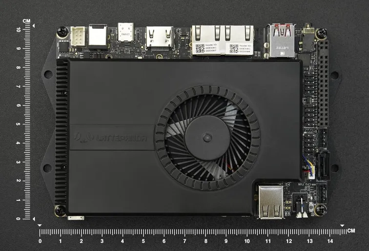
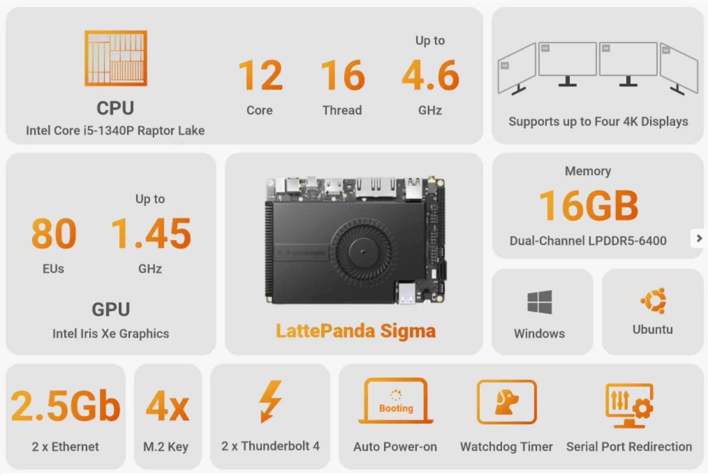
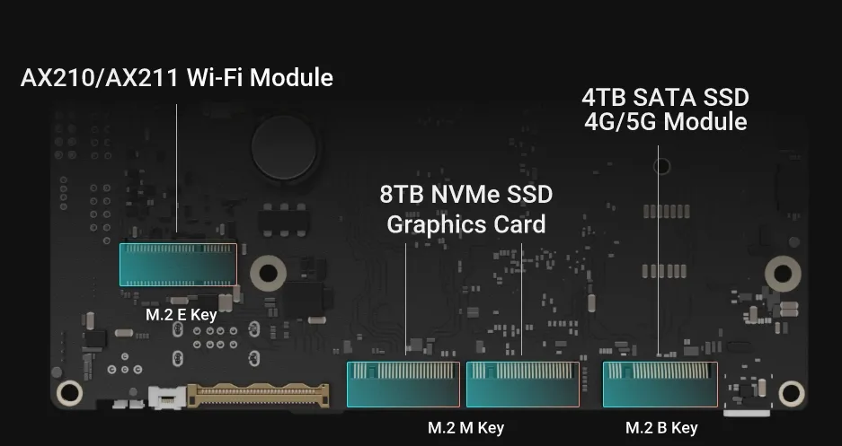
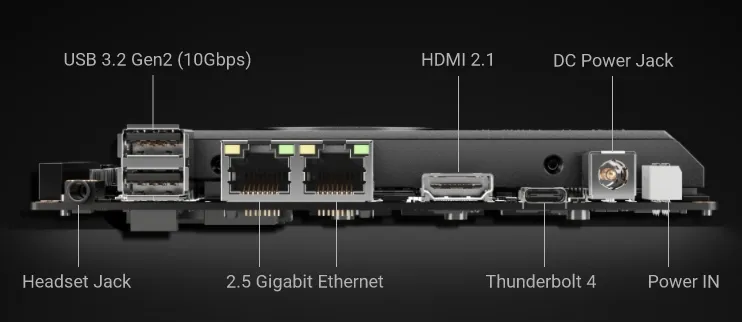
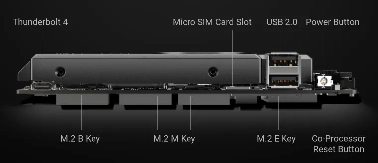

# LattePanda Sigma

## Introduction

Lattepanda makes single board computers that stand out from
the usual Raspberry Pi clones in a few ways.
Powered by Intel processors,
they support major operating systems including [linux][-linux].
[This is the most powerful yet][lattepanda-sigma-home],
[starting at $580][lattepanda-sigma-dfrobot].

## Specifications

### System on Chip

* Intel Core Intel Core i5-1340P Raptor Lake
  * 4 Performance Cores, 8 Threads - 4.6GHz (Max Turbo)
  * 8 Efficiency Cores, 8 Threads - 3.4GHz (Max Turbo)
  * 12MB Intel Smart Cache
  * 28W Base TDP, 40W Configurable TDP, 64W Max Turbo TDP (Instantaneous)
* Intel Xe Graphics
  * 80 Execution Units
* 16GB LPDDR5 6400MHz RAM

### High Speed I/O

* PCIe 4.0 x4 M.2 M-Key 2280 Slot
* PCIe 3.0 x4 M.2 M-Key 2280 Slot
* M.2 B Key 2280 Slot (Storage, Cellular)
* M.2 E Key 2230 Slot (WiFi, Bluetooth)

### Low Speed I/O

* 2 x Thunderbolt 4 (40Gbps) Ports
* 2 x USB 3.2 Gen 2 (10Gbps) Ports
* 2 x USB 2.0 Ports (480Mbps)
* 2 x 2.5Gb Ethernet Ports
* 1 x HDMI 2.1 Port
* 1 x 3.5mm Audio Jack
* TPM 2.0
* ATMega 32U4 Microcontroller (Coprocessor hooked up to GPIO)
* 20 pin GPIO header
* 146 x 102 x 26mm (5.75 x 4.02 x 1.02in)

## Uses

### Roaming Server/Router/HTPC

I could really use a small, efficient and relatively powerful computer that
can act as the WiFi router, selfhost server, large media server,
development server and HTPC.
This could fill that role.
There is however **one caveat** it's actually a bit larger than most NUC boards.
Though it is still thin because the whole board surface is covered by a cooler.
But those NUCs will need an extra ethernet port and WiFi slot.
Also they don't have multiple M.2 slots for storage.

It will have an expansion bay 3d printed for it to hold a single 3.5" HDD.
This means it will act as a backup of the home server.
It will then also be accessible without internet access as you take it with you.
It will have a [*"AP-mode"* WiFi card][wle600vx-wifi-teklager] in the M.2 E slot.
This way you can set up hotel WiFi to be routed through the ethernet ports.
It has enough CPU power to be an ample development server,
even while running some constant selfhosted services that are containerized.
It can act as a HTPC with the HDMI port.

When at home it can sit at the office and keep a separate copy of the home server.
Again, its power can be used to make it a worthy development server.
Hell it could even stay at the office and you'd only need an input device to do work on.
Potentially even an iPad could be the work device,
while development takes place on the server through the iPad.

## References

### Web Links

* [LattePanda Sigma (from lattepanda.com)][lattepanda-sigma-home]
* [LattePanda Sigma (from dfrobot.com)][lattepanda-sigma-dfrobot]
* [WLE600vx WiFi Kit][wle600vx-wifi-teklager]

<!-- Hidden References -->
[lattepanda-sigma-home]: https://www.lattepanda.com/lattepanda-sigma "LattePanda Sigma (from lattepanda.com)"
[lattepanda-sigma-dfrobot]: https://www.dfrobot.com/product-2671.html?tracking=64474d2e241f4 "LattePanda Sigma (from dfrobot.com)"
[wle600vx-wifi-teklager]: https://teklager.se/en/products/router-components/wle600vx-wireless-wifi-kit "WLE600VX WiFi Kit (from teklager.se)"

### Note Links

* [Linux][-linux]
<!-- Hidden References -->
[-linux]: linux.md "Linux"
