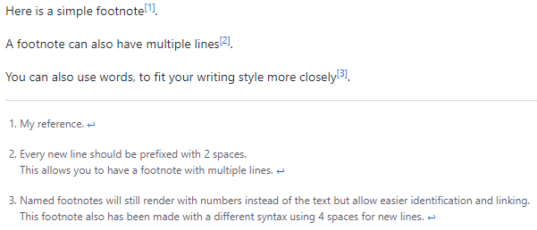

# Markdown

## What is Markdown?

Web pages contain documents that are annotated & formatted to
provide content that is visually appealing to help the reader connect with
the information on the web page.
Markup language offers the capability of adding features to the text,
such as headings, images, lists, and links to the other content,
that make the text more appealing and easier to read.

## How to Write Markdown Syntax

Below is a series of examples of how to write Markdown syntax.
Note that for some examples,
you are also provided with the equivalent HTML tags.
This is because markdown is meant to
have syntax that is a subset of [HTML][html-zk].
So some *markdown* syntax will
have directly corresponding [HTML][html-zk] syntax.

### Headings

Using the hash-sign or `#` repeated 1 to 6 times consecutively corresponds to
an [HTML][html-zk] `<h1>` to `<h6>` tag,
depending on the number of hash-marks are strung together.

```markdown
# Heading Level 1
## Heading Level 2
### Heading Level 3
#### Heading Level 4
##### Heading Level 5
###### Heading Level 6
```

The above markdown snippet will get transformed to the below [html][html-zk].

```html
<h1>Heading Level 1<h1>
<h2>Heading Level 2<h2>
<h3>Heading Level 3<h3>
<h4>Heading Level 4<h4>
<h5>Heading Level 5<h5>
<h6>Heading Level 6<h6>
```

### Emphasis

There are effectively 4 kinds of text emphasis:
*italics*, **bold**, ***combined bold-italic***, ~~strike-through~~.

```markdown
Emphasis, aka italics, with *asterisks* or _underscores_.

Strong emphasis, aka bold, with **asterisks** or __underscores__.

Combined emphasis with **asterisks and _underscores_**.

Strike-through uses two tildes. ~~Scratch this.~~
```

This will produce the below blockquotes.

>Emphasis, aka italics, with *asterisks* or *underscores*.
>Strong emphasis, aka bold, with **asterisks** or **underscores**.
>Combined emphasis with ***asterisks*** and ***underscores***.
>Strike-through uses two tildes. ~~Scratch this.~~

Which also corresponds of course to some [html syntax like below][html-zk]:

```html
Emphasis, aka italics, with <i>asterisks</i> or <i>underscores</i>.

Strong emphasis, aka bold, with <b>asterisks</b> or <b>underscores</b>.

Combined emphasis with <b><i>asterisks and underscores</i></b>.

Strike-through uses two tildes. <strike>Scratch this.</strike>
```

### Lists

Lists are really useful to show ordered and unordered collections of ideas.
Markdown has syntax to handle both ordered and
unordered lists to wrap list collections in.

*(In this example, leading and trailing spaces are shown with with dots: ⋅)...*

```txt
1. First ordered list item
2. Another item
⋅⋅* Unordered sub-list. 
1. Actual numbers don't matter, just that it's a number
⋅⋅1. Ordered sub-list
4. And another item.

⋅⋅⋅You can have properly indented paragraphs within list items.
Notice the blank line above, and the leading spaces
(at least one, but we'll use three here to also align the raw Markdown).

⋅⋅⋅To have a line break without a paragraph, you will need to use two trailing spaces.⋅⋅
⋅⋅⋅Note that this line is separate, but within the same paragraph.⋅⋅
⋅⋅⋅(This is contrary to the typical GFM line break behaviour, where trailing spaces are not required.)

* Unordered list can use asterisks
- Or minuses
+ Or pluses
```

Which produces this text below

**--Start of example markdown formatted text results--.**

1. First ordered list item
2. Another item

* Unordered sub-list.

1. Actual numbers don't matter, just that it's a number
2. Ordered sub-list
3. And another item.
You can have properly indented paragraphs within list items.
Notice the blank line above, and the leading spaces
(at least one, but we'll use three here to also align the raw Markdown).
To have a line break without a paragraph,
you will need to use two trailing spaces.
Note that this line is separate, but within the same paragraph.
(This is contrary to the typical GFM line break behaviour,
where trailing spaces are not required.)

* Unordered list can use asterisks
* Or minuses
* Or pluses

**--End of example markdown formatting--.**

### Links

There are two ways to create links.

```txt
[I'm an inline-style link](https://www.google.com)

[I'm an inline-style link with title](https://www.google.com)

[I'm a reference-style link][Arbitrary case-insensitive reference text]

NOTE THAT THIS IS WHATS IN THE PARENTHESES DOING THIS IN MD IS HARD ../blob/master/LICENSE
[I'm a relative reference to a repository file]()

[You can use numbers for reference-style link definitions][1]

Or leave it empty and use the [link text itself].

URLs and URLs in angle brackets will automatically get turned into links. 
http://www.example.com or <http://www.example.com> and sometimes 
example.com (but not on Github, for example).

Some text to show that the reference links can follow later.

[arbitrary case-insensitive reference text]: https://www.mozilla.org
[1]: http://slashdot.org
[link text itself]: http://www.reddit.com
```

Which results in these links:

[I'm an inline-style link](https://www.google.com)

[I'm an inline-style link with title](https://www.google.com)

[I'm a reference-style link][Arbitrary case-insensitive reference text]

[I'm a relative reference to a repository file](https://google.com)

[You can use numbers for reference-style link definitions][1]

Or leave it empty and use the [link text itself].

URLs and URLs in angle brackets will automatically get turned into links.
<http://www.example.com> or <http://www.example.com> and sometimes
example.com (but not on Github, for example).

Some text to show that the reference links can follow later.

[arbitrary case-insensitive reference text]: https://www.mozilla.org
[1]: http://slashdot.org
[link text itself]: http://www.reddit.com

### Images

```txt
Here's our logo (hover to see the title text):

Inline-style: 


Reference-style: 
![alt text][logo]

[logo]: https://github.com/adam-p/markdown-here/raw/master/src/common/images/icon48.png
"Logo Title Text 2"
```

Here's our logo (hover to see the title text):

Inline-style:


Reference-style:
![alt text][logo]

[logo]: https://github.com/adam-p/markdown-here/raw/master/src/common/images/icon48.png
"Logo Title Text 2"

### Code and Syntax Highlighting

Code blocks are part of the Markdown spec,
but syntax highlighting isn't.
However, many renderers -- like Github's and Markdown Here --
support syntax highlighting.
Which languages are supported and
how those language names should be written will vary from renderer to renderer.
Markdown Here supports highlighting for dozens of languages
(and not-really-languages, like diffs and HTTP headers);
to see the complete list, and how to write the language names,
see the [highlight.js](http://softwaremaniacs.org/media/soft/highlight/test.html)
demo page.

```txt
Inline `code` has `back-ticks around` it.
```

Inline `code` has `back-ticks` around it.

Blocks of code are either fenced by lines with three back-ticks `\`\`\``,
or are indented with four spaces.
I recommend only using the fenced code blocks --
they're easier and only they support syntax highlighting.

```txt
```javascript
var s = "JavaScript syntax highlighting";
alert(s);
`` 
 
```python
s = "Python syntax highlighting"
print s
``
 
``
No language indicated, so no syntax highlighting. 
But let's throw in a <b>tag</b>.
``
```

### Footnotes

Footnotes aren't part of the core Markdown spec, but they
[supported by GFM](https://docs.github.com/en/get-started/writing-on-github/getting-started-with-writing-and-formatting-on-github/basic-writing-and-formatting-syntax#footnotes).

```txt
Here is a simple footnote[^1].

A footnote can also have multiple lines[^2].  

You can also use words, to fit your writing style more closely[^note].

[^1]: My reference.
[^2]: Every new line should be prefixed with 2 spaces.  
  This allows you to have a footnote with multiple lines.
[^note]:
    Named footnotes will still render with numbers instead of
the text but allow easier identification and linking.  
This footnote also has been made with a different syntax using 4 spaces for new lines.
```

Which renders to:



### Tables

Tables aren't part of the core Markdown spec,
but they are part of GFM and Markdown Here supports them.
They are an easy way of adding tables to your email --
a task that would otherwise require copy-pasting from another application.

```txt
Colons can be used to align columns.

| Tables        | Are           | Cool  |
| ------------- |:-------------:| -----:|
| col 3 is      | right-aligned | $1600 |
| col 2 is      | centered      |   $12 |
| zebra stripes | are neat      |    $1 |

There must be at least 3 dashes separating each header cell.
The outer pipes (|) are optional, and you don't need to make the 
raw Markdown line up prettily. You can also use inline Markdown.

Markdown | Less | Pretty
--- | --- | ---
*Still* | `renders` | **nicely**
1 | 2 | 3
```

Colons can be used to align columns.

| Tables        | Are           | Cool  |
| ------------- |:-------------:| -----:|
| col 3 is      | right-aligned | $1600 |
| col 2 is      | centered      |   $12 |
| zebra stripes | are neat      |    $1 |

There must be at least 3 dashes separating each header cell.
The outer pipes (|) are optional, and you don't need to make the
raw Markdown line up prettily. You can also use inline Markdown.

Markdown | Less | Pretty
--- | --- | ---
*Still* | `renders` | **nicely**
1 | 2 | 3

## Blockquote

```txt
> Blockquotes are very handy in email to emulate reply text.
> This line is part of the same quote.

Quote break.

> This is a very long line that will still be quoted properly when it wraps.
>Oh boy let's keep writing to make sure this is long enough to actually wrap for everyone.
>Oh, you can *put* **Markdown** into a blockquote. 
```

Results in:

> Blockquotes are very handy in email to emulate reply text.
> This line is part of the same quote.

Quote break.

> This is a very long line that will still be quoted properly when it wraps.
>Oh boy let's keep writing to make sure this is long enough to actually wrap for everyone.
>Oh, you can *put* **Markdown** into a blockquote.

### Inline HTML

You can also use raw [HTML][html-zk] in your Markdown,
and it'll mostly work pretty well.

```html
<dl>
  <dt>Definition list</dt>
  <dd>Is something people use sometimes.</dd>

  <dt>Markdown in HTML</dt>
  <dd>Does *not* work **very** well. Use HTML <em>tags</em>.</dd>
</dl>
```

<dl>
  <dt>Definition list</dt>
  <dd>Is something people use sometimes.</dd>

  <dt>Markdown in HTML</dt>
  <dd>Does *not* work **very** well. Use HTML <em>tags</em>.</dd>
</dl>

### Horizontal Rule

```txt
Three or more...

---

Hyphens

***

Asterisks

___

Underscores
```

Three or more...

---

Hyphens

---

Asterisks

---

Underscores

### YouTube/Video Links

They can't be added directly
but you can add an image with
a link to the video like this:

```txt
<a href="http://www.youtube.com/watch?feature=player_embedded&v=YOUTUBE_VIDEO_ID_HERE
" target="_blank"></a>
```

Or, in pure Markdown, but losing the image sizing and border:

```txt
[](http://www.youtube.com/watch?v=YOUTUBE_VIDEO_ID_HERE)
```

## References

### Web Links

<!-- Hidden References -->

### Note Links

* [HTML: HyperText Markup Language][html-zk]

<!-- Hidden References -->
[html-zk]: ./html.md "HTML: HyperText Markup Language"
