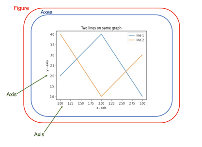
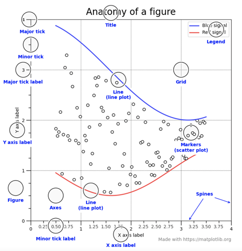
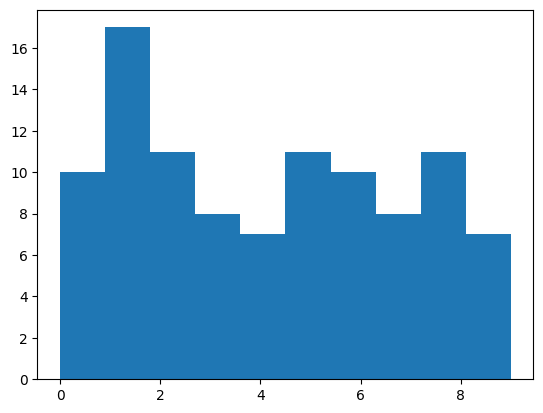

# Matplotlib: Python Plotting Library

## Introduction

Graphics are really important in data science.
So a useful library to know is **matplotlib**.

>**Matplotlib** is a plotting library for the [Python programming language][py-zk]
>and its [numerical mathematics extension NumPy][numpy-zk].
>It provides an object-oriented API for embedding plots into applications using
>general-purpose GUI toolkits like Tkinter, wxPython, Qt, or GTK.

## Install

To install matplotlib, use the following command:

```sh
pip install matplotlib
# or python 3
pip3 install matplotlib
```

Then import the module using the following command:

```python
import matplotlib.pyplot as plt
```

or if you want the whole library:

```python
import matplotlib as mpl
```

>**Note:** the `plt` is a common alias for the `matplotlib.pyplot` module.
>The same is true for `mpl` for the root module `matplotlib`.

## Basics

### Why is Plotting Important?

Data visualization & plotting is the discipline of understanding and
detecting underlying patterns,
*properties* and trends in data using visual representations.

### What is Matplotlib?

Matplotlib is a library for producing publication-quality figures.
Matplotlib was initially designed by John D. Hunter in 2003 to serve two purposes:

1. Allow for interactive, cross-platform control of figures and plots.
2. Produce static graphics files easily without a graphical user interface (GUI).

Matplotlib, much like [python][py-zk] itself,
gives users complete control over the appearance of their *plots* while
also offering a powerful default system.

### Matplotlib Object Hierarchy

One important big-picture matplotlib concept is its object hierarchy.

As seen before, a basic plot can be created using the `plot` function.

This one-liner hides the fact that a *plot* is really a hierarchy of
nested [Python][py-zk] objects.
A hierarchy means that there is a tree-like structure of
*Matplotlib* objects underlying each *plot*.



The matplotlib diagram above consists of a number of components.

>"A figure object is the outermost container for a Maplotlib graphic,
>which can contain multiple axes objects.
>You can think of the *Figure* object as
>a box-like container holding one or more *Axes* objects (actual *plots*).
>Below the axes in the hierarchy are smaller objects such as
>the actual **Y** and **X** axis of a plot,
>individual lines, legends, and text boxes" (Solomon, 2021).

Almost every element of a chart can be customized in Python as an object.

### Elements in a Plot

As mentioned,
Matplotlib graphics can contain many elements that one can customize,
depending on whatever particular need.

The figure below includes an extensive showcase of the elements in a *plot*.



In the figure above,

* Title denotes the title of the *plot*.
* Grid sets the visibility of a grid on the *plot*.
* The **X** and **Y** axis labels denote the labels of the respective axes.
* Spines are lines noting the data area boundaries.
* Ticks are markers denoting the data points on that axis.
* Tick labels refer to the value of the data points on the axis.
* Legend denotes the legend of the *plot*, describing what the *plot* shows.

## Subplots

The `subplot` function is used to create multiple plots in a single figure.
It returns a `Figure` object and a list of `Axes` objects.
Commonly these are named `fig` and `ax` respectively.

```python
import matplotlib.pyplot as plt
fig, ax = plt.subplots()
```

From here you can perform all kinds of customizations to the plot.
So let's generate some data using [`numpy.random`][numpy-zk] and plot it.

```python
import matplotlib.pyplot as plt
import numpy as np
np.random.seed(0)
fig, ax = plt.subplots()
ax.plot(np.random.rand(20))
ax.set_title('First Graph')
plt.show()
```

***TODO add plots when CMS/Object store is ready***

You can also create multiple subplots in a single figure.

```python
n_rows = 2
n_cols = 2
fig, ax = plt.subplots(n_rows, n_cols, figsize=(10, 10))
for row_num in range(n_rows):
    for col_num in range(n_cols):
        a = ax[row_num][col_num]
        a.plot(np.random.rand(20))
        a.set_title(f'Plot ({row_num + 1}, {col_num + 1})')
fig.suptitle('Main Title')
fig.tight_layout()
plt.show()
```

By assigning indices to the `ax` object, you can access each subplot individually.
Here by using both a inner and outer list,
you can arrange subplots in a grid.

Of note is the `figsize` parameter.
This is used to specify the size of the figure.
The `figure.suptitle` method is used to set the title of the figure.
And the `figure.tight_layout` method is used to automatically adjust the

Crucially for almost any usecase of **matplotlib**,
the `plt.show()` function must be called to display the plot.

## Types of Plots

### Line Plots

A *line plot* is a *plot* that displays information as
a series of data points called *"markers"* connected by straight line segments.
Line graphs are used to track changes over a period of time or sequence, like distance.
They can also compare data sets over the same independent variable,
normally represented in the **X** axis.

#### In a Line Plot

* The **X** axis represents the independent or quantitative variable.
* The **Y** axis represents the dependent or qualitative variable.
  * Can be interpretted as decimals, percentages, currency, etc.
* Variables have contiguous values.
* The data is ordered.

#### Line Plots in Matplotlib

To create a line plot in matplotlib,
use the `ax.plot` method (Matplotlib 2021).

For example:

```python
import matplotlib.pyplot as plt
import numpy as np
fig = plt.figure()
ax = fig.axes()

x = np.linspace(0, 10, 1000)
ax.plot(x, np.sin(x))
```

***TODO: add plot when CMS/Object store is ready***

### Bar Plots

A *bar plot* is a *plot* that displays information as a relationship between
a numeric and a categorical variable, or *ordinal* variable.
Each entity of the *categorical* variable is represented by a bar.
The size of the bar is proportional to the value of the *numeric* variable.

* Like line charts,
bar graphs are used to compare data between different groups or track changes over time.
* Bar graphs can display multiple groups of data at once in the same bar.
  * This can be a stacked visual that shows the graph's composition along the **Y** axis.

In Matplotlib, the `bar()` function is used to create bar *plots* (Matplotlib 2021).

The parameters to be used with the axes object of the `bar()` function are as follows:

```python
bar(x, height, width, bottom, aligh)
```

This example shows how to create a *bar plot* using the `bar()` function.

```python
# Use pyplot for our plotting constructs
import matplotlib.pyplot as plt

# Define the dataset
courses = ['Data Science', 'Python', 'R', 'Statistics', 'Machine Learning']
students = [30, 45, 8, 25, 38]

# Create a figure to draw on
fig = plt.figure()
ax = fig.add_axes([0, 0, 1, 1])
# Add the bar chart to the subplot
ax.bar(courses, students)
plt.xlabel('Courses')
plt.ylabel('Enrolled Students')
plt.title('Student Enrollment by Course')
```

***TODO: add plot when CMS/Object store is ready***

### Scatter Plots

A *scatter plot* is used to determine relationships between
two different data dimensions.
In a *scatter plot*, the **X**-axis is used to measure one dimension (or variable),
and the **Y**-axis is used to measure the other.
If both variables increase at the same time, they have a positive relationship.
If one variable decreases while the other increases,
they have a negative relationship.
Sometimes, the variables don't follow any pattern and have no relationship.

In *Matplotlib*,
use the `scatter()` function to create scatter plots (Matplotlib 2021).

The parameters to be used with
the axes object of the `scatter()` function are as follows:

```python
scatter(x_coords, y_coords, shape, colors, alpha)
```

The example below shows how to create a scatter plot in Matplotlib:

```python
import matplotlib.pyplot as plt
import numpy as np
# Create data
N = 500 # Create 500 random numbers
x = np.random.rand(N)
y = np.random.rand(N)

# Create the scatter plot using the scatter function
plt.scatter(x, y, c='g', alpha=1)
plt.title('Scatter plot using Matplotlib')
plt.xlabel('x-axis')
plt.ylabel('y-label')
```

***TODO: add plot when CMS/Object store is ready***

### Histograms

Say you have a list of randomly chosen numbers, perhaps chosen using numpy,
how would you want to visually inspect the distribution?
Histograms are the best way to plot this relationship.

Histograms are concerned with the outcomes of [random variables][prob-randvar-zk].
They examine the distribution of possible outcomes of
a single random variable.
To learn more read the previously linked notes on the theory,
in the more broad [probability theory notes][prob-zk].

To do this, we will use the `hist` function from the `matplotlib.pyplot` module.
After generating a list of random numbers, we can plot a histogram of
the distribution of the randomly chosen numbers.

```python
# Data as sampling from an unseen population
# Choose at random from 0 through 9
import numpy as np
import matplotlib.pyplot as plt
# np.random.seed(69)

a = np.random.choice(np.arange(0, 10), 100)
plt.hist(a, bins=10)
```

This simply chooses 100 random numbers from 0 through 9, and plots a histogram.
The `bins` parameter specifies the number of bins to use in the histogram.
The resulting chart looks like this:



#### Bins

One of the most important decisions made when
creating histograms is the number of **bins** to use.
The number of bins is a tradeoff between
the amount of detail in the histogram
and the amount of information lost due to *binning*.

In matplotlib, the number of bins is specified using the `bins` parameter,
as was seen before.
It can however be specified in a number of different ways.
Such as: a numpy or python `range` object, or a list of bin edges.
The below code is just as valid and produces bins 0 through 10 inclusive.

```python
plt.hist(a, bins=np.arange(0, 11))
```

Each bin tells us how many times a value fell within that bin.
Since this is random set of 100 numbers,
the number represented by each bin above is actually a percentage of the total.

#### Problem of Bin Size

A lot of tweaking is involved in choosing the right number of bins.
The number of bins is a tradeoff between the amount of detail in the histogram
and the amount of information lost due to *binning*.

To read more about it, [allaboutcircuits.com has a great article][normal-dist-hists-circuits]
on histograms in general and on the problem of bin size.
And [here is a great interactive tool][bin-size-tool] to
help you visualize the problem and
get a feel for how to choose the right number of bins.

***TODO: Add more details on the problem of bin size in probability.md***

But to summarize:

* Each bin with at least one value in it is called a **bin with mass**.
* There should be no bins with no mass between bins with mass.
* Generally, histograms show somewhat Gaussian distributions.
  * Therefore the bins should follow that general shape.

## References

### Web Links

* [Matplotlib Homepage][matplotlib.org]
* [Matplotlib (from Wikipedia, the free encyclopedia)][matplotlib-wiki]
* [Example Gallery (from matplotlib.org)][matplotlib-ex-gallery]
* [API Documentation (from matplotlib.org)][matplotlib-api-docs]
* [Matplotlib. "Anatomy of a Figure." Matplotlib. 2021][matplotlib-showcase]
* [Solomon, Brad. "Python Plotting with Matplotlib". RealPython. 2021][matplotlib-guide-realpy]
* [Tutorials (from matplotlib.org)][matplotlib-tutorials]
* [Probability Density Function (from probabilitycourse.com)][intro-prob-density]
* [The Normal Distribution: Histograms & Probability (from allaboutcircuits.com by Robert Keim)][normal-dist-hists-circuits]
* [Interactive Histogram Bin Sizing Learning Tool][bin-size-tool]

<!-- Hidden References -->
[matplotlib.org]: http://matplotlib.org/ "Matplotlib Homepage"
[matplotlib-wiki]: https://en.wikipedia.org/wiki/Matplotlib "Matplotlib (from Wikipedia, the free encyclopedia)"
[matplotlib-ex-gallery]: https://matplotlib.org/stable/gallery/index.html "Example Gallery (from matplotlib.org)"
[matplotlib-api-docs]: https://matplotlib.org/stable/api/index.html "API Documentation (from matplotlib.org)"
[matplotlib-showcase]: https://matplotlib.org/stable/gallery/showcase/anatomy.html "Matplotlib. \"Anatomy of a Figure.\" Matplotlib. 2021"
[matplotlib-guide-realpy]: https://realpython.com/python-matplotlib-guide/ "Solomon, Brad. \"Python Plotting with Matplotlib\". RealPython. 2021"
[matplotlib-tutorials]: https://matplotlib.org/stable/tutorials/index.html "Tutorials (from matplotlib.org)"
[intro-prob-density]: https://www.probabilitycourse.com/chapter4/4_1_1_pdf.php "Probability Density Function (from probabilitycourse.com)"
[normal-dist-hists-circuits]: https://www.allaboutcircuits.com/technical-articles/normal-distribution-understanding-histograms-probability/ "The Normal Distribution: Understanding Histograms & Probability (from allaboutcircuits.com by Robert Keim)"
[bin-size-tool]: http://www.shodor.org/interactivate/activities/Histogram/ "Interactive Histogram Bin Sizing Learning Tool"

### Note Links

* [Python][py-zk]
* [NumPy: Numerical Python][numpy-zk]
* [Probability][prob-zk]
* [Probability: Random Variables][prob-randvar-zk]

<!-- Hidden References -->
[py-zk]: ./python.md "Python"
[numpy-zk]: ./numpy.md "NumPy: Numerical Python"
[prob-zk]: ./probability.md "Probability"
[prob-randvar-zk]: ./probability.md#random-variables "Probability: Random Variables"
