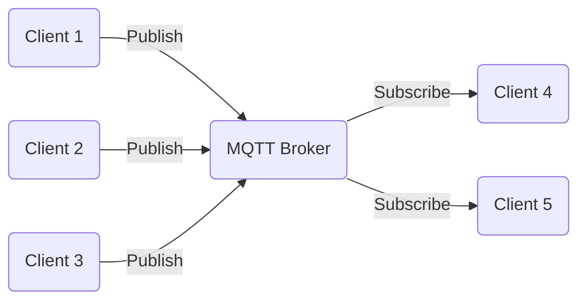

# Message Queue Telemetry Transport (MQTT)

## Introduction

>**MQTT** (originally an initialism of **MQ Telemetry Transport**)
>is a lightweight, [publish-subscribe][-pub-sub],
>machine to machine network protocol for
>[message queue/message queuing service][-mq].
>It is designed for connections with remote locations that have devices with
>resource constraints or limited network bandwidth,
>such as in the Internet of Things (IoT).
>It must run over a transport protocol that provides ordered, lossless,
>bi-directional connections—typically, [TCP/IP][-tcp-ip],
>but also possibly over QUIC.
>It is an open OASIS standard and an ISO recommendation (**ISO/IEC 20922**).
>
>--[(Wikipedia 2023)][wiki-mqtt]

Many objects, such as cars, kitchen appliances, thermostats, and watches,
can be connected to the internet to provide an endless stream of data that
needs to be processed.
The [HTTP protocol][-http] is not appropriate for handling this kind of data because
it is not in a *request-response* format.

## Basic Concepts

The **MQTT** protocol follows a *publish-subscribe* model in which
a message is *published* to a *topic* and is immediately received by all of
the *subscribers* to that *topic*.
In other words, *topics* are used by the *broker* to send messages to all of
the *clients* and to filter any message received by the *clients*.

*Clients* can *publish* data to the *broker*.
*Clients* can also *subscribe* to *topics* and
the *broker* will send data to them when the *broker* receives data about that *topic*.
The *broker* is responsible for receiving all of the messages and determining which
*clients* are *subscribed* to each message.
The *broker* then sends the message to the *subscribed* clients.

## Architecture

The architecture of MQTT is made of the *publish* and *subscribe* connections between
the *client* and the *broker*.
As you can see in the image below,
the MQTT *broker* is at the center of the architecture,
surrounded by various *clients* that can *publish* or *subscribe* to that *broker*.

## Implementations of MQTT Protocol

### Mosquitto

>**Note:** See the [notes on mosquitto][-mosq] for more details.

Eclipse Mosquitto is the broker that handles the messages passed by IoT devices to
the *MQTT* protocol using a *publish-subscribe* model.
See the [notes on the publish-subscribe pattern][-pub-sub] for more details.
Publishers send a message and subscribers receive the message via the broker.
Messages are sent to message brokers,
who are responsible for routing the messages to any clients that
subscribed to the associated publishers.

### Python

In [Python][-py] the [Paho library][-paho] implements the MQTT protocol to
connect to a MQTT broker.
This includes *publish* and *subscription* connections.

### Firebase

>**Note:** For more details read about [Firebase][-firebase].

**Firebase** is an application platform, or PaaS that simplifies the development of
backends to application services.
This includes an implementation of the MQTT protocol for real time streaming of data.

## References

### Web Links

* [Wikipedia contributors. "MQTT". Wikipedia, The Free Encyclopedia. 29 June. 2023][wiki-mqtt]

<!-- Hidden References -->
[wiki-mqtt]: https://en.wikipedia.org/wiki/MQTT "Wikipedia.org 'MQTT'"

### Note Links

* [Publish-Subscribe Pattern][-pub-sub]
* [Message Queue Pattern][-mq]
* [Internet Protocol Suite (TCP/IP)][-tcp-ip]
* [HyperText Transfer Protocol][-http]
* [Mosquitto (MQTT Broker)][-mosq]
* [Python][-py]
* [Paho (Python MQTT Library)][-paho]

<!-- Hidden References -->
[-pub-sub]: publish-subscribe.md "Publish-Subscribe Pattern"
[-mq]: message-queue.md "Message Queue Pattern"
[-tcp-ip]: internet-protocol-suite.md "Internet Protocol Suite (TCP/IP)"
[-http]: http.md "HyperText Transfer Protocol"
[-mosq]: mosquitto.md "Mosquitto (MQTT Broker)"
[-py]: python.md "Python"
[-paho]: python-paho.md "Paho (Python MQTT Library)"
