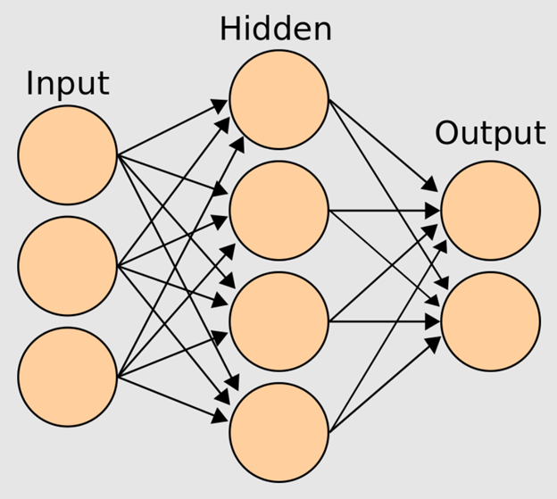
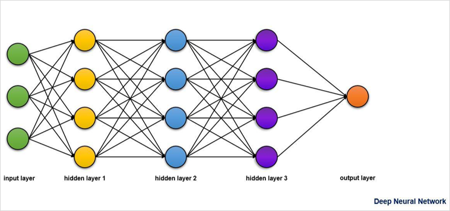

# Neural Network

## Introduction

**Neural Networks** are a type of *supervised learning* algorithm that
is used across the data engineering and science fields.
Inspired by biological neurons and complex pathways between neurons in the brain,
neural networks are incredibly receptive to errors in the training data.
Typically,
neural networks are made out of a dense web of interconnected neurons in which
each neuron takes a set of values (real-world inputs) and outputs a decision.
Or as [Wikipedia - Neural Network][wiki-nn] puts it:

>A **neural network** can refer to either a neural circuit of biological neurons
>(sometimes also called a biological neural network),
>or a network of artificial neurons or nodes,
>in the case of an artificial neural network.
>Artificial neural networks are used for solving [machine learning][-ml] problems;
>they model connections of biological neurons as weights between nodes.
>A positive weight reflects an excitatory connection,
>while negative values mean inhibitory connections.
>All inputs are modified by a weight and summed.

Because neural networks are based on biological neurons,
maybe it's worth comparing artificial vs. biological neurons.

## Basics

Deep neural networks consists of a network or circuit of
artificial neurons *(nodes)* that are used to solve complex machine learning problems.

There are three conceptual layers of neurons in a neural network:

* Input layer
* Hidden layer
* Output layer

Each neuron from one layer is connected to
all the neurons in the next layer.
See the image below,
which depicts the interconnections between the layers of a neural network.

The number of neurons in each layer is arbitrary and
will depend on the problem that is being solved.
A connection between neurons
(represented by the arrows between layers) is called an **activation**.

The input layer passes initial data to the hidden layer,
where the data is multiplied by the weights of that hidden layer.
In the case of multiple hidden layers,
this may be repeated several times.
Hidden layers are located between the input and output layers and
exist to extract and filter through features identified by the input layer.
These features are then sent to the output layer based on
the mathematical function performed within the hidden layers.
The output layer consists of the final result of a deep neural network.

Deep neural networks may have more than one hidden layer.
See the image below, which shows the multiple hidden layers within
a deep neural network.

## Comparison to Biological Neural Networks

### Biological Components

Biological neural networks are composed of axons, dendrites, and synapses.

### Artificial Components

Artificial neural networks are composed of *nodes*,
inputs, outputs, weights and biases.

### Information Flow of Neural Networks

#### Biological Information Flow

Electrical pulses enter the neuron through dendrites.
The information flows through the cell and is processed.
Then, the output electric pulse is sent by the synapse to
the next neuron through an axon.

#### Artificial Information Flow

There are three layers of neurons.
The *input layer* initially processes the external information and
then sends the signals to the *hidden layer*,
which extracts relevant characteristics and features.
The important features are sent to the final layer or *output layer*,
which produces the desired output.

### Training Neural Networks

#### Biological Training

Synapses can increase or decrease the signal sent to the next neuron.
This is called *synaptic plasticity*.
It changes the signal by changing the chemical composition of the synapse.

#### Artificial Training

Weights and biases can be applied to change the signal sent to the next *node*.
The information changes as a product of [matrix][-matrix] or tensor multiplication.

## Neural Network Advantages

Input problems can be represented in *attribute*-value pairs,
which can be discrete-valued, real-valued,
or represented as a vector of several real or discrete valued *attributes*.
This is a robust way to represent data points with
vast amount of different data inputs available.

For example, when preprocessing training data,
images will be converted into a table of pixels with the $x$ and $y$ coordinates
(*attributes*) corresponding to a pixel brightness or color (*value*).
The resulting two-dimensional table can then be fed into the model for training.
These networks also allow for data to be preprocessed into discrete values or
vector values when needed.

Errors and noise in training data don't necessarily affect the outcome.
Since neural networks require large amounts of training data,
any error or outlier in the training data will not affect the outcome of the model.
Simply speaking, the artificial neural network will identify and
filter out any errors in the data within the first input layer.

## Neural Network Disadvantages

Neural networks are computationally expensive.
The training process is computationally expensive and
requires a large amount of training data.
The training process requires so much computational power that
often it is difficult to construct even distributed systems to
cope with all the calculations and memory requirements.
Neural networks by their nature also require some level of data dependency.
This is why sometimes it's hard to split neural network training into
several computing nodes to share the load.

## Applications of Deep Neural Networks in Machine Learning

There are several applications of deep neural networks in ML,
including speech recognition and image recognition.
Next, you will learn how to create a neural network to recognize images of
handwritten digits.

The picture below represents an image of a number that
needs to be fed through a deep neural network so that
it can be recognized as the number four.

[Tensorflow][-tf]

## TODO

* [ ] Section on Input Layer
* [ ] Section on Hidden Layer
* [ ] Section on Output Layer
* [ ] Section on Activation Functions
* [ ] Section on Forward Propagation
* [ ] Section on Backward Propagation
* [ ] Section on Weight Updates

## References

### Web Links

* [Wikipedia.org. 'Neural Network' Accessed 2023-06-09][wiki-nn]

<!-- Hidden References -->
[wiki-nn]: https://en.wikipedia.org/wiki/Neural_network "Wikipedia.org. 'Neural Network' Accessed 2023-06-09"

### Note Links

* [Machine Learning][-ml]
* [Matrix][-matrix]
* [Tensorflow][-tf]

<!-- Hidden References -->
[-ml]: machine-learning.md "Machine Learning"
[-matrix]: matrix.md "Matrix"
[-tf]: tensorflow.md "Tensorflow"
