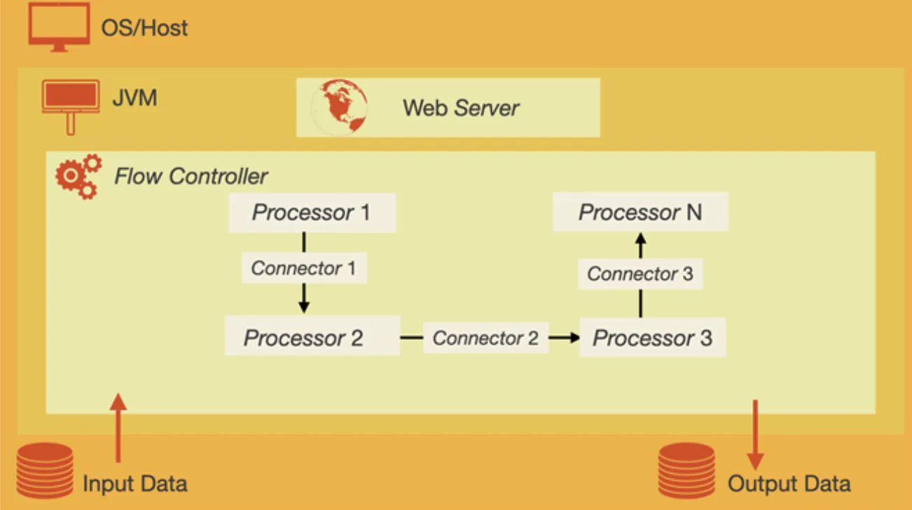

# Apache NiFi

## Introduction

According to [Wikipedia][wiki-nifi]:

>**Apache NiFi** is a software project from
>the Apache Software Foundation designed to automate the flow of
>data between software systems. Leveraging the concept of
>extract, transform, load (ETL), it is based on
>the "NiagaraFiles" software previously developed by
>the US National Security Agency (NSA),
>which is also the source of a part of its present name – *NiFi*.

## History of Apache NiFi

NiFi was initially developed by the National Security Agency (NSA) in 2006 and
was used by the organization for ETL for eight years.
In 2014, it was donated to the Apache Software Foundation and, in 2015,
NiFi became an official part of the Apache Project Suite.
Since the,
NiFi has been continually updated and improved and every six to eight weeks,
Apache NiFi releases a new version.
When using NiFi,
it is important to ensure that you are using the most recent version.

## Features of NiFi

When it comes to features, it's pretty good at handling pipelines when
it comes to going between systems.
It has a friendly user interface.
It is modeled around *processors*.
You can think of *processors* as *transformers*.
It's also really scalable, simply add more commodity machines in parallel.

## Pros and Cons

### Pros

* It's open source.
* It can transfer data or map to different systems.
  * When doing [ETL][-etl] this is important because as you're extracting data,
you can send data to the right endpoints to act on it.
* It can deliver data to many kinds of analytic systems.
* You can enrich and prepare for subsequent steps.
* It is scalable

### Cons

* It is not a distributed computation platform
* It is not for complex event processing with complicated event sequencing logic.
* It is not for doing aggregate operations on large volumes of data.
  * You're better off doing this on larger data-warehouse or
[distributed database systems][-dist-db].

## Three Concepts of NiFi

### FlowFile

It's the data itself contained within NiFi's pipeline format.
It contains the data itself.
It also contains *attributes* that are associated with the data,
such as metadata or key-value pair structures that are associated.

### Processor

The *processor* is the name for the parts of the system doing ETL *transforms*.
It applies to `FlowFiles`.
Every transformation creates a new output from the transformation.
So you can pair these up and you can take a *processor* that
outputs feeds into the next *processor*,
layering the transforms.
Between each *processor* is a `FlowFile` of the intermediary till
you get to the final output.

### Connector

A *connector* can be thought of as a queue for the `FlowFiles` waiting to
be processessed by the *processor*.
The advantage there is you can create a priority queue.
Even with rules like FIFO or LIFO.
You can also have some back pressure.
For example, you can limit it to 10k `FlowFiles` in the queue and
stopping the queue until you've processed more of them and
limit the data flow.

## NiFi Architecture

## References

### Web Links

* [Apache NiFi (from Wikipedia, the free encyclopedia)][wiki-nifi]

<!-- Hidden References -->
[wiki-nifi]: https://en.wikipedia.org/wiki/Apache_NiFi "Apache NiFi (from Wikipedia, the free encyclopedia)"

### Note Links

* [Extract, Transform, Load (ETL)][-etl]
* [Distributed Database Systems][-dist-db]

<!-- Hidden References -->
[-etl]: etl.md "Extract, Transform, Load (ETL)"
[-dist-db]: distributed-database.md "Distributed Database Systems"
