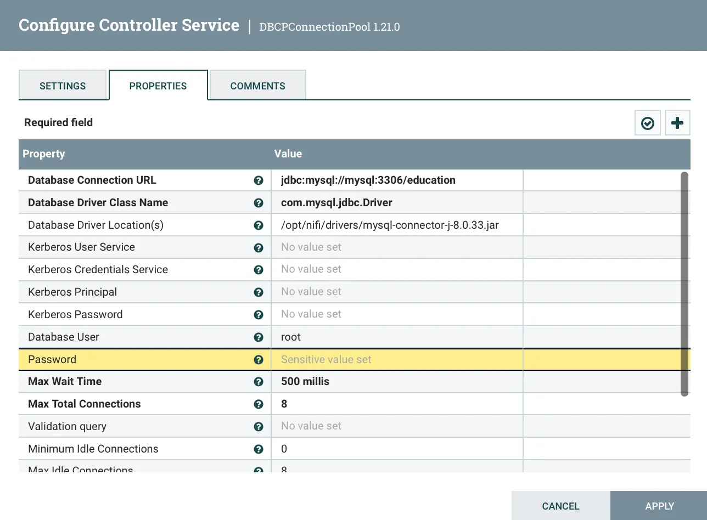
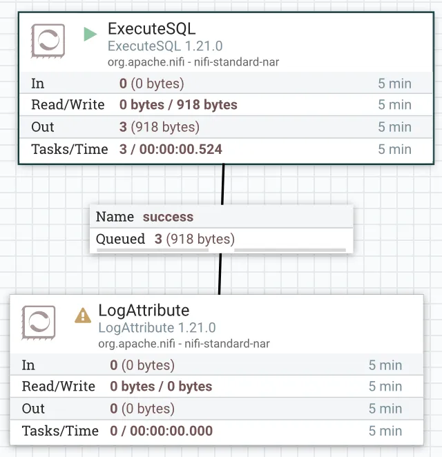

# Apache NiFi

## Introduction

According to [Wikipedia][wiki-nifi]:

>**Apache NiFi** is a software project from
>the Apache Software Foundation designed to automate the flow of
>data between software systems. Leveraging the concept of
>extract, transform, load (ETL), it is based on
>the "NiagaraFiles" software previously developed by
>the US National Security Agency (NSA),
>which is also the source of a part of its present name – *NiFi*.

## History of Apache NiFi

NiFi was initially developed by the National Security Agency (NSA) in 2006 and
was used by the organization for ETL for eight years.
In 2014, it was donated to the Apache Software Foundation and, in 2015,
NiFi became an official part of the Apache Project Suite.
Since the,
NiFi has been continually updated and improved and every six to eight weeks,
Apache NiFi releases a new version.
When using NiFi,
it is important to ensure that you are using the most recent version.

## Features of NiFi

When it comes to features, it's pretty good at handling pipelines when
it comes to going between systems.
It has a friendly user interface.
It is modeled around *processors*.
You can think of *processors* as *transformers*.
It's also really scalable, simply add more commodity machines in parallel.

## Pros and Cons

### Pros

* It's open source.
* It can transfer data or map to different systems.
  * When doing [ETL][-etl] this is important because as you're extracting data,
you can send data to the right endpoints to act on it.
* It can deliver data to many kinds of analytic systems.
* You can enrich and prepare for subsequent steps.
* It is scalable

### Cons

* It is not a distributed computation platform
* It is not for complex event processing with complicated event sequencing logic.
* It is not for doing aggregate operations on large volumes of data.
  * You're better off doing this on larger data-warehouse or
[distributed database systems][-dist-db].

## Three Concepts of NiFi

### FlowFile

It's the data itself contained within NiFi's pipeline format.
It contains the data itself.
It also contains *attributes* that are associated with the data,
such as metadata or key-value pair structures that are associated.

### Processor

The *processor* is the name for the parts of the system doing ETL *transforms*.
It applies to `FlowFiles`.
Every transformation creates a new output from the transformation.
So you can pair these up and you can take a *processor* that
outputs feeds into the next *processor*,
layering the transforms.
Between each *processor* is a `FlowFile` of the intermediary till
you get to the final output.

### Connector

A *connector* can be thought of as a queue for the `FlowFiles` waiting to
be processed by the *processor*.
The advantage there is you can create a priority queue.
Even with rules like FIFO or LIFO.
You can also have some back pressure.
For example, you can limit it to 10k `FlowFiles` in the queue and
stopping the queue until you've processed more of them and
limit the data flow.

## Key Components of NiFi

These key components add to the list of concepts that must be known to
understand the functioning and configuring of NiFi.

* *Connector*: A *connector* links *processors* together and
defines the relationship between the *processors*, which controls how data flows.
  * *Connectors* can also link one *processor* back to itself to create a *loop*.
* *Controller*: A *controller* records connections between processes and
controls the allocation of threads used by
all processes [(Taylor 2021)][taylor-nifi-tutorial].
* *Event*: *Events* represent the change to a *`FlowFile`* while
traversing through a NiFi *flow*.
These *events* are tracked in NiFi *repositories*.
* *Flow*: The NiFi *flow* is a process
that begins once all the *processors* are connected and running.
  * During the process, data is updated, inserted, or deleted in a [database][-db].
* *`FlowFile`*:
A *`FlowFile`* is "original data with meta-information attached to it.
It allows you to process not only [CSV][-csv] or
other record-based data but also pictures, videos, audio or other binary data.
* *Process Group*: A process group is composed of all of the *processors* and
their related *connectors*.
  * It includes the exchange of data that occurs between
these *entities* through the use of ports.
* *Processor*: A *processor* is "the NiFi component that
is responsible for creating, sending, receiving, transforming, routing,
splitting, merging, and processing *`FlowFiles`*.
It is the most important building block available to NiFi users to
build their data *flows*" [(Apache Software Foundation 2018)][apache-nifi-home].
* *Server*: The NiFi UI and running processes are hosted on a *server*.

There are many different components to the NiFi architecture.
To learn more about the key components,
reference [Apache NiFi Overview][apache-nifi-overview].

## NiFi Architecture

NiFi has a well-thought-out architecture.
Once data is fetched from external sources or your local machine,
if is represented as a `FlowFile` inside the NiFi architecture.
Next, a *flow controller* must be created to configure your *flow*.
At this stage,
you will need to add different *controllers* depending on
the type of database you are working with.
After that, you must add a number of
single-*function* components (in NiFi, these are called *processors*) that
can be utilized to build out a customized NiFi data *flow*.
Finally, in order to start the data *flow* to perform [ETL][-etl],
you must connect your *processors* using *connectors*.
Below is a diagram that should explain how these architectures work.


## Why Use NiFi?

There are a number of reasons to use Nifi.
NiFi allows you to import data into NiFi from
numerous data sources and create *`FlowFiles`* to
integrate that data into your data *flow* process.
NiFi is user-friendly and customizable;
you can edit your data in real time,
manage your data *flows*, and integrate NiFi into your existing infrastructure
[(Taylor 2021)][taylor-nifi-tutorial].

NiFi is a popular tool because it is equipped with a number of useful features.
Key features of NiFi are described in the following table:

* Continuous Improvement
  * NiFi is updated frequently,
ensuring users have access to the most up-to-date systems and features.
  * NiFi also runs quickly to allow for fast processing,
testing and communication of data.
* Customizable
  * NiFi gives the power to the user to create a data *flow* that works best for them.
  * Users can set up the *processors*, *connectors*, and *controllers* that
they need to build an effective *flow* for their data.
  * NiFi uses single-*function* components that can be built and added on to
make data *flows* as simple or complex as the user needs them to be.
* Role-Based Security Features
  * NiFi uses role-based authentication and authorization protocols to
ensure the security of data [(Taylor 2021)][taylor-nifi-tutorial].
  * Data also flows through secure *methods* that encrypt communication to
prevent data insecurity.
* Support
  * NiFi offers helpful online guides and technical support for
users to help with troubleshooting issues and optimizing data *flows*.
* User-Friendly
  * NiFi uses the [Java][-java] programming language.
  * Commonly known language & allows for easy transfer of data from any system to NiFi.
  * NiFi is also easily accessed, even from places with limited connectivity.

For more information read the
[top-level NiFi documentation overview][apache-nifi-docs-overview].

## Deploy NiFi in a Container

One of the most common ways to deploy NiFi is through the use of
[software container runtimes][-container], particularly [Docker][-docker].

### Create the Container Network

Firstly, a container network is required,
like using the `docker network` set of sub-commands.
A container network is necessary because NiFi needs to work with other containers,
when running it as a container.
This is to run with other containers like the databases that can also be containerized.
To create the container network, run the following command:

```bash
docker network create nifi
```

### Create the NiFi Container

Next, create the NiFi container.
We'll define an example using Docker below:

```bash
docker run \
      --name nifi \
      --network nifi \
      --publish 8080:8080 \
      --env NIFI_WEB_HTTP_PORT=8080 \
      --detach apache/nifi:latest
```

These parameters are:

* `--name nifi`: The name of the container is `nifi`.
* `--network nifi`: The container is connected to the `nifi` container network.
* `-p 11111:8080`: The container is mapped to external port `11111` to `8080`.
* `-e NIFI_WEB_HTTP_PORT=8080`: The NiFi web HTTP port is `8080`.
  * **NOTE** this seems required in latest versions of NiFi.
  * Otherwise, the NiFi web UI will not be accessible.
* `-e NIFI_WEB_HTTP_HOST=0.0.0.0`: The NiFi web HTTP host is the local host.
  * **NOTE** same as above.
* `--detach`: The container is detached from the terminal.
  * It will run in the background and we'll interact with it later.
* `apache/nifi:latest`: The container image to use is `apache/nifi:latest`.
  * **Remember**, it's particularly important in NiFi to keep up to date.

Now you should be able to navigate a browser to `http://localhost:8080/nifi`.
There you should see the UI for NiFi.

A database will also be required in some fashion to run NiFi.
Here `mysql:8.0` or MySQL 8.0 is used.

```bash
docker run \
    --name mysql \
    --network nifi \
    -p 3306:3306 \
    -e MYSQL_ROOT_PASSWORD=MyNewPass \
    --detach \
    mysql:8.0
```

These parameters are:

* `--name mysql`: The name of the container is `mysql`.
* `--network nifi`: The container is connected to the `nifi` container network.
* `-p 3306:3306`: The container is mapped to external port `3306` to `3306`.
* `-e MYSQL_ROOT_PASSWORD=MyNewPass`: The root password is set to `MyNewPass`.
* `--detach`: The container is detached from the terminal.
  * It will run in the background and we'll interact with it later.
* `mysql:8.0`: The container image to use is `mysql:8.0`.

## Initialize a MySQL Database for NiFi ETL

[MySQL databases][-mysql] are some of the more common databases to be used with NiFi.
Here we'll initialize a MySQL database for use with NiFi using docker and
some [SQL commands][-sql].
We'll create an `education` database with a `students` table.

To open the MySQL shell on the terminal in the `mysql` container using this command:

```bash
docker exec -it mysql mysql -u root -pMyNewPass
```

Then we'll initialize the `education` database and
`students` table using the following SQL commands:

```sql
DROP DATABASE IF EXISTS education;
CREATE DATABASE IF NOT EXISTS education;
USE education;

CREATE TABLE `students` (
  `email` varchar(64) NOT NULL,
  `name` varchar(64) NOT NULL,
  `city` varchar(64) NOT NULL,
  PRIMARY KEY (`email`)
);

INSERT INTO `students` VALUES('peter@mit.edu','Peter Parker','Cambridge,MA');
```

This then creates the `education` database and `students` table.
The `students` table has three columns: `email`, `name`, and `city`.
Finally, a single row is inserted into the `students` table.

## Add a MySQL Driver to NiFi

To make NiFi work with MySQL,
we'll need to add a MySQL driver to NiFi.
This same process can be used to add other drivers to NiFi as well.
This allows NiFi to directly access the database to read and write data.

The driver is a [Java archive (JAR)][-java] file.
Since NiFi is written in Java,
the driver needs to be a JAR file.
To access the MySQL Java driver,
go to its [download page][mysql-driver-dl].
Then download the `mysql-connector-java-8.0.33.jar` file.

>**NOTE**: The version is always going to get updated.
>Currently the version being used and written about is `8.0.33`.
>Use whatever the latest version is when you see this version string.

For most linux operating systems and containers,
you'll want to select the `Platform Independent` option.
But you could also download a *.deb* for Debian-based systems or
a *.rpm* for Red Hat-based systems as an example.

After you've downloaded the archive and decompress it,
find the JAR file and copy it over to the NiFi container.
To copy it over to the NiFi container,
use the following command:

```bash
docker exec -it nifi mkdir -p /opt/nifi/drivers
docker cp mysql-connector-java-8.0.33.jar nifi:/opt/nifi/drivers/
```

## Create an ETL Pipeline in NiFi

To start,
we can start by creating the *Database Connection Pool* within the NiFi web UI.
To do this,
there should be a view titled `Operate` with a gear icon representing settings.
Click that and you should be able to configure a NiFi *Flow*.
Open the `Controller Settings` tab and
click the `+` button to add a new controller service.
Then select the `DBCPConnectionPool` controller service.
Then Add it it.

To configure this controller service, click on the gear icon for
the `DBCPConnectionPool` controller service.
Then click the `Properties` tab.
Then click the `+` button to add a new property.
Then add the following properties:

* `Name`: MySQL
* Properties:
  * `Connection URL`: `jdbc:mysql://mysql:3306/education`
    * The `mysql` is the name of the MySQL container or its hostname.
      * The hostname docker provides defaults to the name of the container.
    * The `education` is the name of the database we created earlier.
  * `Database Driver Class Name`: `com.mysql.jdbc.Driver`
    * This is the name of the MySQL driver Java class.
  * `Database Driver Location(s)`:
`/opt/nifi/drivers/mysql-connector-java-8.0.33.jar`
    * This is the location of the MySQL driver JAR file.
    * Same as the location we copied the JAR file to earlier.
  * `Database User`: `root`
    * The database user to use to connect to the database.
  * `Password`: `MyNewPass`
    * The password for the database user specified before.

Verify that the configuration looks something like the below screenshot.
Then hit the `Apply` button to apply the configuration.
Then hit the `Enable` icon which is a lightning bolt.
Just choose the `Service and All Referencing Components` option.
Then hit the `Apply` button to apply the configuration.
The `State` listed for the `DBCPConnectionPool` controller service should be `Enabled`.



Now we can create a *Processor* to read data from the database.
To add a *Processor*,
drag a *processor* block from the top bar of the main NiFi view into the workspace.
As you drop, an `Add Processor` dialog should appear.
From there you can select the `ExecuteSQL` processor.

Now we have our first processor.
Add another, `LogAttribute` and add it to the workspace.
Then connect from the `ExecuteSQL` processor to the `LogAttribute` processor.
Only check the `For Relationships` `success` checkbox before adding.

Now we'll go ahead and configure the `ExecuteSQL` processor.
Start off by setting the option to automatically terminate with `failure`.
Then move to `Scheduling` and set it to run every `30 sec`.
Then move to `Properties` and set the following properties:

* `Database Connection Pooling Service`: `MySQL`
  * This is the name of the controller service we created earlier.
* `SQL select query`: `SELECT * FROM education.students`
  * This is the SQL query to run against the database.
    * This query selects all rows from the `students` table.
  * It's just normal SQL syntax.
* `Relationships` tab > `Auto-terminate relationships`: `failure`
  * This is the relationship to auto-terminate on.
    * This is the relationship we checked earlier.
    * This is the relationship that will be used if the query fails.

Now if you apply and start the processor you'll see an item in the queue after
enabling and starting the *processor*.
It should look something like the below screenshot.



You'll see that the connection has some queued *FlowFiles* within it.
This is the singular row in the `students` table.


So now we have setup our first basic pipeline as seen in the diagram above.
A data source is accessed by a *processor*.
Then the data is connected using a *connector* to another *processor*.
In that *connector* a *FlowFile* is created with all the data we want.
Then the next processor deals with or transforms or loads the data within the *FlowFile*.

## References

### Web Links

* [Apache NiFi (from Wikipedia, the free encyclopedia)][wiki-nifi]
* [Apache NiFi Overview][apache-nifi-overview]
* [Apache NiFi Documentation Overview][apache-nifi-docs-overview]
* [Apache Software Foundation NiFi Home][apache-nifi-home]
* [Taylor, David. "Apache NiFi Tutorial (from guru99.com)][taylor-nifi-tutorial]
* [MySQL Connector/J Download Page][mysql-driver-dl]

<!-- Hidden References -->
[wiki-nifi]: https://en.wikipedia.org/wiki/Apache_NiFi "Apache NiFi (from Wikipedia, the free encyclopedia)"
[apache-nifi-docs-overview]: https://nifi.apache.org/docs.html "Apache NiFi Documentation Overview"
[apache-nifi-overview]: https://nifi.apache.org/docs/nifi-docs/html/overview.html "Apache NiFi Overview"
[apache-nifi-home]: https://nifi.apache.org/ "Apache Software Foundation NiFi Home"
[taylor-nifi-tutorial]: https://www.guru99.com/apache-nifi-tutorial.html "Apache NiFi Tutorial (from guru99.com)"
[mysql-driver-dl]: https://dev.mysql.com/downloads/connector/j/ "MySQL Connector/J Download Page"

### Note Links

* [Extract, Transform, Load (ETL)][-etl]
* [Distributed Database Systems][-dist-db]
* [Databases][-db]
* [Comma-Separated Values (CSV)][-csv]
* [Java][-java]
* [Containers (Software)][-container]
* [Docker][-docker]
* [MySQL][-mysql]
* [Structured Query Language (SQL)][-sql]

<!-- Hidden References -->
[-etl]: etl.md "Extract, Transform, Load (ETL)"
[-dist-db]: distributed-database.md "Distributed Database Systems"
[-db]: database.md "Databases"
[-csv]: csv.md "Comma-Separated Values (CSV)"
[-java]: java.md "Java"
[-container]: container.md "Containers (Software)"
[-docker]: docker.md "Docker"
[-mysql]: mysql.md "MySQL"
[-sql]: sql.md "Structured Query Language (SQL)"
