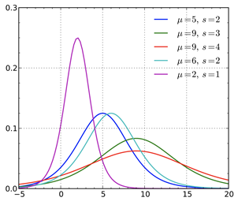

# Normal Distribution

## Introduction

>In [probability theory][prob-zk], a **normal distribution** or
>the **Gaussian distribution** is a type of continuous probability distribution for
>a real-valued [random variable][prob-rv-zk].
>The general form of its probability density function is:
>[from Wikipedia, the free encyclopedia][normal-dist-wiki]

$$f(x) = \frac{1}{\sigma \sqrt{2 \pi}} e^{-\frac{1}{2} (\frac{x - \mu}{\sigma}^2)}$$

Where $\mu$ is the mean and $\sigma$ is the standard deviation.
The simplified form of the normal distribution is:

$$f(x) = \frac{1}{\sqrt{2 \pi}} e^{-\frac{1}{2} x^2}$$

Which is something known as the **standard normal distribution**,
which will be covered later.
The area underneath the *probability density function* (PDF) is equal to 1.
Because remember,
the probability that a random variable appearing somewhere in
the distribution is absolute, it will always happen or the distribution is false.
The simplified notation for a normal distribution is:

$$X \sim N(\mu, \sigma^2)$$

## Mean and Variance

The mean is denoted by the Greek letter $\mu$,
and the variance is denoted by $\sigma^2$.
Variance is squared because it is a measure of the squared deviation from the mean.

Their relationship is given by:

$$\mu = E(x) = \frac{\sum{(x)}}{N}$$
$$\sigma^2 = E[(X - \mu)^2] = \sum{\frac{(x - \mu)^2}{N}}$$

Where the $E(x)$ is the expected value of $x$, or the mean.
The parameter $N$ is the number of observations and is a common notation.

***TODO: Continue from here using wikipedia***

## Special Cases of the Normal Distribution

### T-Distribution

Another type of discrete probability distribution function is the t-distribution.
The t-distribution,

>“also known as the Student’s t-distribution,
>is a type of probability distribution that is similar to
>the normal distribution with its bell shape but
>has heavier tails” (Hayes 2021).

It is, therefore, more prone to producing values that fall far from its mean.

>“T-distributions have a greater chance for
>extreme values than normal distributions, hence the fatter tails” (Hayes 2021).

The shape of a t-distribution is determined by a parameter called degrees of freedom.
The concept of degrees of freedom indicates that
the value may shift depending on the factors that
influence the calculation of the statistic (Frost 2021).

If the value of the degrees of freedom is small,
the distributions will have heavier tails.
On the other hand,
a higher value for the degrees of freedom will
make the t-distribution resemble a standard normal distribution.

The probability density function is symmetric,
and its overall shape resembles the bell shape of
a normally distributed variable with mean 0 and variance 1,
except that it is a bit lower and wider.
If the value of the degrees of freedom is small,
the distribution will have a heavier tail.
On the other hand,
a higher value for the degrees of freedom will
make the t-distribution resemble a standard normal distribution.


The t-distribution plays a role in many widely used statistical analyses,
including the t-test, analysis of variance,
which assesses the statistical significance of the difference between two sample means,
(Frost 2021).

### Logistic Distribution

The logistic distribution is used for various growth models and
a type of regression known, appropriately enough, as logistic regression. (Wikipedia 2021).

The standard logistic distribution is a continuous distribution on
the set of real numbers with distribution function F given by:

$$F(x) = \frac{e^x}{1 + e^x}$$



## Normal Distributions in Python

Using [numpy][numpy-zk] and [matplotlib][matplotlib-zk]
we do a lot of analysis using the normal distribution in python.
Numpy's `random.normal` function is used to generate random numbers that
follow a normal distribution.
Then using the `matplotlib.pyplot` module we can plot the histogram of the data.

```python
# Exercise - use the formula of the normal distribution to
# plot the probability density function of the same randomly generated data
import matplotlib.pyplot as plt
import numpy as np
np.random.seed(0)
Npts = 100
p = np.random.normal(0, 1, Npts)
# Compute the curve of the standard normal distribution
x = np.linspace(-4, 4, 100)
y = np.exp(-x**2/2)/np.sqrt(2*np.pi)
# Plot the histogram of the data and the calculated normal curve
plt.hist(p, bins=20, density=True)
plt.plot(x, y, 'r')
```

Which produces the following plot:


Clearly the histogram of the data is not exactly the same as the theoretical curve,
but that is to be expected.
Generally, the more data points we have the closer the histogram will be to the curve.
What is important is that the histogram is a good approximation of the curve.

The `numpy.linspace` function is used to generate a list of evenly spaced numbers,
they are used to generate the x-axis of the plot.
Then the same equation seen before is used to
calculate the theoretical curve of the *standard normal distribution*.

>**Note:** the `np.random.seed(0)` is used to ensure that
>the random numbers are the same every time the code is run.
>Without it, the random numbers will be different every time the code is run.

## References

### Web Links

* [Normal Distribution (from Wikipedia, the free encyclopedia)][normal-dist-wiki]
<!-- Hidden References -->

[normal-dist-wiki]: https://en.wikipedia.org/wiki/Normal_distribution "Normal Distribution (from Wikipedia, the free encyclopedia)"

### Note Links

* [Probability][prob-zk]
* [Probability: Normal Distribution][prob-normal-zk]
* [Probability: Random Variables][prob-rv-zk]
* [NumPy: Numerical Python][numpy-zk]
* [Matplotlib: Python Plotting Library][matplotlib-zk]

<!-- Hidden References -->
[prob-zk]: ./probability.md "Probability"
[prob-normal-zk]: ./probability.md#normal-distribution "Probability: Normal Distribution"
[prob-rv-zk]: ./probability.md#Random-Variables "Probability: Random Variables"
[numpy-zk]: ./numpy.md "NumPy: Numerical Python"
[matplotlib-zk]: ./matplotlib.md "Matplotlib: Python Plotting Library"
