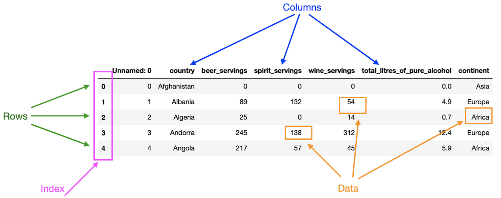

# Pandas: Python Data Analysis Library

## Introduction

**Pandas** is a [Python][py-zk] library for data analysis.
It provides high-performance,
easy-to-use data structures and data analysis tools.
All of it revolves around the `DataFrame` object,
which is a tabular [data structure][data-struct-zk] with labeled axes (rows and columns).
It is similar to a spreadsheet or a SQL table, or the `data.frame` in R.
[Wikipedia describes it as...][pandas-wiki]

>**Pandas** is a software library written for
>the [Python programming language][py-zk] for data manipulation and analysis.
>In particular,
>it offers [data structures][data-struct-zk] and
>operations for manipulating numerical tables and time series.

## Series

### Introduction

Data series in Pandas are similar to lists in Python.
They are one-dimensional arrays of data.
They can be created from lists or dictionaries.
But in Pandas,
you always have to have an index, whether specified or not.
Let's examine the below code snippet.

### Creating a Series

```python
import pandas as pd
import numpy as np
alist = [1,2,3,4]
s1 = pd.Series(alist)
s1
```

When you just create a `Series` object from a list,
a default index is created for you,
starting from 0 and counting up by 1.
Below is the result of the above code snippet.

```txt
0    1
1    2
2    3
3    4
dtype: int64
```

You may want to actually specify the index yourself.
To do this you can either create a dictionary,
where the keys are the index values.
It's also possible to create a `Series` object from a list or [`np.array`][numpy-zk],
where it is the same size as the data Series in the same order.
Modifying the above code snippet with a second list of alphabetical characters,
you get the following result.

```python
import pandas as pd
import numpy as np
alist = [1,2,3,4]
blist = ['a', 'b', 'c', 'd']
s1 = pd.Series(data=alist, index=blist)
s1
```

```txt
a    1
b    2
c    3
d    4
dtype: int64
```

You can also create Series from dictionaries.
Simply make the keys the index values,
and the values associated with the keys the data in the series.

```python
mydict = {'a': 1, 'b': 2, 'c': 3, 'd': 4}
s3 = pd.Series(mydict)
s3
```

And you get the same result as before with two lists.

### Accessing an Element in a Series

To access a specific value in a `Series` object,
you can use the index value the same way you'd access a value in a dictionary or list.

```python
s1['a']
# Output: 1
```

Accessing a value in a series by its index, like `s1` from before, gets you `1`.

### Slice a Series

Series are sliced a bit differently than lists.
Because they have an index of potentially *ordinal values*,
you can't assume that the index values are sequential.
So instead of using the `:` operator,
you have two nested brackets,
with the inner brackets containing the index values you want to slice.

```python
s1[ ['a', 'c']]
```

Results in :

```txt
a    1
c    3
dtype: int64
```

Now, is the slice taken a copy or reference?
Let's find out by modifying the end of the code from before.

```python
s2 = s1[ ['a', 'c']]
s2['a'] = 10
s1['a']
```

The result is `1`.
So clearly slicing in pandas copies the data.

## Read & Write Files in Pandas

### Pandas I/O API

The ***pandas*** I/O API is a set of
top level reader functions accessed like `pd.read_csv()` that
generally return a pandas object.
It is fairly modular so over time it has accumulated a large number of
specialized readers for various formats.

For example,
suppose your manager asks you to analyze some data saved in [HTML format][html-zk].
As a data scientist,
you would then load the data in
your [Python][py-zk] program using the appropriate *pandas* function to
read the [HTML files][html-zk] and perform the analysis.

### Some Common File Formats with API References

| Function                          | Description       |
| --------------------------------- | ----------------- |
| [read_json()][pandas-json-read]   | Read JSON files   |
| [read_csv()][pandas-csv-read]     | Read CSV files    |
| [read_html()][pandas-html-read]   | Read HTML files   |
| [read_excel()][pandas-excel-read] | Read Excel files  |
| [read_sql()][pandas-sql-read]     | Read SQL files    |
| [to_json()][pandas-json-write]    | Write JSON files  |
| [to_csv()][pandas-csv-read]       | Write CSV files   |
| [to_html()][pandas-html-write]    | Write HTML files  |
| [to_excel()][pandas-excel-write]  | Write Excel files |
| [to_sql()][pandas-sql-write]      | Write SQL files   |
| [pandas IO tool][pandas-io-tool]  | *                 |

* \* *Set of functions to read/write custom formats of data to handle data in more bespoke ways*

### Read & Write JSON Files

**Pandas** can be used in conjunction with [JSON files][json-zk].
[JSON][json-zk] is a data format that is commonly used for
storage and communication of data between systems, particularly on the internet.

#### Write Pandas Objects to JSON File

To make it easier to start, let's begin by creating a [JSON string][json-zk].

```python
myseries = pd.Series([1,2,3,4], ['a', 'b', 'c', 'd'])
myseries.to_json(orient='index')
# Output: '{"a":1,"b":2,"c":3,"d":4}'
```

Using the `to_json()` method,
with parameter `orient='index'`,
the index becomes the key in the JSON string and the data becomes the value.

To actually write the JSON string to a file,
you can use the `to_json()` method again,
but this time with the `path_or_buf` parameter or
the first positional argument with a file path.

```python
myseries = pd.Series([1,2,3,4], ['a', 'b', 'c', 'd'])
myseries.to_json('myseries.json', orient='index')
```

#### Read JSON File into Pandas Object

Now that there's a file to read,
it's possible to read it into a `Series` object.
It's mainly done using the `pd.read_json()` method.

```python
myseries = pd.read_json('myseries.json', orient='index')
myseries
```

Which results in this nicely formatted table:

|     | 0   |
| --- | --- |
| a   | 1   |
| b   | 2   |
| c   | 3   |
| d   | 4   |

Note that because there isn't an obvious indication of the index,
the `orient='index'` parameter is used again to indicate that the index is the key.
It's also important to note that because there is no pandas object yet,
the `read_json()` method is called from the abstract `pd` module,
not a method of a pandas object like a `Series` or `DataFrame`.

## DataFrame

### Basics

A pandas **Dataframe** is a 2-dimensional labeled data structure where
data is organized in rows & columns.
Pandas **dataframes** have four pricnipal components:
rows, columns, index, and data.
As shown below in the annotated screenshot.



Given some data,
each row represents an observation and each column a variable.
In the example above,
the first row contains the dirnks consumption for Afghanistan,
whereas the second row contains the drinks consumption for Albania.

In a **dataframe**,
columns can be seen as a label for each measurement taken.
In the image above,
each of the columns describes what data is stored in them;
for example,
the column `continent` contains the continent of the country.

The *index* defines the location, address, of each data point in the *dataframe*.
Thus, the *index* can be used to access data in a *dataframe*.
In the image from before, the first column contains the *index* of the *dataframe*.
Columns also have an *index*: the column name.
Therefore, the entry "Afghanistan" in
the first row has row index 0 and column index "country".

Finally, the *data* is simply the information stored in the *dataframe*.
One particular thing to consider about
*dataframes* is that they can contain different types of data.
However, a column in a *dataframe* can only have one data type.
Observe the *dataframe* above.
You can determine that the data across the *dataframe* is of different types:
*integers* and *floats*.
However, the data stored in a single column of
the *dataframe* is always going to be of the same type.
For example, all the entries in the column "total_litres_of_pure_alcohol" are of type *float*.

### Exploring a DataFrame

Once you have defined or imported your *dataframe* in your program,
it is important that you become familiar with your data.
Pandas offer a range of functions to facilitate this.

For example, suppose that you have read and saved the *dataframe* in
the image below in your code as df.
Often,
one of the first things you would like to do is visualize the first few rows of
your *dataframe* to see what type of data it contains.
This can be achieved by using the `head()` function, like this:

```python
df.head()
```

|     | Unnamed: 0 | country     | beer_servings | spirit_servings | wine_servings | *    | continent |
| --- | ---------- | ----------- | ------------- | --------------- | ------------- | ---- | --------- |
| 0   | 0          | Afghanistan | 0             | 0               | 0             | 0.0  | Asia      |
| 1   | 1          | Albania     | 89            | 132             | 54            | 4.9  | Europe    |
| 2   | 2          | Algeria     | 25            | 0               | 14            | 0.7  | Africa    |
| 3   | 3          | Andorra     | 245           | 138             | 312           | 12.4 | Europe    |
| 4   | 4          | Angola      | 217           | 57              | 45            | 5.9  | Africa    |

\* *total_litres_of_pure_alcohol*

By default,
the `head()` function returns the first five rows of the *dataframe*.
This number can be changed by passing an integer to the function.

To know the dimensions of your *dataframe*,
*i.e.* the number of rows and columns,
you can use the `shape` attribute, like this:

```python
df.shape
```

The output is a tuple with the number of rows as the first element and the
number of columns as the second element.
In the example above,
the *dataframe* has 193 rows and 8 columns.

You can see that the command returns a tuple containing the number of
rows (193) and columns (7) in the *dataframe*.

To display the data types in each column of your *dataframe*,
you can use the `.info()` function, like this:

```python
df.info()
```

This function returns a list of all the columns in your data set and
the type of data that each column contains.
Here, you can see the data types int64, float64, and object.
Int64 and float64 are used to describe integers and floats, respectively.
The object data type is used for columns that
pandas doesn’t recognize as any other specific type.
It means that all of the values in the column are strings.


### Create a DataFrame

#### Using Lists

Let's jump right into an example.
It's possible to create a `DataFrame` object from [random data via NumPy][np-zk].
Then to give the columns names,
it's possible to pass a list of column names to the `columns` parameter.

```python
import pandas as pd
import numpy as np
cols = ['A', 'B', 'C', 'D']
my_array = np.random.randint(0, 100, size=(5,4))
print(my_array)
# Output:
# [[49 81 18 22]
# [ 0  7 29 70]
# [97 19 49 75]
# [50 58 96 34]
# [18 30  7  2]]
df = pd.DataFrame(my_array, columns=cols)
df
```

The resulting **data frame** is this nice table:

|     | A   | B   | C   | D   |
| --- | --- | --- | --- | --- |
| 0   | 46  | 45  | 46  | 96  |
| 1   | 86  | 40  | 98  | 47  |
| 2   | 79  | 11  | 92  | 77  |
| 3   | 28  | 24  | 49  | 61  |
| 4   | 98  | 78  | 42  | 35  |

The first positional argument is the data,
then any number of optional parameters can be passed,
like the `columns` parameter.

You can even create date ranges using the `pd.date_range` function to define columns.

```python
import pandas as pd
import numpy as np
cols = pd.date_range('2019-01-01', periods=4, freq='D')
my_array = np.random.randint(0, 100, size=(5,4))
print(my_array)
# Output:
# [[49 81 18 22]
# [ 0  7 29 70]
# [97 19 49 75]
# [50 58 96 34]
# [18 30  7  2]]
df = pd.DataFrame(my_array, columns=cols)
df
```

The resulting **data frame** is this nice table:

|     | 2019-01-01 | 2019-01-02 | 2019-01-03 | 2019-01-04 |
| --- | ---------- | ---------- | ---------- | ---------- |
| 0   | 46         | 45         | 46         | 96         |
| 1   | 86         | 40         | 98         | 47         |
| 2   | 79         | 11         | 92         | 77         |
| 3   | 28         | 24         | 49         | 61         |
| 4   | 98         | 78         | 42         | 35         |

#### Performing Operations on Columns

It's possible to perform operations on columns.
For example, let's say you want to add a column that is the sum of two other columns.

```python
df['A + B'] = df['A'] + df['B']
df
```

The resulting **data frame** is this nice table:

|     | A   | B   | C   | D   | A + B |
| --- | --- | --- | --- | --- | ----- |
| 0   | 46  | 45  | 46  | 96  | 91    |
| 1   | 86  | 40  | 98  | 47  | 126   |
| 2   | 79  | 11  | 92  | 77  | 90    |
| 3   | 28  | 24  | 49  | 61  | 52    |
| 4   | 98  | 78  | 42  | 35  | 176   |

#### Using Dictionaries

There are many situations where
defining *dataframes* using dictionaries is more convenient.

```python
import pandas as pd
contact = {'Name': 'john', 'Email': 'john@mit.edu', 'Course': 1}
contacts = {
  'Name': ['john', 'jane', 'joe'],
  'Email': ['john@mit.edu', 'jane@mit.edu', 'joe@mit.edu'],
  'Course': [1, 2, 3]
}
df = pd.DataFrame(contacts)
df
```

The keys become the column names.
And the values become the rows.
Since there can be multiple values for each key,
like if a list is used,
the order of the values matches the order in all the other lists.

The resulting *dataframe* is this nice table:

|     | Name | Email        | Course |
| --- | ---- | ------------ | ------ |
| 0   | john | john@mit.edu | 1      |
| 1   | jane | jane@mit.edu | 2      |
| 2   | joe  | joe@mit.edu  | 3      |

>**Note:** The order of the keys in the dictionary is not guaranteed.
>So the order of the columns in the resulting *dataframe* is not guaranteed.
>It's possible to specify the order of the columns by
>passing a list of column names to the `columns` parameter.

#### Further Reading

* [Pandas: How to Read and Write Files][pandas-rw-files-realpy]

## References

### Web Links

* [Pandas (Software)(from Wikipedia, the free encyclopedia)][pandas-wiki]
* [Pandas Series (from W3Schools)][pandas-series-w3]
* [Pandas Dataframe (from pandas.pydata.org documentation)][pandas-df-pydata]
* [Pandas: How to Read and Write Files (from RealPython by Mirko Stojilkovic)][pandas-rw-files-realpy]
* [read_json (from pandas.pydata.org documentation)][pandas-json-read]
* [read_csv (from pandas.pydata.org documentations)][pandas-csv-read]
* [read_html (from pandas.pydata.org documentation)][pandas-html-read]
* [read_excel (from pandas.pydata.org documentation)][pandas-excel-read]
* [read_sql (from pandas.pydata.org documentation)][pandas-sql-read]
* [to_json (from pandas.pydata.org documentation)][pandas-json-write]
* [to_csv (from pandas.pydata.org documentation)][pandas-csv-write]
* [to_html (from pandas.pydata.org documentation)][pandas-html-write]
* [to_excel (from pandas.pydata.org documentation)][pandas-excel-write]
* [to_sql (from pandas.pydata.org documentation)][pandas-sql-write]
* [pandas IO tool (from pandas.pydata.org documentation)][pandas-io-tool]

<!-- Hidden References -->
[pandas-wiki]: https://en.wikipedia.org/wiki/Pandas_(software) "Pandas (Software)(from Wikipedia, the free encyclopedia)"
[pandas-series-w3]: https://www.w3schools.com/python/pandas/pandas_series.asp "Pandas Series (from W3Schools)"
[pandas-df-pydata]: https://pandas.pydata.org/pandas-docs/stable/reference/api/pandas.DataFrame.html "Pandas Dataframe (from pandas.pydata.org documentation)"
[pandas-rw-files-realpy]: https://realpython.com/pandas-read-write-files/ "Pandas: How to Read and Write Files (from RealPython by Mirko Stojilkovic)"
[pandas-json-read]: https://pandas.pydata.org/pandas-docs/stable/user_guide/io.html#io-json-reader "read_json (from pandas.pydata.org documentation)"
[pandas-csv-read]: https://pandas.pydata.org/pandas-docs/stable/user_guide/io.html#io-read-csv-table "read_csv (from pandas.pydata.org documentations)"
[pandas-html-read]: https://pandas.pydata.org/pandas-docs/stable/user_guide/io.html#io-read-html "read_html (from pandas.pydata.org documentation)"
[pandas-excel-read]: https://pandas.pydata.org/pandas-docs/stable/user_guide/io.html#io-excel-reader "read_excel (from pandas.pydata.org documentation)"
[pandas-sql-read]: https://pandas.pydata.org/pandas-docs/stable/user_guide/io.html#io-sql "read_sql (from pandas.pydata.org documentation)"
[pandas-json-write]: https://pandas.pydata.org/pandas-docs/stable/user_guide/io.html#io-json-writer "to_json (from pandas.pydata.org documentation)"
[pandas-csv-write]: https://pandas.pydata.org/pandas-docs/stable/user_guide/io.html#io-store-in-csv "to_csv (from pandas.pydata.org documentation)"
[pandas-html-write]: https://pandas.pydata.org/pandas-docs/stable/user_guide/io.html#io-html "to_html (from pandas.pydata.org documentation)"
[pandas-sql-write]: https://pandas.pydata.org/pandas-docs/stable/user_guide/io.html#io-excel-writer "to_sql (from pandas.pydata.org documentation)"
[pandas-io-tool]: https://pandas.pydata.org/pandas-docs/stable/user_guide/io.html "pandas IO tool (from pandas.pydata.org documentation)"
[pandas-excel-write]: https://pandas.pydata.org/pandas-docs/stable/user_guide/io.html#io-excel-writer "to_excel (from pandas.pydata.org documentation)"

### Note Links

* [Python Programming Language][py-zk]
* [NumPy][numpy-zk]
* [Data Structure][data-struct-zk]
* [JSON: JavaScript Object Notation][json-zk]
* [HTML: HyperText Markup Language][html-zk]

<!-- Hidden References -->
[py-zk]: ./python.md "Python Programming Language"
[numpy-zk]: ./numpy.md "NumPy"
[data-struct-zk]: ./data-structure.md "Data Structure"
[json-zk]: ./json.md "JSON: JavaScript Object Notation"
[html-zk]: ./html.md "HTML: HyperText Markup Language"
