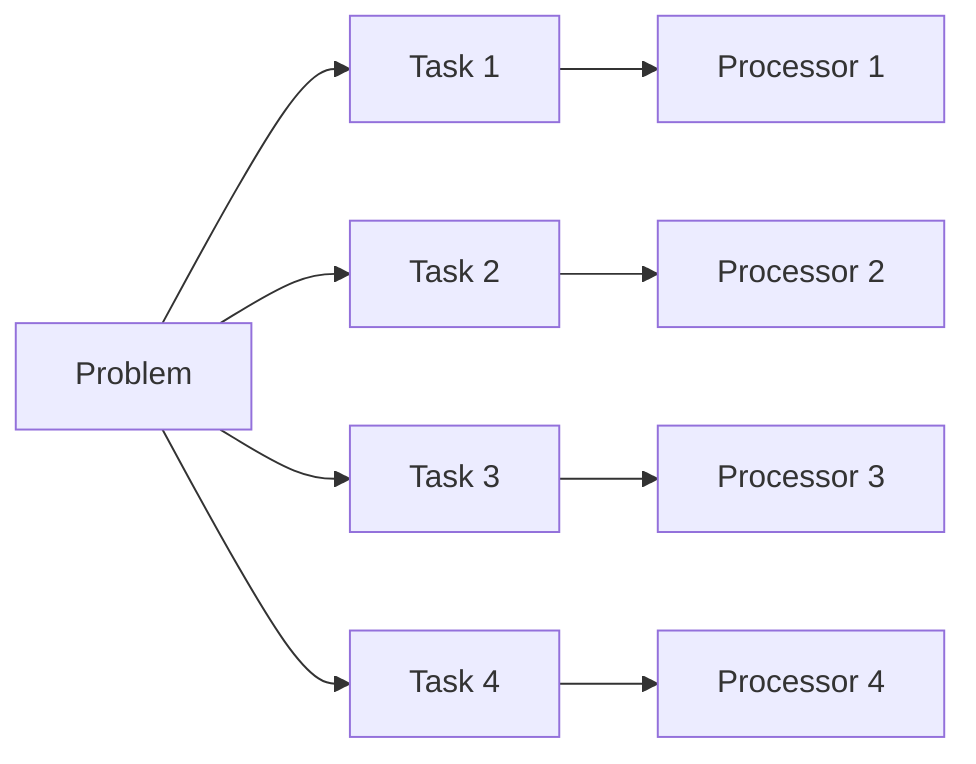

# Parallel Computing

## Introduction

>**Parallel computing** is a type of computation in
>which many calculations or processes are carried out simultaneously.
>Large problems can often be divided into smaller ones,
>which can then be solved at the same time.
>There are several different forms of parallel computing:
>**bit-level**, **instruction-level**, **data**, and **task parallelism**.
>Parallelism has long been employed in high-performance computing,
>but has gained broader interest due to
>the physical constraints preventing frequency scaling.
>As power consumption (and consequently heat generation) by
>computers has become a concern in recent years,
>parallel computing has become the dominant paradigm in
>[computer architecture][-comp-arch] mainly in the form of multi-core processors.

## Sequential vs. Parallel Computing

To understand the benefits of *parallel computing*,
first it is necesasry to understand the concept of traditional computing,
in **series**, or **sequential computing**.
When traditional computers were first introduced,
a compiler would accept a set of instructions,
such as those included in a program.
The compiler would then convert those instructions into
a set of machine-language instructions.
After that, the set of instructions would be fed through
the central processing unit [CPU][-comp-arch-cpu] to be
executed sequential in a specific order.

When a CPU processes each execution of a set of instructions,
there are a set of processes that must be completed in a specific order.
Simply put, the CPU must begin by
fetching the instructions from memory,
then decoding the instructions,
and finally writing the results back to memory.
The order of these processes for sequential computing is depicted below:


## Basics of Parallel Processing

Parallel Processing works by breaking up a large set of instructions into
smaller, independent sets of instructions that can be processed simultaneously.
Then, multiple CPUs, cores, or threads can be used to process the instructions that
are handed to them then returned the results of.
These different processing elements are somehow interconnected,
either by shared memory, bus, network, etc.
The chart below shows the basic layout of this processing of a problem.



Due to the slowing advancement of CPU clock speeds and per-clock performance,
we can't rely on *sequential computing* to increase the performance of our programs.
Instead, we must rely on *parallel computing* to increase the performance of our programs.
It is often more energy efficient to make CPUs use more cores at lower clock speeds and
lower per-clock performance boost architectures.
[Graphics Processing Units or (GPUs)][-gpu] take this to the extreme,
since rendering graphics and
performing tensor/[matrix][-mat] operations is a highly parallel task.

As **Amdahl's law** below shows,
the sequential portions of a computation task limit the potential speedup of
parallel computation.
So it becomes important to figure out how much of a task is sequential which
can be done by analyzing the **dependencies** of the task.
**Dependencies** are the relationships between tasks that
**depend** on another portion of the task to be completed before
it can be started.

## Pitfalls

### Amdahl's Law

Optimally,
the speedup from parallelization would be linear;
that is doubling the number of processing elements would halve the runtime.
That is mostly not the case.
Some can have near-linear speedup, but most are sub-linear,
flattening out in speedup at very few additional processing elements,
resulting in diminishing returns for each additional processing element.

This phenomenon is known as **Amdahl's law**,
which states that the theoretical speedup of a program when executed in
parallel is limited by the time needed for the sequential fraction of the program.
The theoretical speedup possible with Amdahl's law is described by this formula:

$$
S_{latency}(s) = \frac{1}{1 - p + \frac{p}{s}}
= \frac{s}{s + p (1 - s)}
$$

Where:

* $S_{latency}(s)$ is the potential speedup in latency of execution of the task.
* $s$ is the speedup in latency of the execution of
  the parallel-capable part of the task.
* $p$ is the ratio of the parallel-capable part of the task to
  the whole task.

### Dependencies

What *Amdahl's law* hints at,
but doesn't explicitly *(though implicitly)* state,
is that there are various kinds of dependencies in parallel tasks and processes that
limit the speedup of parallelization.
Not only that but careless implementation of parallelization can
result in a lot of very difficult to debug errors.
Some of these include the below types of problems due to dependencies.

#### Race Conditions

Race conditions occur when two or more threads can access shared data and
they try to change it at the same time.
Because the thread scheduling algorithm can swap between threads at any time,
you don't know the order in which the threads will attempt to access the shared data.
This is also true of parallel processing orchestration systems when
the tasks are split between separate computing nodes.

#### Deadlocks

A deadlock is a situation where a thread is waiting for an object lock that
another thread holds, and this second thread is waiting for an object lock that
the first thread holds.
Here's an example.

Thread 1:

```java
synchronized (A) {
    synchronized (B) {
        // ...
    }
}
```

Thread 2:

```java
synchronized (B) {
    synchronized (A) {
        // ...
    }
}
```

Thread 1 grabs the lock for `A` and then tries to grab the lock for `B`.
Thread 2 grabs the lock for `B` and then tries to grab the lock for `A`.
Each thread is waiting for the other to release the lock,
so they end up waiting forever.

#### Starvation

Starvation occurs when a thread is perpetually denied access to resources
and is unable to make progress.
This happens when shared resources are made unavailable for long periods by
"greedy" threads.
For example, suppose an object provides a synchronized method that
often takes a long time to return.
If one thread invokes this method frequently, other threads that also need
frequent synchronized access to the same object will often be blocked.

### Solutions to Pitfalls

### Solutions Overview

Libraries, parallel programming models,
and concurrent programming languages have been created to
avoid the pitfalls of parallel programming and
make it easier to reason about parallel programs.
This gets especially important the more complex the parallel program or system is.
The solutions to the pitfalls of parallel programming are:

### Checkpoints

**Checkpoints** are a way to save the state of a program at periodic intervals.
This gives greater fault tolerance to the program.
If a program running in parallel ever enters a state where it is stuck due to
an unknown variable state, the thread or processor can reference
the last checkpoint instead of throwing exceptions.

### Automatic Parallelization

Automatic parallelization is the technique of transforming sequential code into
multi-thread code.
This is usually performed by the compiler and is used on *CPU cores* with
shared memory.

### Parallel Programming Languages and Paradigms

[Parallel][-lang-para] [programming languages][-lang] leave
*multi-threading* and *multi-computing* up to the individual programmer.
There are two types of parallel programming languages:
one which is performed on *shared memory* shared by *CPU cores* and
one which is performed on *distributed memory* *CPU cores*.
The latter type uses *message passing* to communicate between *CPU cores* while
shared memory CPUs, manipulate shared memory variables. [(OmniSci 2021)][omnisci21]

### Locks and Semaphores

**Locks** and **semaphores** are a complex programming technique derived from
a simple concept.
When a *thread* seeks to perform a memory access,
known as a resource consumption action,
the *thread* will place a **lock** on the resource so
no other *thread* can have access during the execution.
A **semaphore** is is then used as a signalling mechanism,
and a *thread* that is waiting for a resource to be released will
wait on the **semaphore** to signal that the resource is available.

#### Further Reading on Locks and Semaphores

More information on *locks* and *semaphores* can be found here:

* [Semaphores in Process Synchronization][g4g-semaphore]

### Sleep

A *thread* can be put to **sleep** when not in use or
waiting for a *lock* to be released.
Putting the *thread* to sleep essentially stops the CPU from executing commands.
Without sleeping,
the *thread* will constantly be checking if the *lock* is released,
this uses up CPU cycles and thus wastes energy.

## Levels of Parallelism

### The Levels of Parallelism

There are four levels of parallelism that can be used to
implement parallel computing systems and software.

### Bit-Level Parallelism

**Bit-level parallelism** is a form of parallel computing based on
increasing processor word size.
Increasing the word size reduces the number of
instructions the processor must execute in order to perform an operation on
variables whose sizes are greater than the length of the word.

### Instruction-Level Parallelism

**Instruction-level parallelism** is a form of parallel computing that
groups instructions together and executes them simultaneously.
Modern processors are capable of
executing multiple instructions per clock cycle.
This is known as super-scalar execution, hyper-threading, etc.

### Task Parallelism

**Task parallelism** is a form of parallel computing that
distributes threads of execution across available processors.
The threads operate simultaneously on different cores but
on different pieces of data.
If the threads heavily depend on each other,
then the application is more of a concurrent program than a parallel one.

### Data Parallelism

**Data parallelism** is a form of parallel computing that
distributes subsets of the same data across multiple processors,
each of which operates on the data independently.
This is useful in highly regular computations where the amount of data
is easily divisible into separate independent chunks that
can be calculated simultaneously with little or no dependency on each other.

## References

### Web Links

* [Wikipedia. "Parallel Computing". Accessed 2023-06-14][wiki-parallel-compute]
* [GeeksforGeeks. "Semaphores in Process Synchronization". Accessed 2021-06-14][g4g-semaphore]
* [OmniSci. "Parallel Computing Definition". 2021][omnisci21]

<!-- Hidden References -->
[wiki-parallel-compute]: https://en.wikipedia.org/wiki/Parallel_computing "Wikipedia. 'Parallel Computing'. Accessed 2023-06-14"
[g4g-semaphore]: https://www.geeksforgeeks.org/semaphores-in-process-synchronization/ "GeeksforGeeks. 'Semaphores in Process Synchronization'. Accessed 2021-06-14"
[omnisci21]: https://www.omnisci.com/technical-glossary/parallel-computing "OmniSci. 'Parallel Computing Definition'. 2021"

### Note Links

* [Computer Architecture][-comp-arch]
* [Computer Architecture: Central Processing Unit (CPU)][-comp-arch-cpu]
* [Programming Languages][-lang]
* [Programming Languages: Parallel Programming Languages][-lang-para]

<!-- Hidden References -->
[-comp-arch]: computer-architecture.md "Computer Architecture"
[-comp-arch-cpu]: computer-architecture.md#central-processing-unit-cpu "Computer Architecture: Central Processing Unit (CPU)"
[-lang]: programming-language.md "Programming Languages"
[-lang-para]: programming-language.md#parallel-computing-languages "Programming Languages: Parallel Programming Languages"
