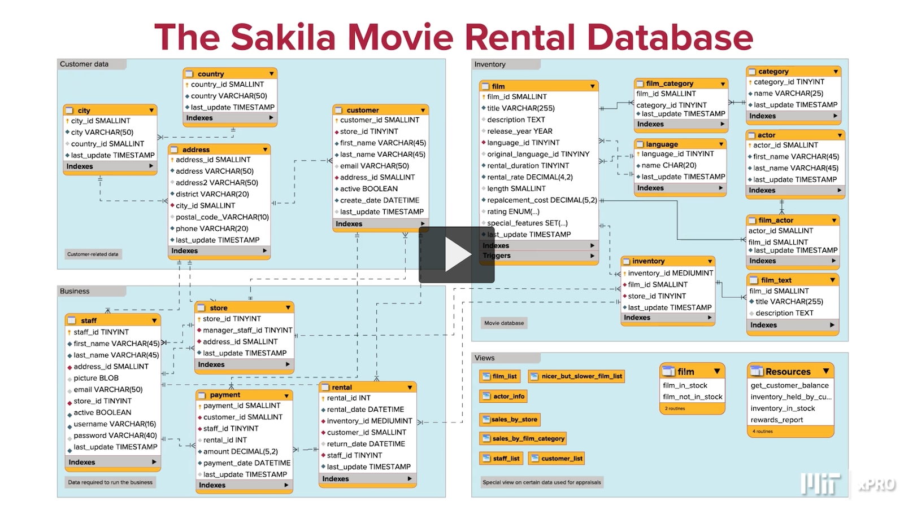

# PCDE Module 6 Content: Database Analysis & the Client Server Interface

## Overview

In this course we will cover...

### Database Analysis Course Overview

* Data exploration
* Histograms
* Data binning
* Detecting duplicates
* Data cleaning
* Pivot tables
* Dealing with Strings
* Dealing with Dates

### Associated Notes

* [SQL Overview][sql-zk]
* [EDA in SQL][sql-eda-zk]

### Links

***TODO*** Please put these somewhere in your cloud and archives,
ideally on your bin as well.

#### Bad Sakila Database SQL Files

* [Bad Sakila schema file][pcde-bad-sakila-schema-dl-emeritus]
* [Bad Sakila data file][pcde-bad-sakila-data-dl-emeritus]


## Bad Sakila Database

### Bad Sakila Overview

We will be using the "Bad Sakila" Movie Rental database for this module.
It is based on the context of a movie rental business with
tables divided into 4 categories.
Those 4 categories are Customer data, Business, Inventory, & views.



* Customer data
  * Customer
    * *PK*: customer_id
    * *FK(s)*: store_id, address_id
    * dependents: first_name, last_name, email, active, create_date, last_update
  * Address
    * *PK*: address_id
    * *FK(s)*: city_id
    * dependents: address, address2, district, postal_code, phone, last_update
  * City
    * *PK*: city_id
    * *FK(s)*: country_id
    * dependent: city, last_update
  * Country
    * *PK*: country_id
    * *FK(s)*: null
    * dependents: country, last_update
* Business
  * Store
    * *PK*: store_id
    * *FK(s)*: manager_staff_id, address_id
    * dependents: last_update
  * Staff
    * *PK*: staff_id
    * *FK(s)*: address_id, store_id
    * dependents: first_name, last_name, picture, email, active,
username, password, last_update
  * Rental
    * *PK*: rental_id
    * *FK(s)*: inventory_id, staff_id, customer_id
    * dependents: rental_date, return_date, last_update
  * Payment
    * *PK*: payment_id
    * *FK(s)*: customer_id, staff_id, rental_id
    * dependents: amount, payment_date, last_update
* Inventory
  * Inventory
    * *PK*: inventory_id
    * *FK(s)*: film_id, store_id
    * dependents: last_update
  * Film
    * *PK*: film_id
    * *FK(s)*: language_id, original_language_id
    * dependents: title, description, release_year, rental_duration, rental_rate, length,
replacement_cost, rating, special_features, last_update
  * Film_category
    * *PK*: film_id + category_id
    * *FK(s)*: film_id, category_id
    * dependents: last_update
  * Category
    * *PK*: category_id
    * *FK(s)*: null
    * dependents: name, last_update
  * Language
    * *PK*: language_id
    * *FK(s)*: null
    * dependents: name, last_update
  * Actor
    * *PK*: actor_id
    * *FK(s)*: null
    * dependents: first_name, last_name, last_update
  * Film_actor
    * *PK*: actor_id + film_id
    * *FK(s)*: actor_id, film_id
    * dependents: last_update
  * Film_text
    * *PK*: film_id?
    * *FK(s)*: film_id?
    * dependents: title, description
* Views
  * film_list
  * nicer_but_slower_film_list
  * actor_info
  * sales_by_store
  * sales_by_film_category
  * stall_list
  * customer_list
  * film
    * film_in_stock
    * film_not_in_stock
  * Resources
    * get_customer_balance
    * inventory_held_by_customer
    * inventory_in_stock
    * rewards_report

## Discussion 6.1: The Bad Sakila Movie Rental Database (4:00)

### Prompt

In the last video,
Dr. Sanchez performed some queries to explore the Bad Sakila Data.

Now it is time for you to explore on your own.
Think about what other information you would want to
know about the data in a database and
what information would help you understand the database better.
In your initial discussion post,
list at least three new queries you can run to
locate specific information using the tables included in the database.
For each query:

* State the query that you would use (write the query as you would in SQL).
* Describe the data that would be output from the query.
* Explain why this query would be helpful in understanding the database.

In your discussion post,
be sure to share links to any websites that
were helpful to you as you considered what types of
queries data scientists and engineers typically use to better understand databases.

Read the statements posted by your peers.
Engage with them by responding with
thoughtful comments and questions to deepen the discussion.

**Suggested Time**: 4 minutes

**Suggested Length**: 150-200  words

This is a required activity and will count toward course completion.

### Post

I've heard of [Kaggle](kaggle.com) before and
have been interested in trying them out for a while now.
I thought this would be a good opportunity to learn about **EDA** by
using this platform and some of
the notebooks and writings their users contribute.

On that note,
a contributor known as *anny_ksks*,
has contributed [this great jupyter notebook][eda-sql-kaggle] that
explores the data within a great subreddit for our interests (I'll see you there),
[r/DataIsBeautiful][r-dataisbeautiful].

In it she asks some pertinent questions I suppose any good Data Engineer might:

>* What are the most popular Reddit's? Which topics are viral?
>* Which posts have been removed and why?
>* What % removed reddits are deleted by moderatos?
>* Who are the most popular authors?
>* Who are the biggest spammers at Reddit platform?

In this notebook I also learned something new about our old friend *pandas*,
it can be used to store results of queries by directly entering SQL into it.
You can even use SQL to query dataframes themselves.

These questions got me thinking about our `bad_sakila` database.

* Is english really the most common film language?
* What are the most filmed actors in this movie rental store?
* What customers the most obsessive about an actor(ess)?
  * *i.e which customer rents the most of a single actor(ess)?*

#### Is English the most common Film Language?

So let's get exploring.
First, the simple one, which film language is most common, is it english?
To do this we open the `film` database and join it with `language` `ON`
the `language.language_id` and `film.language_id` columns.

```sql
SELECT l.name, COUNT(f.language_id)
FROM film f
JOIN language l
    ON f.language_id = l.language_id
GROUP BY language_id;
```

Well that was underwhelming,
it seems this rental company only does english movies.
There's exactly 1000 english movies in the whole inventory.
This helps us understand we aren't dealing with cinema outside Hollywood.

| name    | COUNT(f.language_id) |
| ------- | -------------------- |
| English | 1000                 |

#### What are the most filmed actors in this movie rental company?

Who are the most filmed actors in this film inventory?
Again,
we return to the `film` table and
start `SELECT`ing actor names and a `COUNT` of film appearances as columns.
And now we are dealing with a more complicated *many-to-many* relationship,
`actor` to `film`.
So we'll need to join via a *join table*, `film_actor` `ON`
the `film_id` column.
Then join the `actor` and `film_actor` database `ON`
the `actor_id` columns.
Then `GROUP BY` the **join table**'s actor_id column because
this is where we get the count of film appearances of each actor.
Finally, we `ORDER BY` the aliased `films` column to
more easily see who has appeared in the most films.

```sql
SELECT a.last_name, a.first_name, COUNT(j.actor_id) AS films
FROM film f -- f for film
JOIN film_actor j -- j for join
    ON f.film_id = j.film_id
JOIN actor a -- a for actor
    ON a.actor_id = j.actor_id
GROUP BY j.actor_id
ORDER BY films DESC;
```

This was an expensive join statement.
On my macbook with M1 CPU it took me just over a minute to get the answer.
Below is the first 12 rows of the *join table* that answers our question.
*Gina Degeneres* appears in the most films in our inventory.
Looking further down the table we see a lot of reoccurrences.
This tells us that the data is somewhat concentrated around
the same groupings of actors.

| last_name   | first_name | films |
| ----------- | ---------- | ----- |
| DEGENERES   | GINA       | 42    |
| TORN        | WALTER     | 41    |
| KEITEL      | MARY       | 40    |
| CARREY      | MATTHEW    | 39    |
| KILMER      | SANDRA     | 37    |
| DAMON       | SCARLETT   | 36    |
| BASINGER    | VIVIEN     | 35    |
| WITHERSPOON | ANGELA     | 35    |
| WOOD        | UMA        | 35    |
| BERRY       | HENRY      | 35    |
| DUNST       | GROUCHO    | 35    |
| BOLGER      | VAL        | 35    |

#### What customers the most obsessive about an actor(ess)?

This one is a bit of fun,
which customer is most obsessed about an actor or actress?
We can figure this out by
checking out which customer has rented out
the most films starring one actor or actress.

I thought I'd open this up for discussion as it is quite complex.
How do we get this relationship setup in a query?
We have a set of relationships that lead us from `customer` to `actor`.

* `actor` is related to `film_actor`.
* `film_actor` is related to `film`.
* `film` is related to `inventory`.
* `inventory` is related to `rental`.
* `rental` is related to `customer`.

Would you just chain several joins together by their *foreign keys* to
finally arrive at the `GROUP BY` statement that gives us a `customer_id`
that has rented the most of any one `actor_id`?

A query like this would be expensive,
but this is the sort of relationship that can be really valuable to
a business like a movie rental company.
It tells us what movies customers are most likely to rent,
and thus make a rental more likely if advertised to.

### Replies

***TODO*** Add your replies

## Knowledge Check 6.1: Exploring a Database (30:00)

### Q1

Which SQL statement would you use to create a schema?

* INSERT schema schema_name
* ADD schema schema_name
* ADD if not exists schema schema_name
* CREATE schema schema_name
  * **Correct**

### Q2

Which SQL statement would you use to access a database before
exploring tables in that database?

* GO INSIDE db_name
* SELECT db_name
* USE db_name
  * **Correct**
* GET db_name

### Q3

Which SQL statement could you use to get an overview of
all the tables in a database?

* SHOW TABLE OVERVIEW
* SHOW TABLE INFO
* SHOW TABLE DESIGN
* SHOW TABLE STATUS
  * **Correct**

### Q4

Which SQL statement can be used to count the number of rows in a table?

* SELECT COUNT(rows) FROM table_name
* SELECT COUNT(*) FROM table_name
  * **Correct**
* SELECT rows FROM table_name
* SELECT num_rows FROM table_name

## Codio Coding Activity 6.1: Exploring a Dataset Using SQL (45:00)

### 1. Codio Coding Activity 6.1: Exploring a Dataset using SQL

#### Select The Database

To avoid mistakes,
you are strongly advised to select the database before attempting any question.
You can do so using the syntax:

```sql
USE database_name
```

#### Load the Database

To load the database,
type the following in the Terminal window:

```sql
source bad-sakila-schema.sql
source bad-sakila-data.sql
```

#### Resetting the Terminal

If something glitches in the Terminal window,
the workaround is to terminate the command with ; + Enter.
Alternatively you can navigate to the next page and
then back to the one you were working on.
Both of these options will reset the Terminal.

### 2. The Bad Sakila Database

#### The Bad Sakila Database

Throughout this activity,
you will be working with the `bad_sakila` database that you have explored in
the last three videos.

In the file window,
type the correct commands to
visualize all the tables present in the bad_sakila database.

#### Solution

```sql
USE bad_sakila;
SHOW TABLES;
```

How many tables are in the bad sakila database? 16

### 3. Showing the Status of the Tables

Showing the Status of the Tables

Rearrange the code blocks below to
view the status of the tables in the bad sakila dataset.

Hint: You won’t use all of the blocks.

You will have three attempts to complete this question.
After your final attempt,
you will be able to view the correct answers for each item.

#### Solution 

```sql
USE bad_sakila;
SHOW TABLE STATUS;
```

### 4. Familiarizing With Your Data I

After loading a database,
the next logical step is to familiarize yourself with your data.

Suppose that you want to know
how many actor_id records are stored in the table actor.

In the file window,
type the commands to display the number of actors across the database.

The result should be:

```txt
+----------+
| COUNT(*) |
+----------+
|      200 |
+----------+
```

#### Solution

```sql
USE bad_sakila;
SELECT COUNT(*)
FROM actor;
```

### 5. Familiarizing With Your Data II

Next, suppose you want to know the number of different languages spoken in
the movies in the database.

In the file window,
type the commands to display the number of languages across the database.

The results should be:

```txt
+----------+
| COUNT(*) |
+----------+
|        6 |
+----------+
```

#### Solution

```sql
USE bad_sakila;
SELECT COUNT(*)
FROM language;
```

### 6. Familiarizing With Your Data III

Display the Language Table

What is the command to show the records in the language table?

Hint: You won’t use all of the blocks.

You will have three attempts to complete this question.
After your final attempt,
you will be able to view the correct answers for each item.

### 7. Filtering Query Results I

Now,
let’s work on filtering the records in
the bad sakila database using more advanced queries.

NOTE: For the next two exercises,
you will need to utilize some concepts that you learned in Modules 4 and 5.

Suppose you want to retrieve the rows in the actor table where
the last_name column values have GEN somewhere in the last_name value.

Ensure that the resulting table contains
the columns actor_id, first_name, and last_name.

In the file window,
type the correct commands to retrieve the records in
the actor table as described above. Remember to select the database first!

Results:

```txt
+----------+------------+-----------+
| actor_id | first_name | last_name |
+----------+------------+-----------+
|       14 | VIVIEN     | BERGEN    |
|       41 | JODIE      | DEGENERES |
|      107 | GINA       | DEGENERES |
|      166 | NICK       | DEGENERES |
+----------+------------+-----------+
```

#### Solution

```sql
USE bad_sakila;
SELECT actor_id, first_name, last_name
FROM actor
WHERE
    last_name LIKE "%GEN%";
```

### 8. Filtering Query Results II

Next,
suppose you want to find all actors whose last names contain the letters LI.
This time,
order the rows by last name and first name, in that order.

Ensure that the resulting table contains the columns first_name and last_name.

After typing the correct queries in the Terminal you should see the following output:

```txt
+------------+-----------+
| first_name | last_name |
+------------+-----------+
| GREG       | CHAPLIN   |
| WOODY      | JOLIE     |
| AUDREY     | OLIVIER   |
| CUBA       | OLIVIER   |
| GROUCHO    | WILLIAMS  |
| MORGAN     | WILLIAMS  |
| SEAN       | WILLIAMS  |
| BEN        | WILLIS    |
| GENE       | WILLIS    |
| HUMPHREY   | WILLIS    |
+------------+-----------+
```

#### Solution

```sql
SELECT first_name, last_name
FROM actor
WHERE last_name LIKE '%li%'
ORDER BY last_name, first_name;
```

### 9. Joining Tables I

In the next exercise,
you will be using the tables film, film_actor from the bad_sakila database.

For your convenience, see below the ER diagram for the bad_sakila database.

Suppose you want to know how many films each
actor with the same first name participated in.

In the file window,
type the commands to retrieve the records as described above.

HINT: Before trying the exercise,
use the command SHOW COLUMNS FROM table_name;
to visualize all the columns in each table. Join the tables.

#### Solution

```sql
USE bad_sakila;
SELECT COUNT(*), a.first_name
FROM film f
JOIN film_actor j
    ON f.film_id = j.film_id
JOIN actor a
    ON a.actor_id = j.actor_id
GROUP BY a.first_name;
```


## References

### Web Links

* [Bad Sakila Database Schema File (from emeritus)][pcde-bad-sakila-schema-dl-emeritus]
* [Bad Sakila Database Data File (from emeritus)][pcde-bad-sakila-data-dl-emeritus]
* [EDA using SQL][eda-sql-kaggle]
* [Reddit: r/DataIsBeautiful][r-dataisbeautiful]

<!-- Hidden References -->
[pcde-bad-sakila-schema-dl-emeritus]: https://classroom.emeritus.org/courses/1412/files/476581/download "Bad Sakila Database Schema File (from emeritus)"
[pcde-bad-sakila-data-dl-emeritus]: https://classroom.emeritus.org/courses/1412/files/476564/download "Bad Sakila Database Data File (from emeritus)"
[eda-sql-kaggle]: https://www.kaggle.com/code/olgaberezovsky/eda-using-sql/notebook "EDA using SQL"
[r-dataisbeautiful]: https://www.reddit.com/r/dataisbeautiful/ "Reddit: r/DataIsBeautiful"

### Note Links

* [SQL Overview][sql-zk]
* [Exploratory Data Analysis in SQL][sql-eda-zk]

<!-- Hidden References -->
[sql-zk]: ./sql.md "SQL Overview"
[sql-eda-zk]: ./sql-eda.md "Exploratory Data Analysis in SQL"

### Referenced By

* [PCDE Course Overview][pcde-overview-zk]

<!-- Hidden References -->
[pcde-overview-zk]: ./pcde-course-overview.md "PCDE Course Overview"
