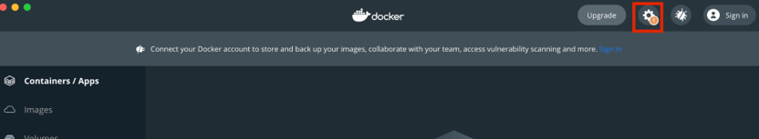
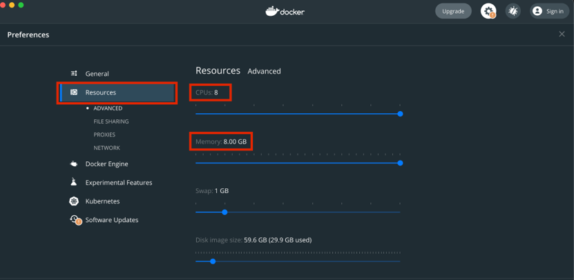

# PCDE Project 23.1: Creating a Sense-Making Data Pipeline

## Introduction

In this project, you will use the [Python][-py] [urllib library][-py-url] to
pull data from MIT’s course catalog.
The data being pulled from the web will be unstructured,
so you will have to clean it first to extract the course names.
Once the course names are extracted and the data is structured,
you will perform some [data analysis][-eda] to
learn how many times each word occurs throughout all of the course names.
This analysis will be saved as a [JSON file][-json],
which will then be referenced by your [D3][-d3] web application.
Lastly, the web application will generate a visual analysis of
the JSON data that you just collected.

To streamline the data analysis process,
you will use software tools that you have learned about in previous modules,
such as [Docker][-docker] and [Airflow][-py-airflow].
You will be responsible for instantiating an Airflow web server within
a Docker container to handle each Python task that you define.
These tasks will divide the project into smaller, more manageable pieces.
In the end,
you will experiment with different D3 libraries to customize your project.

As you write the code for this project,
it is strongly recommended that you run each method independently as
it is created so that you can verify that each task works as expected.

This project is worth a total of 100 points.

## Instructions

### Part 1: Code Development

#### Step 1

Create a folder titled `project-23`.
Place the [code visualization][pcde-23-1-vis-code-dl] folder within
the `project-23` folder, and create another empty folder titled `airflow-docker`.
Then, create a new `assignment.py` file,
which will contain your coding throughout the project.
Provide a screenshot of the `project-23` folder with
the code `visualization folder`, `airflow-docker` folder,
and `assignment.py` file within it.

#### Step 2

Open the `assignment.py` file using VS Code.
First, you will need to import all of the libraries that you will be using.
Import the following libraries:

* The DAG object (needed to instantiate a DAG)
  * From `airflow`, import `DAG`.
  * From `datetime`, import `timedelta`.
* *Operators* (needed to operate)
  * From `airflow.operators.bash`, import `BashOperator`.
  * From `airflow.utils.dates`, import `days_ago`.
  * From `airflow.operators.python`, import `PythonOperator`.
* *Task Functions* (used to facilitate tasks)
  * Import `urllib.request`.
  * Import `time`.
  * Import `glob`, `os`.
  * Import `json`.

Provide a screenshot to show that you have imported the DAG object,
the operators,
and all of the necessary task functions into the assignment.py file.

#### Step 3

Generate your first task.
This task will be a Python function named `catalog()` that accepts no arguments.
Inside of the `catalog()` function,
define two helper functions named `pull(url)` and `store(data, file)`.

The `pull(url)` function accepts, as an argument, a URL of type string.
This function will execute the code provided in lines 6 and 7 in
the [`code_starter/01_pull.py`][proj23-01-pull-dl] file and
will return the data variable.

The `store(data, file)` function accepts two arguments:
a filename of type string and the data that was returned by the `pull()` function.
The `store()` method will execute the following:

* Create and open a file named after the URL where the data came from
  (example: `m1a.html`).
* Write the data to the file.
* Close the file.

Below, you are provided with the pseudocode to define the `catalog()` function and
the `pull(url)` and `store(data, file)` helper functions.
Note: This is just pseudocode;
you will need to complete it with the correct syntax:

```python
# pull course catalog pages
def catalog():

    #define pull(url) helper function
    def pull(url):
      
        return data
         
    #define store(data,file) helper function
    def store(data,file):
 
        print('wrote file: ' + file)
```

Provide a screenshot of the `pull(url)` and
`store(data, file)` helper functions defined inside of the `catalog()` task.

#### Step 4

Once you have defined these two helper functions,
you need to write some code within
the `catalog()` method to utilize them.
Create a list titled `urls` that contains the working URLs in
the [00_urls.txt][proj23-urls-txt-dl] file as strings.
Use a `for` loop to iterate through the `urls` list.
First, the loop will call the `pull(url)` function to obtain the data.
Then, the loop will call the `store(data, file)` function to obtain the data.
Use the pseudocode provided below to define the `for` loop.
Note: This is just pseudocode; you will need to complete it with correct syntax.

```python
index = url.rfind('/') + 1
#call pull function

file = url[index:]
#call store function

print('pulled: ' + file)
print('--- waiting ---')
time.sleep(15)
```

Provide a screenshot of the entire `catalog()` function,
including the `urls` list and the `for` loop just implemented.

#### Step 5

Continue coding within the `assignment.py` file.
Create the second task in the Airflow pipeline called `combine()`.
The `combine()` task will combine all of the unstructured data files into
one large file.
Use the pseudocode below to combine the files.
Note: This is just pseudocode;
you will need to complete it with the correct syntax:

```python
open('combo.txt') as outfile:
       for file in glob.glob("*.html"):
           open(file) as infile:
               outfile.write(infile.read())
```

Provide a screenshot of the `combine()` method with
the correct code to combine the files.

#### Step 6

Continue coding within the `assignment.py` file.
Create the third task method, called `titles()`.
This function will utilize the [BeautifulSoup4][bs4-quickstart] library,
which enables you to scrape web pages.

The `titles()` function will take no arguments.
This function imports the BeautifulSoup4 library and contains one helper function,
`store_json()`, to store the resulting JSON file.
Copy the code below under the definition of the `titles()` function to
import the BeautifulSoup4 library and define the `store_json()` function.

```python
from bs4 import BeautifulSoup
def store_json(data,file):
       with open(file, 'w', encoding='utf-8') as f:
           json.dump(data, f, ensure_ascii=False, indent=4)
           print('wrote file: ' + file)
```

Next, you will use the BeautifulSoup4 library to inspect the HTML page and
gather the information within the `h3` element of the page where
the course titles are found.
You will then place the result in a JSON file.
Complete the pseudocode for the `titles()` function below to open and
read the HTML file generated by the `combine()` function.

```python
def titles():
      from bs4 import BeautifulSoup
      def store_json(data,file):
           with open(file, 'w', encoding='utf-8') as f:
               json.dump(data, f, ensure_ascii=False, indent=4)
               print('wrote file: ' + file)

   #Open and read the large html file generated by combine()


   #the following replaces new line and carriage return char
   html = html.replace('\n', ' ').replace('\r', '')
   #the following create an html parser
   soup = BeautifulSoup(html, "html.parser")
   results = soup.find_all('h3')
   titles = []

   # tag inner text
   for item in results:
       titles.append(item.text)
   store_json(titles, 'titles.json')
  ```

Provide a screenshot of the completed `titles()` method with the correct code to
open and read the HTML file generated by the `combine()` function.

#### Step 7

Continue coding within the `assignment.py` file.
The next task method will remove all punctuation, numbers,
and one-character words from the `titles.json` file.
This task method, `clean()`, takes no arguments and uses the same helper function,
`store_json(data,file)`, that you used in the `title()` function defined in
the previous step.
Below is the pseudocode for the `clean()` method.
Implement any needed commands to complete the pseudocode:

```python
def clean():
   #complete helper function definition below
   def store_json(data,file):
      .. 
   with open(titles.json) as file:
       titles = json.load(file)
       # remove punctuation/numbers
       for index, title in enumerate(titles):
           punctuation= '''!()-[]{};:'"\,<>./?@#$%^&*_~1234567890'''
           translationTable= str.maketrans("","",punctuation)
           clean = title.translate(translationTable)
           titles[index] = clean

       # remove one character words
       for index, title in enumerate(titles):
           clean = ' '.join( [word for word in title.split() if len(word)>1] )
           titles[index] = clean

       store_json(titles, 'titles_clean.json')
```

Provide a screenshot of the fully implemented `clean()` method with
the correct code to remove all punctuation, numbers,
and one-character words from the `titles.json` file.

#### Step 8

Continue coding within the `assignment.py` file.
The final task method you will define is `count_words()`.
The `count_words()` method accepts no arguments and
uses the helper function `store_json(data,file)` that
was used in the previous two tasks to save the resulting JSON file.
The pseudocode for the `count_words()` method is below.
Implement any needed commands to complete the pseudocode:

```python
def count_words():
     from collections import Counter
     def store_json(data,file):
           ..
     with open(titles_clean.json) as file:
            titles = json.load(file)
            words = []

            # extract words and flatten
            for title in titles:
                words.extend(title.split())

            # count word frequency
            counts = Counter(words)
            store_json(counts, 'words.json')
```

Provide a screenshot of the completed `count_words()` method with
the correct code to call the `store_json(data,file)` helper function.

#### Step 9

Continue coding within the `assignment.py` file.
Because this Python file will be run using Airflow,
you need to design an Airflow pipeline as the final part to this file.
The first step is to define the DAG.
Then, define each task, from `t0` to `t5`, for a total of six tasks.
The first task, `t0`,
will be a `bash` command to install the BeautifulSoup4 library within
the Docker environment.
The next five tasks will each call one Python function that you have defined in
the previous steps.
Below, you are provided with some code to get started.
The `t0` task is already defined for you.
The `t1` task is also already defined for you,
and it executes the `catalog()` function in your DAG.
Complete the code below to define the remaining four tasks:

```python
with DAG(
   "assignment",
   start_date=days_ago(1),
   schedule_interval="@daily",catchup=False,
) as dag:

# INSTALL BS4 BY HAND THEN CALL FUNCTION

   # ts are tasks
   t0 = BashOperator(
       task_id='task_zero',
       bash_command='pip install beautifulsoup4',
       retries=2
   )
   t1 = PythonOperator(
       task_id='task_one',
       depends_on_past=False,
       python_callable=catalog
   )
   #define tasks from t2 to t5 below


   t0>>t1>>t2>>t3>>t4>>t5
```

Provide a screenshot of the DAG declaration with all six tasks,
from `t0` to `t5`, correctly defined.

### Part 2: Code Execution

#### Step 10

Execute the command below in a Terminal window to
copy the `assignment.py` file inside the `airflow-docker/dags` folder so
that Airflow can load the Python tasks as a DAG.

```sh
cp assignment.py airflow-docker/dags
```

Next, make sure that your Docker application is open.
To speed up your computations,
select the gear icon on the top right corner of your Docker UI.



Select the Resources option in the menu on the left and
increase the CPU and memory to the maximum value possible.



Select Apply and Restart to finalize your changes.

You are now ready to run the Airflow pipeline.
In a Terminal window, navigate to the airflow-docker folder that
you created within the `project-23` folder.
Follow the first four steps in [Mini-Lesson 19.2][-air-install] to
install Airflow on your machine and to initialize the containers.

Provide a screenshot of your Docker application that shows that
your Airflow Docker container has initiated.

## Submission

### Submission: Part 1: Code Development

1. Provide a screenshot of the `project-23` folder with
    the `code-visualization` folder, `airflow-docker` folder,
    and `assignment.py` file within it.
2. Provide a screenshot to show that you have imported the DAG object,
    the operators, and all of the necessary task functions into
    the `assignment.py` file.
3. Provide a screenshot of the `pull(url)` and
    `store(data, file)` helper functions defined inside of the `catalog()` task.
4. Provide a screenshot of the entire `catalog()` function,
    including the `urls` list and the `for` loop that you just implemented.
5. Provide a screenshot of the `combine()` method with
    the correct code to combine the files.
6. Provide a screenshot of the completed `titles()` method with
    the correct code to open and read the HTML file generated by
    the `combine()` function.
7. Provide a screenshot of the fully implemented `clean()method` with
    the correct code to remove all punctuation, numbers,
    and one-character words from the `titles.json` file.
8. Provide a screenshot of the completed `count_words()` method with
    the correct code to call the `store_json(data,file)` helper function.
9. Provide a screenshot of the DAG declaration with all six tasks,
    from `t0` to `t5`, correctly defined.

### Submission: Part 2: Code Execution

1. Provide a screenshot of your Docker application that shows thatyour Airflow Docker container has initiated.

## References

### Web Links

* [PCDE Course Project 23-1 Visualization Code Download][pcde-23-1-vis-code-dl]
* [Project 23 Download: code_starter/01_pull.py][proj23-01-pull-dl]
* [Project 23 Download: 00_urls.txt][proj23-urls-txt-dl]
* [BeautifulSoup4 Quick-start guide][bs4-quickstart]

>**TODO**: Once the pastebin service is up and running,
>place this code (which will be in the PCDE archive) into it
>and change the link to the bin

* [Airflow: Install][-air-install]

>**TODO:** This link above currently links to the emeritus mini lesson 19.2,
>it needs to link to the airflow note section on docker deploys or
>the separate note made for airflow installs.

<!-- Hidden References -->
[pcde-23-1-vis-code-dl]: https://classroom.emeritus.org/courses/1412/files/1004584/download "PCDE Course Project 23-1 Visualization Code Download"
[proj23-01-pull-dl]: https://classroom.emeritus.org/courses/1412/files/1004590/download "Project 23 Download: code_starter/01_pull.py download link"
[proj23-urls-txt-dl]: https://classroom.emeritus.org/courses/1412/files/1004587/download "Project 23 Download: 00_urls.txt"
[bs4-quickstart]: https://pypi.org/project/beautifulsoup4/ "BeautifulSoup4 Quick-start guide"
[-air-install]: https://classroom.emeritus.org/courses/1412/pages/mini-lesson-19-dot-2-installing-airflow-in-a-docker-container-30-00?module_item_id=623956 "Airflow: Install"

### Note Links

* [Python][-py]
* [URLLib (Python Std.Lib.)][-py-url]
* [Exploratory Data Analysis (EDA)][-eda]
* [JavaScript Object Notation (JSON)][-json]
* [Javascript][-js]
* [Data Driven Documents (D3, a Javascript Library)][-d3]

<!-- Hidden References -->
[-py]: python.md "Python"
[-py-url]: python-urllib.md "Python urllib Library"
[-eda]: exploratory-data-analysis.md "Exploratory Data Analysis (EDA)"
[-json]: json.md "JavaScript Object Notation (JSON)"
<!-- [-curl]: curl.md "cURL" -->
[-js]: javascript.md "Javascript"
[-d3]: d3.md "Data Driven Documents (D3, a Javascript Library)"
[-docker]: docker.md "Docker"
[-py-airflow]: python-airflow.md "Python Airflow"
