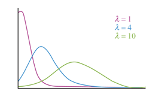
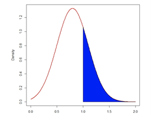
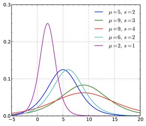
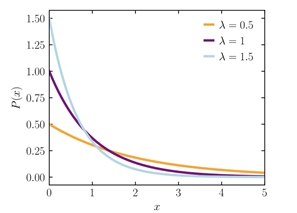

# Probability

This is an overview of probabilities and statistics topics.

## Random Variables

Random variables are numerical outcomes of random phenomena,
with the range of possible values represented by that variable.

For example,
in the coin toss experiment,
the possible outcomes of tails and heads get mapped to 0 and 1 respectively,
then the random variable **X** will have possible values of 0 or 1.

On the other hand,
when rolling a fair die,
the possible values for the random variable are 1, 2, 3, 4, 5, and 6,
because the die has 6 sides so those are the possible outcomes.

There are two types of random variables: discrete and continuous.

If a random variable can take only a finite number of values,
then it must be discrete.
The variables described in the previous examples are all discrete.

>"A continuous random variable is one that takes an infinite number of possible values.
>Continuous random variables are usually measurements-"
>-- (Yale University, n.d.)

A continuous random variable is a random variable with
a set of possible values (known as the range) that is infinite and uncountable.
Continuous random variables are usually measurements,
such as height and weight,
because they can assume any value within a specified range.

## Probability Density Functions

As covered in the section about [random variables](#random-variables),
they are numerical outcomes of random phenomena.
**Probability density functions** (PDFs) are then
the functions that describe the probability of a random variable.

The *probability distribution function* for
a random variable $X$ maps the values that $X$ can take to
the probability value for that outcome.

For example,
consider again the experiment of rolling a fair die.
As described above,
the random variable $X$ can take the values 1, 2, 3, 4, 5, and 6.
If the die is fair, then any outcome has an equal probability of $\frac{1}{6}$.

Therefore, the probability distribution for
this experiment can be summarized as follows:

| Outcome     | 1   | 2   | 3   | 4   | 5   | 6   |
| :---------- | :-- | :-- | :-- | :-- | :-- | :-- |
| Probability | 1/6 | 1/6 | 1/6 | 1/6 | 1/6 | 1/6 |

As you'll see next, *probability density functions* can be discrete or continuous.

## Probability Distributions

### Common Discrete Probability Density Functions

#### Binomial Distribution

One common discrete *probability distribution function* is the binomial distribution.

>"A binomial distribution describes the probability of success or failure of
>an experiment that is repeated multiple times."
>(Glenn, 2021).

Therefore,
the binomial is a type of distribution that only displays two possible outcomes.

A coin toss has only two possible outcomes:
heads or tails.
Therefore, a coin toss experiment can be described by the binomial distribution.

#### Uniform Distribution

A uniform distribution, also called a rectangular distribution,
is a *probability distribution* that has constant probability.

Rolling a single die is one example of a discrete uniform distribution.
A die roll has six possible outcomes: 1, 2, 3, 4, 5, or 6.
There is a $\frac{1}{6}$ probability of rolling any of these numbers.

#### Poisson Distribution

Another type of *discrete probability distribution* is the **Poisson distribution**.
The **Poisson distribution** can be used to
predict the probability of events occurring within a fixed interval based on
how often they have occurred in the past.

The **Poisson distribution** is given by:

$$F(x) = \frac{e^{-\lambda} \lambda^x}{x}$$

where $x$ is the average number of events that occur in a fixed interval.

This parameter also dictates the shape of the *Poisson distribution*.

Here is an example of how to use the *Poisson distribution*.

>"A textbook store rents an average of 200 books every Saturday night.
>Using this data,
>it is possible to predict the probability that more books will sell
>(perhaps 220 or 240) on the following Saturday nights"
>(Glenn, 2013).

### Common Continuous Distributions

#### Normal Distribution

The **normal probability distribution**,
a widely used *continuous probability distribution*,
is actually a family of distributions with differing means (indicated by $\mu$)
and standard deviations (indicated by $\sigma$).

So widely known it [has its own note document][normal-dist-zk].
Read there for more information.

The normal distribution is given by:

$$f(x) = \frac{1}{\sigma \sqrt{2 \pi}} e^{-\frac{1}{2} (\frac{x - \mu}{\sigma}^2)}$$

The normal distribution is symmetric about the mean,
which is the same as the median and the mode.

>"Because there are infinite values that the random variable $x$ could assume,
>the probability of $X$ taking any particular value is zero.
>(Nicholas School of the Environment, 2021)."

Therefore, values are often expressed in ranges.
For example,
the probability that a random variable $X$ is greater than 1 is given by
the area shaded in blue in the figure below.

#### T-Distribution

A closely related distribution is the **t-distribution**,
which is also symmetrical and bell-shaped but
it has heavier “tails” than the normal distribution.

It is highly similar to the normal distribution,
in fact it's a special case of the normal distribution.
For more information,
see the [Normal Distribution: T-Distrbution][normal-dist-t-zk] note.

#### Logistic Distribution

The logistic distribution is used for various growth models and
a type of regression known, appropriately enough, as logistic regression (Wikipedia 2021).

The standard logistic distribution is a continuous distribution on
the set of real numbers with distribution function F given by:

$$F(x) = \frac{e^x}{1 + e^x}$$

#### Exponential Distribution

The exponential distribution is a widely used continuous distribution.
It is often used to model the time elapsed between events.

A continuous random variable $X$ is said to have an exponential distribution with
a parameter $\lambda > 0$ if its probability density function is given by

$$f(x | \lambda) = \begin{cases} \lambda e^{-\lambda x} & x \geq 0 \\ 0 & x < 0 \end{cases}$$

where $x$ is the random variable, $\lambda$ is the rate parameter,
and $e$ is the base of the natural logarithm.

To get an intuitive feel for this interpretation of the exponential distribution,
suppose you are waiting for an event to happen.
For example, you are at a store and are waiting for the next customer.
In each millisecond,
the probability that a new customer will enter the store is very small.
Imagine that a coin is tossed each millisecond.
If it lands on heads,
a new customer enters.
The time until a new customer arrives will
approximately follow an exponential distribution.

## Mean and Variance

One of the most important characteristics to
a lot of probability distributions is the **mean** and **variance**.
A **mean** is the average, or expected value, of a distribution.
The **variance** is a measure of how spread out the distribution is,
or how much the values vary from the mean.
The mean is denoted by the Greek letter $\mu$,
and the variance is denoted by $\sigma^2$.
Variance is squared because it is a measure of the squared deviation from the mean.

Their relationship is given by:

$$\mu = E(x) = \frac{\sum{(x)}}{N}$$
$$\sigma^2 = E[(X - \mu)^2] = \sum{\frac{(x - \mu)^2}{N}}$$

Where the $E(x)$ is the expected value of $x$, or the mean.
The parameter $N$ is the number of observations and is a common notation.

## References

### Note Links

* [Normal Distribution][normal-dist-zk]
* [Normal Distribution: T-Distribution][normal-dist-t-zk]

<!-- Hidden Reference Links Below Here -->
[normal-dist-zk]: ./normal-distribution.md "Normal Distribution"
[normal-dist-t-zk]: ./normal-distribution.md#T-Distribution "Normal Distribution: T-Distribution"

### Referenced By

* [PCDE Course Overview][pcde-overview]

<!-- hidden reference links below here -->
[pcde-overview]: ./pcde-course-overview.md "PCDE Course Overview"

### Web Links

* [PCDE Course Mini Lesson 2.6: Probability Districution Functions][pcde-lesson-2-6]

<!-- hidden reference links below here -->
[pcde-lesson-2-6]: https://classroom.emeritus.org/courses/1412/pages/mini-lesson-2-dot-6-probability-distribution-functions-30-00?module_item_id=401417 "PCDE Course Mini Lesson 2.6: Probability Districution Functions"
