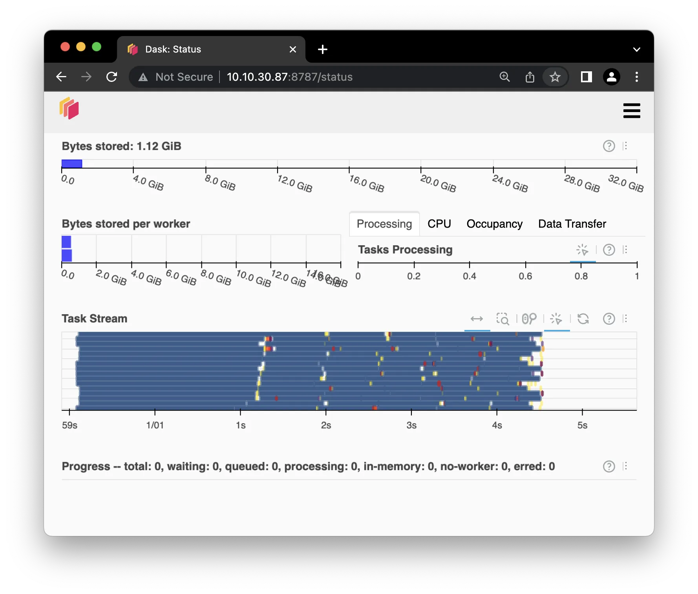

# DASK (Python Multiprocessing Library)

## Introduction

>**DASK** is a flexible library for [parallel computing][-parallel-compute] in
>[Python][-py]
>
>-- [DASK Documentation (2023)][dask-docs]

As stated by the DASK documentation,
**DASK** is a Python library for parallel computing.
DASK enables programmers to have more control over the way that
a program is compiled and run.

## Advantages

DASK is useful for processing [big data][-big-data] *collections*.
DASK allows for large [*arrays*][-ds-arr] and [*dataframes*][-ds-df] to
be processed in parallel across multiple external machines or internal threads.
DASK is a preferred alternative to [NumPy][-np] and [pandas][-pd] as
these libraries cannot handle big data when the data is too large to
fit in-memory. [(Dask Developers 2018)][dask-overview]

DASK is a dynamic task scheduler.
It allows the programmer to identify specific *tasks* to be computed in parallel.
The execution engine can do so on big data *collections* or on user-defined workloads.
The use of DASK can replace other *threading* and
*multi-core* processing libraries as it works to use small amounts of memory and
process *tasks* with low latency and high throughput.
[(Dask Developers 2018)][dask-overview]

## Getting Started

[Google Colab][google-colab] is a powerful computing platform for
Python data science, exploration, prototyping of large data sets and systems.
For this example, it will be used to illustrate how to use DASK.

First open a new Colab Notebook.

Next, run the following [pip][-pip] command in your Colab Notebook to
download the DASK dependencies in Colab [(Sowmya.L.R 2020)][lr20]:

```sh
pip install 'dask[complete]'
```

>**Note:** In a notebook environment you can also use magic commands (`%`) to
>call shell commands.

```python
%pip install 'dask[complete]'
```

If both of these commands above are not running properly,
you may need to reinstall the [gym][-gym] library.

```sh
pip uninstall gym
pip install gym
# Or if using the newer gymnasium deprecating gym...
pip uninstall gym
pip install gymnasium
```

## Basic Usage

A major advantage of using DASK is that it allows for big data files to
be read quickly.

Try loading a [CSV file][-csv] with DASK.
Begin by downloading this [CSV dataset file][pcde-minilesson-22-4-dataset]
to your local system.

Or within the terminal of your Colab Notebook, run the following command:

```sh
wget https://example.com/data.csv
```

Keeping the dataset on the colab server will almost certainly allow for
faster downloads and won't take up space on your own computer.

Next, once the dataset is on the Colab instance,
you can use this code to read the file into the notebook.

```python
from google.colab import files
uploaded = files.upload()
import dask.dataframe as dd
%time df = dd.read_csv('dataset.csv', encoding='ISO-8859-1')
```

After running this code, you will be prompted to choose a file from
you local device. Choose the downloaded CSV dataset file.
If you downloaded the file directly to the Colab instance,
you can do something like this instead.

```python
import dask.dataframe as dd
%time df = dd.read_csv('dataset.csv', encoding='ISO-8859-1')
```

DASK also allows for *task visualization*.
This can help users understand how *tasks* are being processed,
and it also is useful when debugging code.
Run the code below to try out a sample visualization to see how it works.

```python
import dask.array as da
x = da.ones((50, 50), chunks=(5, 5))
y = x + x.T
y.visualize(filename='transpose.svg')
```

## Running Tasks in Parallel

In addition to the ability to load and process large datasets,
DASK also provides the ability to program specific independent tasks to run in parallel.
This is helpful, as a *task* can be programmed and
a specific *function* can be labelled to a *task*.
To do so, annotate the *function* with `@Delayed`,
which indicates to DASK that you wish for this *function* to
be run at a specific desired time.

### Example Parallel Task

Consider you're writing a part of a program that needs to compute this sum:

$$ result = \frac{\sum_{i=1}^{y}x*i}{y!} $$

From what we know about basic order of operations in arithmetic,
The numerator and denominator both need to be computed before the division.
We can also see that the numerator and denominator are independent of each other.
Therefore you know that you can compute the numerator and denominator in parallel.
Although a factorial is very likely to be a much more expensive computation,
you will still be able to compute the numerator and denominator in parallel to
save some time.

First you'll need to import the `delayed` function from DASK.

```python
from dask import delayed
```

Now, run the following code for the numerator and denominator.

```python
@delayed
def numerator(x, y):
    return sum([x*i for i in range(1, y+1)])
```

Then, define the `denominator` function.

```python
@delayed
def denominator(y):
    if y <= 1:
        return 1
    else:
        return y * factorial(y-1)

```

With the `numerator` and `denominator` functions defined,
they will eventually be split out to run in parallel.
When they're done however,
the results need to be divided to get the final result.
Define the `result` function to do so.

```python
@delayed
def divide(numerator, denominator):
    return numerator / denominator
```

To calculate the whole result in parallel, run the following code.

```python
x = 1500
y = 10
numerator = delayed(numerator)(x, y)
denominator = delayed(denominator)(y)
result = delayed(divide)(numerator, denominator)
```

This process allows DASK to manage how the result is computed.
It's a bit like the `async` and `await` keywords in JavaScript.
This is enough information for DASK to know how to compute the result as
parallel as possible from the division of labor defined in the code above.

To visualize the *task graph* of this computation, run the following code.
You use the `result.visualize()` function to do so.

```python
result.visualize()
```

This should produce a graph that looks something like this.


As expected, DASK handles the two *tasks* independently and
then divides the result.
Instead of waiting for your CPU to finish calculating the result of
the numerator and then getting started on the denominator,
DASK calculates the numerator and denominator in parallel to save time.
This is one of many powerful advantages of using DASK for parallel computing.

Here is a copy of the [Colab Notebook][dask-basic-colab-nb] used for this example.

## Example: Multiple Parallel Files

Here we'll take advantage of DASKs multiprocessing capabilities to
process many files in parallel.

```python
import dask
import os
import datetime

if not os.path.exists('data'):
    os.mkdir('data')

def name(i):
    return str(datetime.date(2000, 1, 1) + 1 * datetime.timedelta(days=i))

df = dask.datasets.timeseries()
df.to_csv('data/*.csv', name_function=name)
```

This will create a directory called `data` and
create a CSV file for each day in the year 2000.
Each file will contain a single day of data.
The files will be named `2000-01-01.csv`, `2000-01-02.csv`, etc.

When running this code in a debugger there should be a set of
ThreadPools and ProcessPools created, equal to
the number of cores on the system.
Each file will be written in parallel.
Even the fastest drives won't be able to keep up with this,
so each thread pool will be forced to compute a few files and
then wait for the disk to catch up before continuing.

>**NOTE:** This will create at least 500MB of data.
>**Don't forget** to delete the data directory when you're done.

## Reading and Analyzing Data

DASK can be used to read and analyze data in parallel,
saving a lot of time when datasets are large.

### DASK DataFrames

DASK DataFrames are a parallel and distributed version of [Pandas][-pd]
[DataFrames][-ds-df].
They are useful when datasets are too large to fit in memory.
To start using DASK DataFrames, import the `dask.dataframe` module.

```python
import dask.dataframe as dd
```

Then to read multiple CSV files into a single DASK DataFrame, run the following code.

```python
df = dd.read_csv('data/*.csv')
```

This will read all of the CSV files in the `data` directory into
a single DASK DataFrame.
To now analyze the data,
you can use the same functions as you would with a Pandas DataFrame.
Along with the `compute()` function to get the result.

```python
df.describe().compute()
```

## Parallel Processing on Distributed Systems

### Introduction to DASK Distributed Computing

So far you have used DASK to run *threads* in parallel on your local machine.
Here those operations are performed in parallel on several computers.
This is useful when the dataset is too large to fit on a single machine.

DASK is a centrally-managed distributed computing platform.
The `dask-scheduler` is a process that
manages all the DASK tasks, called `dask-workers`, that are assigned to it.

### Start the DASK Scheduler

To run the `dask-scheduler`, depending on the OS you are using,
open the Anaconda prompt or a [terminal][-cli] and run the following command.

```sh
dask-scheduler
```

This will start the scheduler on the default port of `8786`.
It will show a message like the following.

```txt
distributed.scheduler - INFO - -----------------------------------------------
distributed.scheduler - INFO - Clear task state
distributed.scheduler - INFO -   Scheduler at: tcp://YOUR.IP.ADD.RES:8786
```

>**Note:** The IP address will be different on your machine.
>Make note of it here and follow along the instructions with that IP address.

### Start the DASK Workers

On each machine that is to join the DASK cluster,
open a new terminal and run the following command.

```sh
dask-worker YOUR.IP.ADD.RES:8786
```

This will start a worker process that will connect to the scheduler.
**Remember** to replace `YOUR.IP.ADD.RES` with the IP address of the scheduler.
This will start a worker process that will connect to the scheduler.

>**Note:** This just started a worker process on the same machine as the scheduler.
>This could just as well be another network accessible machine, VM,
>or [container][-container].

### Connect to the DASK Scheduler

To connect to the DASK cluster,
connect to the IP address and port of the scheduler created earlier.

```python
from dask.distributed import Client
client = Client("tcp://YOUR.IP.ADD.RES:8786")
```

The `client` gets assigned to that address and port here.
The global `dask.distributed` `Client` object is used to
store the variables and functions that are to be distributed.
The `client` object is used to interact with the scheduler.
We'll see next that the `client` object isn't necessary for all operations,
except for establishing the connection to the script.

### Run a DASK Task on the Cluster

Now let's create a computationally intensive task to run on the cluster.
Here a random DASK matrix is used to calculate the exponential of each element,
and then sum the result.

```python
import dask.array as da

x = da.random.random((40000, 40000))
y = da.exp(x).sum()
y.compute()
```

The `x` variable becomes this massive 40,000 by 40,000 matrix.
The `y` variable is the sum of the exponential of each element in `x`.
Note how the `y` is assigned as a DASK array object.
The DASK array object is used to store the function calls to
be executed in order and uses those function calls to determine how to
split the task into smaller tasks to be executed in parallel.
To execute the task, take the DASK array object and call the `compute()` function.
The result is the sum of the exponential of each element in the matrix.

### DASK Dashboard

The DASK dashboard is a web interface that shows the status of the cluster.
And if a browser is pointed to `http://YOUR.IP.ADD.RES:8787` before
running the above task, the dashboard will show the task being executed.
It should look something like this screenshot.



It shows the `Bytes stored` and `Bytes total` of the data in the cluster.
This is the data that is being operated on.
It shows the data being stored per worker,
which in this case since there's 2 workers,
is about half of the total data each.

The `Tasks Processing` shows the number of tasks that are being processed and
how their workloads are being distributed across the workers and
their local load on their respective CPU.

The `Task Stream` shows tasks as they are broken up into smaller tasks and
distributed across the workers.

## References

### Web Links

* [Dask Documentation Home][dask-docs]
* [Dask Developers. “DASK Tutorial Documentation.” DASK. 2018.][dask-overview]
* [Google Colab. "Welcome to Colab!". Accessed 2022-02-07][google-colab]
* [Sowmya.L.R "Introduction to Dask in Python". GeeksforGeeks. 2020-07-10][lr20]
* TODO: The below link needs to be archived and given a permalink on the shortener
* [PCDE Mini Lesson 22.4: Dataset][pcde-minilesson-22-4-dataset]
* [DASK Getting Started Tutorial Colab Notebook][dask-basic-colab-nb]

<!-- Hidden References -->
[dask-docs]: https://docs.dask.org/en/stable/index.html "DASK Documentation"
[dask-overview]:  https://tutorial.dask.org/00_overview.html "Dask Documentation: Tutorial"
[google-colab]: https://colab.research.google.com/ "Google Colab Home"
[lr20]: https://www.geeksforgeeks.org/introduction-to-dask-in-python/ "Geeks for Geeks: Introduction to DASK in Python"
[pcde-minilesson-22-4-dataset]: https://classroom.emeritus.org/courses/1412/files/1004605/download "PCDE: Mini Lesson 22.4: Dataset"
[dask-basic-colab-nb]: https://colab.research.google.com/drive/1l7N5IXwRLFWknW1wHWpvvG0QsIcdPzP9?usp=sharing "DASK Getting Started Tutorial Colab Notebook"

### Note Links

* [Parallel Computing][-parallel-compute]
* [Python][-py]
* [Big Data][-big-data]
* [Data Structure: Arrays][-ds-arr]
* [Data Structure: Dataframes][-ds-df]
* [Numpy (Python Library)][-np]
* [Pandas (Python Library)][-pd]
* [Python Package Installer (PIP)][-pip]
* [Open AI Gym / Farama Gymnasium][-gym]
* [Comma Separated Values (File Format)][-csv]
* [Container (Software)][-container]
* [Command Line Interface (CLI)][-cli]

<!-- Hidden References -->
[-parallel-compute]: parallel-computing.md "Parallel Computing"
[-py]: python.md "Python"
[-big-data]: big-data.md "Big Data"
[-ds-arr]: data-structure.md#arrays "Data Structure: Arrays"
[-ds-df]: data-structure.md#data-frames "Data Structure: Dataframes"
[-np]: numpy.md "Numpy (Python Library)"
[-pd]: pandas.md "Pandas (Python Library)"
[-pip]: pip.md "Python Package Installer (PIP)"
[-gym]: openai-gym.md "Open AI Gym / Karama Gymnasium"
[-csv]: csv.md "Comma Separated Values (File Format)"
[-container]: container.md "Container (Software)"
[-cli]: cli.md "Command Line Interface (CLI)"
