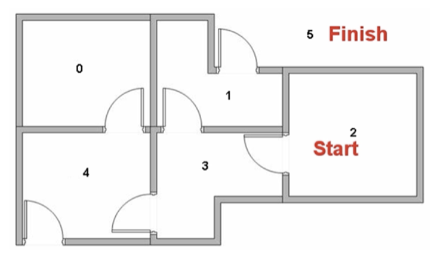

# Reinforcement Learning (Machine Learning)

## Introduction

**Reinforcement Learning** is a type of
*unsupervised learning* [algorithm][-algo] that focuses on optimizing the path to
a desired outcome by maximizing the reward and minimizing the penalty.
Or according to [Wikipedia][wiki-rl]:

>**Reinforcement learning** (**RL**) is an area of
>[machine learning][-ml] concerned with how intelligent agents ought to
>take actions in an environment in order to maximize the notion of cumulative reward.

## What Defines Reinforcement Learning?

There are a number of factors that define a reinforcement learning model:

* The input is the initial state of the model.
* The output has a vast number of possibilities.
* The model is trained by making a decision and
  is then rewarded or penalized until a prescribed outcome is reached.
* The optimal outcome is derived from the outcome with the highest reward.
* The model can continue to learn.
* Decisions are dependent, so sequences of dependent decisions are labeled.

There are also a number of practical, real-world applications of
reinforcement learning that are worth noting:

* Autonomous Machines and robotics
* Machine Learning and Data Processing
* Generating Custom Instructions
* Any environment in which information is collected by making interactions

## Q-Learning

### Introduction to Q-Learning

**Q-Learning** is a reinforcement learning technique that
uses a reward matrix or **Q-matrix** to demonstrate states, actions, and rewards.
The **Q-**[matrix][-mat] varies in each different implementation,
as it consists of a row for each
possible state and a corresponding column for each possible action at the state.

To generate the *Q-matrix*,
[Python's][-py] [NumPy][-np] library is used as shown below.
You will initialize the [matrix][-mat] with zeroes to
begin so that you can update each action with a corresponding reward later.
Use the following code to set the `state_size` and `action_size` to
the desired row and column amounts, respectively.

```python
import numpy as np
Q_Matrix = np.zeros((state_size, action_size))
print(Q_Matrix)
```

There are two ways to contribute to the *Q-matrix*.
The first method is referred to as **exploring**:
the algorithm chooses a random state and a random action,
then calculates the total cost to reach the reward from there.
*Exploring* is important because it allows the algorithm to
find and calculate new states.

The second method is referred to as **exploiting**:
where the algorithm references the *Q-matrix* for all possible actions.
The action with the maximum value will then be chosen as
the desired action from that given state.
Balancing *exploring* and *exploiting* is important and can be controlled by
what's commonly referred to as the **exploration rate** or $\epsilon$.

A table update will be performed for each step and
will end when an *episode* is complete.
An **episode** can be thought of as an endpoint being reached,
given a random starting point.
The whole table will not be complete with just a single *episode*,
but with enough *episodes* and *exploration*,
the algorithm will find all optimal *Q-values*.
**Q-values** are the values that
are stored, updated and referenced in the *Q-matrix*.

### Calculating the Q-Learning Algorithm

The steps to perform a *Q-Learning* algorithm are as follows:

1. The Q-Learning algorithm starts at some state $S_1$,
  then takes some action $A_1$ to receive a reward $R_1$.
2. The algorithm chooses an action to take by referencing the *Q-matrix* and
  choosing the most rewarding action,
  or the algorithm chooses an action randomly to fill in more of the *Q-matrix*.
  This is decided by the *exploration rate* $\epsilon$.
3. After the action is performed and the reward is calculated,
  the *Q-matrix* is updated with a formula.

The formula for the *Q-learning* algorithm is as follows:

$$
Q[state, action] = Q[state, action] + \eta \cdot
(reward + \gamma \cdot Max(Q[newState, :]) - Q[state, action])
$$

The above equation has some variables that need to be defined:

* $\eta$
  * The $\eta$ variable is the **learning rate** of the model.
  * This variable dictates the extent to which
    the newly calculated value is accepted.
  * In the *Q-learning* formula above,
    you are computing the difference between the new and old values,
    multiplying it by the learning rate,
    and then adding the difference to your *Q-matrix*.
    * This essentially moves you in the direction of the latest action.
* $\gamma$
  * Gamma ($\gamma$) is the **discount factor**.
  * It's used to balance current and future rewards.
  * You can see this being applied to the calculated future reward,
    making it have more or less weight on your current state.
  * This variable will generally be between 0.8 and 0.99.
* *Reward*
  * A reward is a value given to a certain state after performing an action.
  * A reward can be added any time in any state and
    is dependent on the specific problem that is being solved.
* $Max()$ *function*
  * The $Max()$ function acts as a placeholder to allocate the values of
    future rewards to the current state.
  * You can think of this as a recursive function,
    as this portion will be greed and
    choose the best path given all possible actions for that next state.

## Bellman Equation

***TODO:*** This needs to be explained better.

## Implementing Q-Learning

### Overview of Algorithm to Create Q-Matrix

1. Choose a random state.
2. Find the list of possible actions for that state.
3. Choose an action at random (or use the matrix to find the best one???).
4. Update the Q matrix with the **Bellman equation**.

### Example Problem

Pretend there's a robot that has to get out of a house from a specific room.
Each room is labelled with a number and the outside *"room"* is labelled with 5.
Below is an image of the rooms with their labels and
the doors leading to each one.



In this example case we want the robot to be dropped in room 2 and
be able to find its way as quickly as possible to room 5 or the outside.
Room 5 is accessible through
two rooms since the outside is one continuous area surrounding the house.

The connections between each room, which is basically a state is as follows:

* 0 => 4
* 1 => 3, 5
* 2 => 3
* 3 => 1, 2, 4
* 4 => 0, 3
* 5 => 1, 4

### Python Implementation of Q-Learning

```python
import numpy aimport numpy as np
# Define the states
ndim = 6
location_to_state = {
    'L0': 0,
    'L1': 1,
    'L2': 2,
    'L3': 3,
    'L4': 4,
    'L5': 5,
}
# Define the actions
actions = [0, 1, 2, 3, 4, 5, 6, 7, 8]
# Define the rewards
rewards = np.array([[0, 0, 0, 0, 1, 0],
                    [0, 0, 0, 1, 0, 100],
                    [0, 0, 0, 1, 0, 0],
                    [0, 1, 1, 0, 1, 0],
                    [1, 0, 0, 1, 0, 100],
                    [0, 1, 0, 0, 1, 100]])

# Maps indices to locations
state_to_location = dict((state, location)
                         for location, state in location_to_state.items())

# Initialize parameters
gamma = 1/2  # Discount factor
alpha = 1.0  # Learning rate


def get_optimal_route(start_location, end_location):
    # Copy the rewards matrix to new Matrix
    rewards_new = np.copy(rewards)

    # Get the ending state corresponding to the ending location as given
    ending_state = location_to_state[end_location]

    # With the above information automatically set the priority of the given ending
    # state to the highest one
    rewards_new[ending_state, ending_state] = 100

    # -----------Q-Learning algorithm-----------

    # Initializing Q-Values
    Q = np.array(np.zeros([ndim, ndim]))
    print(Q)
    np.random.seed(1)
    # Q-Learning process
    for i in range(1000):
        # Pick up a state randomly
        # Python excludes the upper bound
        current_state = np.random.randint(0, ndim)
        # For traversing through the neighbor locations in the maze
        playable_actions = []
        # Iterate through the new rewards matrix and get the actions > 0
        for j in range(ndim):
            if rewards_new[current_state, j] > 0:
                playable_actions.append(j)
        # Pick an action randomly from the list of playable actions
        # leading us to the next state
        next_state = np.random.choice(playable_actions)

        # Compute the temporal difference
        # The action here exactly refers to going to the next state
        TD = rewards_new[current_state, next_state] + gamma * Q[next_state,  
                  np.argmax(Q[next_state, ])] - Q[current_state, next_state]
        # Update the Q-Value using the Bellman equation
        Q[current_state, next_state] += alpha * TD
        #print(f'current: {current_state}, next: {next_state}')
        # print(Q)

 # Initialize the optimal route with the starting location
    route = [start_location]
    # We do not know about the next location yet, so initialize with the value of
    # starting location
    next_location = start_location

    # We don't know about the exact number of iterations
    # needed to reach to the final location hence while loop will be a good choice
    # for iteratiing

    while(next_location != end_location):
        # Fetch the starting state
        starting_state = location_to_state[start_location]
        # Fetch the highest Q-value pertaining to starting state
        next_state = np.argmax(Q[starting_state, ])
        # We got the index of the next state. But we need the corresponding letter.
        next_location = state_to_location[next_state]
        route.append(next_location)
        # Update the starting location for the next iteration
        start_location = next_location
    print(f'{Q}')
    return route


np.set_printoptions(precision=0)
print(get_optimal_route('L2', 'L5'))
```

## A More Complex Example

***TODO:*** Add the second example from the jupyter notebook.

## References

### Web Links

* [Wikipedia.org. 'Reinforcement Learning' Accessed 2023-06-09][wiki-rl]

<!-- Hidden References -->
[wiki-rl]: https://en.wikipedia.org/wiki/Reinforcement_learning "Wikipedia.org. 'Reinforcement Learning' Accessed 2023-06-09"

### Note Links

* [Algorithm][-algo]
* [Machine Learning][-ml]
* [Matrix (Linear Algebra)][-mat]
* [Python][-py]
* [NumPy][-np]

<!-- Hidden References -->
[-algo]: algorithm.md "Algorithm"
[-ml]: machine-learning.md "Machine Learning"
[-mat]: matrix.md "Matrix (Linear Algebra)"
[-py]: python.md "Python"
[-np]: numpy.md "NumPy"
