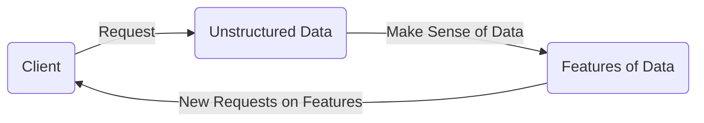

# Sense-Making Data Pipeline (Unstructured Data ETL)

## Introduction

Sense-making is something that we're always doing.
We're always trying to make sense of the world.
And in this project we're going to be doing precisely that with data.
And we'll be looking at data from MIT's course catalog.
During that process we'll try to *sense-make* from the data within
the online course catalog,
we're going to learn this process to create a **sense-making data pipeline**.

This process is very similar to how we [Extract, Transform, Load (ETL)][-etl]
data into data ingestion pipelines, usually for more structured or
at least more predictable data.

## Implementing Sense-Making Data Pipelines

MIT's course catalog exists on this address
[https://student.mit.edu/catalog/index.cgi][mit-catalog].
To explore the data, a good start might be to use [cURL][-curl].

```sh
curl http://student.mit.edu/catalog/index.cgi
```

Then we get some HTML back that acts as an index to the catalog.
We should be able to collect those and crawl deeper into the site map.
For that though we should probably use [Python][-py] or another scripting language.
Specifically, we're going to use [Python's Standard Library URL-Lib][-py-url].
Then we'll parse the response which is an [HTML document][-html].
Then we'll extract the necessary data.
Then we'll create a sense-making data pipeline.
Finally, visualize the data using word frequency representations.

### Extract the Data

As per the ETL process,
first we have to **Extract** the data.
For this example, we'll use `urllib.request` to fetch the site on
the MIT course catalog.

```python
import urllib.request
import json
# request json file
url = 'http://student.mit.edu/catalog/m1a.html'
response = urllib.request.urlopen(url).read()
data = response.decode('utf-8')
# write to console
print(data)
```

The `urllib.request.urlopen(url).read()` does most of the work here.
It opens a URL and `read`s it into a response.
Then we decode the data to be [UTF-8][-utf] text.

>**Note:** You need to be really careful and ensure you sleep the program or
>implement some other rate limiting feature to ensure you do not appear as
>a bot or denial of service agent.

Now you have access to that text and we can start to do things with it.

### Continue Extracting to Make Sense of the Data

Since the purpose of a *sense-making-pipeline* is to
make sense of *unstructured data*,
this step is much more complex than in typical *ETL pipelines*.
What we have now from the MIT course catalog is a bunch of links that
we need to parse out in order to
further dig into the catalog as a whole.

To make an *ETL process* of *unstructured data*,
you essentially need to put the ETL into a loop, sort of like below:



You keep requesting data,
to get some new set of unstructured data.
Then kind of like the **transform** **ETL phase**,
you pick out features of the unstructured data to
know how request the next batch of unstructured data.
Then you keep looping through this process till some point where the process has
satisfied the requirements of this pipeline.
In this case we'll be requesting HTML sites in the course catalog,
looking for course names, numbers and links to the course and
the pages to the departments those courses reside in to
request more courses.
That continues till all links from the initial request are followed.

How that happens is that
the HTML will have nested elements to search.
Without getting overly complicated about the whole nested web of elements,
the `<body>` tag is going to contain all links of interest.
And the way the data is laid out on these webpages,
the links are going to be within `<tr>` then within `<td>` table *rows* and
*data* elements.

Breaking each loop of the *unstructured extraction phase*,
there's going to be:

1. **Capture phase**: Request the data and search for the *target* elements.
2. **Target phase**: *Target* the features of the data we need *`<td>` for example*.
3. **Bubbling phase**: *Bubble* the targets up to be parsed for a loop iteration.

This 1, 2, 3, process resembles the ETL process but looped several times.
Currently, we've essentially gone through the *Capture phase*.

## References

### Web Links

* [MIT Course Catalog Index][mit-catalog]

<!-- Hidden References -->
[mit-catalog]: https://student.mit.edu/catalog/index.cgi "MIT Course Catalog Index"

### Note Links

* [Extract, Transform, Load, Pipeline (ETL Pipeline)][-etl]
* [cURL (C HTTP Client)][-curl]
* [Python][-py]
* [URL-Lib (Python StdLib)][-py-url]
* [HyperText Markup Language (HTML)][-html]

<!-- Hidden References -->
[-etl]: ./etl.md "Extract, Transform, Load Pipeline (ETL Pipeline)"
[-curl]: curl.md "cURL (C HTTP Client)"
[-py]: python.md "Python"
[-py-url]: python-urllib.md "URL-Lib (Python StdLib)"
[-html]: html.md "HyperText Markup Language (HTML)"
[-utf]: ./unicode.md "Unicode Text Format (UTF)"
