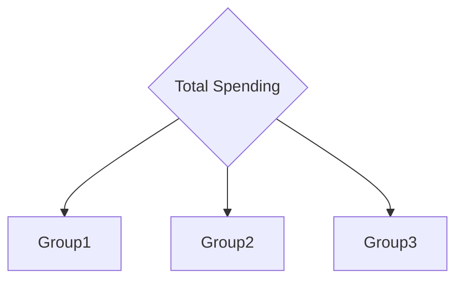

# Visualizing Data in SQL

## Bad Sakila Example

Let's try this out by checking out the counts of
rentals every customer has made.

```sql
SELECT rentals, COUNT(*) AS num_customers,
RPAD('', COUNT(*), '*') AS bar
FROM
(
    SELECT customer_id, count(rental_id) as rentals
    FROM rental
    GROUP BY 1
) a
GROUP BY 1;
```

This performs a sub-query to create a pseudo-table in
the first `FROM`.
You get `rentals` by counting the rental_ids `GROUP`ed `BY` the `1`.
That `1` is a literal to select the *first* column, regardless of name.

## Histograms in SQL

Because of how simple the data displays in SQL are,
it's important to understand what the limitations are.

The `RPAD` function basically just takes a number,
then produces a string by the number of times it occurs.
This gives us basic visualizations,
but for anything more it's better to use SQL
as the way to organize data in a query before sending it to
a better equipped piece of software for visualization.

## Grouping Data into Bins

Say you wanted to know,
from the movie rental database,
how much customers were spending?
We can group the amount into several bins.



Each group gets some discrete range of a value,
and the groups each increase in the values of that range.
So wouldn't it be nice to see how many customers fell into each bin?

```sql
SELECT customer_id, SUM(amount) AS total
FROM payment
GROUP BY 1
ORDER BY total DESC
```

So in this case we can start off by searching for the
amount that each customer,
`customer_id` has spent *(ie a `SUM`)*,
and we can `GROUP` that together.
This then gets us a result table of `customer_id`,
and `total` as the sum of each grouped customer's purchases on record.
With the `ORDER BY` at the end there we can see who spent the most first.

### Binning Using the CASE Statement

As mentioned,
we want to put those spending sums into broader groups to see the overall
spending patterns of the customers at a broader view.
So we aggregate the results yet again.

Below we use the `CASE` statement which
goes through conditions and returns a value when
the first condition is met.
And as these `CASE` statements are chained together,
it forms bins in various groups of 25 till one of the `CASE`s match.
There needs to also be a `ELSE` statement in case a value
can't fit within these bin `CASE`s.

```sql
SELECT
CASE WHEN total <= 75 THEN 'up to 75'
    WHEN total <= 100 THEN '75 to 100'
    WHEN total <= 125 THEN '100 to 125'
    WHEN total <= 150 THEN '125 to 150'
    WHEN total <= 175 THEN '150 to 175'
    WHEN total <= 200 THEN '175 to 200'
ELSE '200+' END AS bin,
COUNT(*) AS count
FROM ( -- this is the original selection query
    SELECT customer_id, SUM(amount) AS total
    FROM payment
    GROUP BY 1
    ORDER BY total DESC
) a
GROUP BY 1;
```

It isn't enough to simply define the bins however.
To find the spending sums of each customer we need to use the
same aggregation query as before to `SELECT` for `SUM(amount)` and
Use that result for `CASE`-`WHEN`-`ELSE` statements to group into bins.
So we `SELECT` bins `FROM` a `SELECT` query `FROM` the payments database result.
The resulting table will then look like this.

|bin       |count|
|----------|-----|
|100 to 125|221  |
|125 to 150|128  |
|150 to 175|37   |
|175 to 200|7    |
|200+      |2    |
|75 to 100 |166  |
|up to 75  |38   |

Now we have what we're looking for.
A number of bins for different ranges of spending sums,
and the associated number of customers spending within
the range of each of these bins.

## Detecting Duplicates

One of the common concerns when
it comes to data in a database is the integrity.
That is,
have we somehow entered a record twice,
is there a duplicate?
Let's take a look at how we can interrogate our database
through selections to detect the possibility of having duplicates.

### Visually Finding Duplicates

One of the first things that comes to mind is to use a visual inspection.
In this case we can run a query say in this case of the rental table and
to order this to be able to visually inspect that information.

```sql
SELECT rental_id, rental_date, return_date
FROM rental
ORDER BY 1,2,3;
```

Here we query the *rental* database for *rental_id*,
*rental_date*, *return_date*.
These together will need to be unique.
By using `ORDER BY` to sort these values,
duplicates will be seen adjacent to each other.

Unfortunately this is a large table.
Finding it visually will be time consuming.
It's not very reliable.
But this might be worthwhile when you have a small amount of data.

### Finding Duplicates through Aggregation

Let's go ahead and use the *customer* table.
Here we aggregate the data by several columns.
Then count the number of grouped rows show up.
Finally, sort the records descending to
quickly find results that are duplicates.

```sql
SELECT customer_id, first_name, last_name, COUNT(*) as records
FROM customer
GROUP BY 1,2,3
ORDER BY records DESC
```

This works,
however the results are a little messy.
To improve the query,
let's aggregate the records again.

```sql
SELECT records, COUNT(*)
FROM ( -- same aggregation query as before, but querying its results
    SELECT customer_id, first_name, last_name, COUNT(*) as records
    FROM customer
    GROUP BY 1,2,3
    ORDER BY records DESC
) a
WHERE records > 1
GROUP BY 1
```

Notice that the same query as before is placed inside `FROM`.
That way we can query the results of that query.
We aggregate yet again by the `records` result and the count of them.
Then we filter out all the values less than or equal to 1.
The result is then only the duplicate records.

### Querying only DISTINCT Records

By using the `distinct` expression within a query statement it is
possible to only query *distinct* records.

```sql
SELECT count(distinct customer_id) as records
FROM customer;
```

If you run this query only the distinct records show up.
If you remember the count after this query,
then run the query again without the `distinct` keyword,
then the difference in
those counts will tell you the number of duplicates present.

## References

### Web Links

<!-- Hidden References -->

### Note Links

<!-- Hidden References -->

### Referenced By

* [Visualizing Data using SQL][sql-vis-zk]
* [PCDE Course Overview][pcde-overview-zk]
* [PCDE Course: Module 6 Content][pcde-mod6-zk]

<!-- Hidden References -->
[sql-vis-zk]: ./sql.md "Visualizing Data using SQL"
[pcde-overview-zk]: ./pcde-course-overview.md "PCDE Course Overview"
[pcde-mod6-zk]: ./pcde-module6-content.md "PCDE Course: Module 6 Content"
