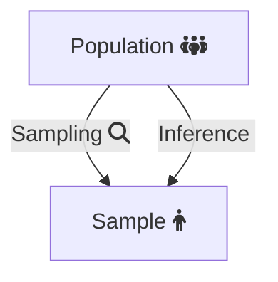
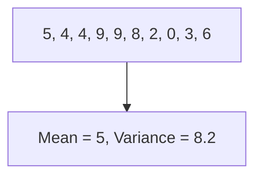

# Statistics in Python

## Introduction

Python is one of the main ways that data engineers &
data scientists today analyze data using statistical methods.
This will go over some of the [python][py-zk] specific details in
how we analyze statistics on a dataset.

>Note: A lot of these topics should be covered more substantively in
>a *statistics* or [*probability*][prob-zk] note.

### Topics

*the below list is the agenda for module 7 in the [PCDE course][pcde-overview-zk]*

* Normal Distribution
  * Mean
  * Variance
  * Unbiased Variance
* Building a model to predict housing prices
  * Data: over 1000 houses with 80 data points each
  * Predicting the dependent variable using independent variables
  * Finding the correlation of independent variables with the dependent variable
  * Using 4 columns out of 80 for the model
    * Finding the most correlated variables allows making the best predictions

## Sample Variance vs. Population Variance

The problem we're usually trying to solve is that
there's a *population* out there and
we can't sample all of them.
But we still need to try to *infer* the statistics that apply to
the whole population.



So let's take a look at an example.
We might be talking about the blood pressure of a population,
let's say an entire country like Sweden.
It will become clear that as we take different samples from different parts of
the country,
we'll see that depending on the sample,
different means will appear.

That's normal.
We can only expect for variances to occur in different sample means taken from
different parts of the population.

### Estimating Population Statistics from a Sample

Take this series of numbers:



These were generated from using a uniform random distribution.
It turns out that:

* Mean = 5
* Variance = 8.2

You can see visually, roughly the variance.
There's numbers like 0 & 9,
so there's 10 values with the middle linearly being 5.

*Variance $\sigma^2$ is computed as*

$\sigma^2 = \frac{\Sigma(x - \mu_x)}{N}$

*Where the $\mu$ (mu or mean) above is computed using*

$\mu_x = \frac{\Sigma_nx_n}{N}$

Let's work through this example to verify the calculation.

$\mu_x = \frac{5 + 4 + 4 + 9 + 8 + 2 + 0 + 3 + 6}{10} = \frac{50}{10} = 5$

Then let's shift the sample mean *x* so it matches the population mean *X*.

Shifted $x, X = x - \mu_x$

This places the 0 of the x-axis around the mean, *normalizing* it.
This is part of calculating *variance* & the *standard deviation*.

Let's take a random sample of five within that population:

```txt
[5, 4, 9, 8, 6]
```

This produces a *mean* of `6.4` & *variance* of `3.4`.
That's quite different from the *mean* of 5 and
*variance* of `8.2` that the population had.
This clear when examining the numbers,
the minimum is `4`, the maximum is `9`,
it's clear that the variance is going to be lower and
the mean is going to be higher.


* Generate a population of 200 from a uniform random distribution
* Pick samples of 50 and calculate mean & variance
  * Subtract the mean & variance from the original mean & variance
* Notice the error in the error in variance doesn't appear
* Below is a solution
  * Instead of dividing by N, divide by N-1


Now the variance converges quite well, what's up with that?
Let's see what happens in python, with a little notebook analysis.

```python
import numpy as np

p = np.array([5, 4, 4, 9, 9, 8, 2, 0, 3, 6])
pmean = p.mean()
pvar = np.var(p)
s = np.array([5, 4, 9, 8, 2])
smean = s.mean()
svar = np.var(s, ddof=0)
pmean, smean, pvar, svar
# Results: (5.0, 5.6, 8.2, 6.64)
```

We calculate the mean `pmean`, and variance `pvar`.
Then we take the small random sample `s`.
Then we get the *sample* mean & variance:
`svar` & `smean` using `np.var` & `np.mean`.
Now let's try again by dividing by N - 1 instead.

```python
import numpy as np

p = np.array([5, 4, 4, 9, 9, 8, 2, 0, 3, 6])
pmean = p.mean()
pvar = np.var(p)
s = np.array([5, 4, 9, 8, 2])
smean = s.mean()
svar = np.var(s, ddof=1)
pmean, smean, pvar, svar
# Results: (5.0, 5.6, 8.2, 8.3)
```

Notice how when the `ddof` or
the *delta degrees of freedom* changes from 0 to 1,
The variance suddenly changes from `6.64` to `8.3`.

### Sources of Bias

Statisticians realized this disparity and formalized it as **Bessel's correction**.
To read a bit more about it,
here's [Wikipedia's Article about Bessel's Correction][bessel-correction-wiki].
Essentially when taking a sample from a population,
the *variance* can differ from the *population variance* immensely.
Let's look at the extreme case.
Here's a population.

$(0, 0, 0, 1, 2, 9)$

$\mu = 2, \sigma^2 = 10.33$

Sample: $(0, 2)$

$\mu_x = 1$,
$\sigma^2 (uncorrected) = \frac{(x_1 - \bar{x})^2 + (x_2 - \bar{x})^2}{N}$
$= \frac{(1+1)}{2} = 1$

$\mu_x = 1$,
$\sigma^2 (corrected) = \frac{(x_1 - \bar{x})^2 + (x_2 - \bar{x})^2}{n-1}$
$= \frac{(1+1)}{1} = 2$

Because of the smaller possibilities presented by a sample,
getting the *variance* of the sample is biased towards smaller numbers than
what is expected for any given sample.
When samples are larger and closer to the population size,
these unbiased correctors are less necessary.

The unbiased corrector could however be any number known as a *degree of freedom*.
In coding languages this is often referred to as the `ddof`,
or *designated degree of freedom*.
The usual *variance* calculation where the denominator is $N$,
has a *degree of freedom* of 0.
The typical *unbiased corrector* we use in
*Bessel's Correction* is 1,
but it could be any cardinal number to correct for particularly small samples.

### Caveats

There are three caveats to *Bessel's Correction*:

  1. It does not yield an unbiased estimator of *standard deviation*
  2. The corrected estimator usually has higher *mean squared error*
      * Higher than typical uncorrected mean estimators
  3. It is only necessary when the population mean is unknown
      * Corrected estimators are only necessary when population mean unknown
      * Because different scaling factors can be chosen to minimize *MSE*

### Using Python to Demonstrate Variance Bias

Here we'll demonstrate this effect using python, numpy, scipy & matplotlib.

```python
import numpy as np
import matplotlib.pyplot as plt
from scipy.stats import norm
np.random.seed(1337)

Npts = 200
diffMean = []
diffVariance = []
bestMean = []
bestVar = []
p = np.random.uniform(0, 100, Npts)
pmean = p.mean()
pvar = np.var(p)
N = 100

for i in range(N):
    sample = np.random.choice(p, 50)# choose sample from pop.
    smean - sample.mean()           # sample mean
    svar = np.var(sample, ddof=0)   # sample variance
                                    # ddof 0 or 1 means div by N or N-1
                                                                       
    diffMean.append(pmean-smean)    # mean diff sample & pop.
    bestMean.append(np.sum(diffMean) / len(diffMean))# accumulate & avg.
    diffVariance.append(pvar-svar)  # var diff between sample & pop.
    bestVar.append(np.sum(diffVariance) / len(diffVariance))# acc. & avg

# plot results
plt.scatter(range(N), bestMean, color='b', label='Mean Error')
plt.ylabel('Error')
plt.scatter(range(N), bestVar, color='g', label='Variance Error')
plt.legend(loc='upper right')
print(pmean, pvar)

```

A random uniform population, `p`, is created from 0 to 100 of `Npts = 100` points.
A *population mean & variance* is calculated, `pmean` & `pvar`, respectively.
Then 100 different random `sample`s of that population are taken by looping.
Each sample has their *sample mean & variance* calculated `smean`, `svar`,
with a *degree of freedom* or `ddof` of 0.

As more samples are having their *mean & variance* calculated,
`diffMean` is a list that gets appended with the differences between
*population mean* & *sample mean*.
This is effectively the error between *sample mean* & *population mean*.
Then the `bestMean` is a running average of
the *population* & *sample means'* difference.
The same is then done for the difference & average difference between
*population variance* & *sample variance*.
And finally `matplotlib` or `plt` is used to plot the average error over time.


Notice that sample mean error is quite steady,
even at the first few samples taken.
Also, the difference between
*population variance* & *sample variance*
changes significantly as more random samples are evaluated,
but it does eventually converge around 20.
Now, change the `ddof=0` to `ddof=1` and see what happens.


With *Bessel's Correction* and a *degree of freedom* of 1,
suddenly the error converges faster, and actually gets close to 0.

### Summary

* Population variance and mean assumes perfect knowledge of whole population
* Sample variance & mean is imperfect and will always have some error
* Sample mean is often much closer to population mean
* Sample variance often needs to be corrected and is biased
* Bessel's correction of N - 1 is often much closer to population variance
  * It however distorts sample mean from population mean

## References

### Web Links

* [Bessel's Correction (from Wikipedia, the free encyclopedia)][bessel-correction-wiki]

<!-- Hidden References -->
[bessel-correction-wiki]: https://en.wikipedia.org/wiki/Bessel%27s_correction "Bessel's Correction (from Wikipedia, the free encyclopedia)"

### Note Links

* [Probability Overview][prob-zk]

<!-- Hidden References -->
[prob-zk]: ./probability.md "Probability Overview"

### Referenced By

* [PCDE Course Overview][pcde-overview-zk]
* [Python Overview][py-zk]

<!-- Hidden References -->
[pcde-overview-zk]: ./pcde-course-overview.md "PCDE Course Overview"
[py-zk]: ./python.md "Python Overview"
