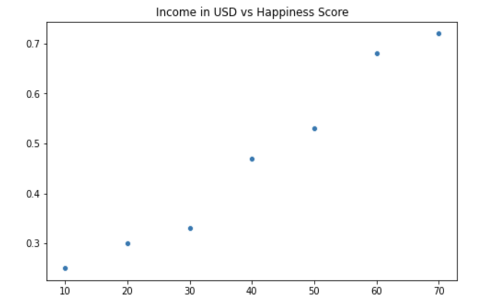

# Statistics in Python

## Introduction

Python is one of the main ways that data engineers &
data scientists today analyze data using statistical methods.
This will go over some of the [python][py-zk] specific details in
how we analyze statistics on a dataset.

>Note: A lot of these topics should be covered more substantively in
>a *statistics* or [*probability*][prob-zk] note.

### Topics

*the below list is the agenda for module 7 in the [PCDE course][pcde-overview-zk]*

* Normal Distribution
  * Mean
  * Variance
  * Unbiased Variance
* Building a model to predict housing prices
  * Data: over 1000 houses with 80 data points each
  * Predicting the dependent variable using independent variables
  * Finding the correlation of independent variables with the dependent variable
  * Using 4 columns out of 80 for the model
    * Finding the most correlated variables allows making the best predictions

## Sample Variance vs. Population Variance

The problem we're usually trying to solve is that
there's a *population* out there and
we can't sample all of them.
But we still need to try to *infer* the statistics that apply to
the whole population.


So let's take a look at an example.
We might be talking about the blood pressure of a population,
let's say an entire country like Sweden.
It will become clear that as we take different samples from different parts of
the country,
we'll see that depending on the sample,
different means will appear.

That's normal.
We can only expect for variances to occur in different sample means taken from
different parts of the population.

### Estimating Population Statistics from a Sample

Take this series of numbers:


These were generated from using a uniform random distribution.
It turns out that:

* Mean = 5
* Variance = 8.2

You can see visually, roughly the variance.
There's numbers like 0 & 9,
so there's 10 values with the middle linearly being 5.

*Variance $\sigma^2$ is computed as*

$\sigma^2 = \frac{\Sigma(x - \mu_x)}{N}$

*Where the $\mu$ (mu or mean) above is computed using*

$\mu_x = \frac{\Sigma_nx_n}{N}$

Let's work through this example to verify the calculation.

$\mu_x = \frac{5 + 4 + 4 + 9 + 8 + 2 + 0 + 3 + 6}{10} = \frac{50}{10} = 5$

Then let's shift the sample mean *x* so it matches the population mean *X*.

Shifted $x, X = x - \mu_x$

This places the 0 of the x-axis around the mean, *normalizing* it.
This is part of calculating *variance* & the *standard deviation*.

Let's take a random sample of five within that population:

```txt
[5, 4, 9, 8, 6]
```

This produces a *mean* of `6.4` & *variance* of `3.4`.
That's quite different from the *mean* of 5 and
*variance* of `8.2` that the population had.
This clear when examining the numbers,
the minimum is `4`, the maximum is `9`,
it's clear that the variance is going to be lower and
the mean is going to be higher.


* Generate a population of 200 from a uniform random distribution
* Pick samples of 50 and calculate mean & variance
  * Subtract the mean & variance from the original mean & variance
* Notice the error in the error in variance doesn't appear
* Below is a solution
  * Instead of dividing by N, divide by N-1


Now the variance converges quite well, what's up with that?
Let's see what happens in python, with a little notebook analysis.

```python
import numpy as np

p = np.array([5, 4, 4, 9, 9, 8, 2, 0, 3, 6])
pmean = p.mean()
pvar = np.var(p)
s = np.array([5, 4, 9, 8, 2])
smean = s.mean()
svar = np.var(s, ddof=0)
pmean, smean, pvar, svar
# Results: (5.0, 5.6, 8.2, 6.64)
```

We calculate the mean `pmean`, and variance `pvar`.
Then we take the small random sample `s`.
Then we get the *sample* mean & variance:
`svar` & `smean` using `np.var` & `np.mean`.
Now let's try again by dividing by N - 1 instead.

```python
import numpy as np

p = np.array([5, 4, 4, 9, 9, 8, 2, 0, 3, 6])
pmean = p.mean()
pvar = np.var(p)
s = np.array([5, 4, 9, 8, 2])
smean = s.mean()
svar = np.var(s, ddof=1)
pmean, smean, pvar, svar
# Results: (5.0, 5.6, 8.2, 8.3)
```

Notice how when the `ddof` or
the *delta degrees of freedom* changes from 0 to 1,
The variance suddenly changes from `6.64` to `8.3`.

### Sources of Bias

Statisticians realized this disparity and formalized it as **Bessel's correction**.
To read a bit more about it,
here's [Wikipedia's Article about Bessel's Correction][bessel-correction-wiki].
Essentially when taking a sample from a population,
the *variance* can differ from the *population variance* immensely.
Let's look at the extreme case.
Here's a population.

$(0, 0, 0, 1, 2, 9)$

$\mu = 2, \sigma^2 = 10.33$

Sample: $(0, 2)$

$\mu_x = 1$,
$\sigma^2 (uncorrected) = \frac{(x_1 - \bar{x})^2 + (x_2 - \bar{x})^2}{N}$
$= \frac{(1+1)}{2} = 1$

$\mu_x = 1$,
$\sigma^2 (corrected) = \frac{(x_1 - \bar{x})^2 + (x_2 - \bar{x})^2}{n-1}$
$= \frac{(1+1)}{1} = 2$

Because of the smaller possibilities presented by a sample,
getting the *variance* of the sample is biased towards smaller numbers than
what is expected for any given sample.
When samples are larger and closer to the population size,
these unbiased correctors are less necessary.

The unbiased corrector could however be any number known as a *degree of freedom*.
In coding languages this is often referred to as the `ddof`,
or *designated degree of freedom*.
The usual *variance* calculation where the denominator is $N$,
has a *degree of freedom* of 0.
The typical *unbiased corrector* we use in
*Bessel's Correction* is 1,
but it could be any cardinal number to correct for particularly small samples.

### Caveats

There are three caveats to *Bessel's Correction*:

  1. It does not yield an unbiased estimator of *standard deviation*
  2. The corrected estimator usually has higher *mean squared error*
      * Higher than typical uncorrected mean estimators
  3. It is only necessary when the population mean is unknown
      * Corrected estimators are only necessary when population mean unknown
      * Because different scaling factors can be chosen to minimize *MSE*

### Using Python to Demonstrate Variance Bias

Here we'll demonstrate this effect using python, numpy, scipy & matplotlib.

```python
import numpy as np
import matplotlib.pyplot as plt
from scipy.stats import norm
np.random.seed(1337)

Npts = 200
diffMean = []
diffVariance = []
bestMean = []
bestVar = []
p = np.random.uniform(0, 100, Npts)
pmean = p.mean()
pvar = np.var(p)
N = 100

for i in range(N):
    sample = np.random.choice(p, 50)# choose sample from pop.
    smean - sample.mean()           # sample mean
    svar = np.var(sample, ddof=0)   # sample variance
                                    # ddof 0 or 1 means div by N or N-1
                                                                       
    diffMean.append(pmean-smean)    # mean diff sample & pop.
    bestMean.append(np.sum(diffMean) / len(diffMean))# accumulate & avg.
    diffVariance.append(pvar-svar)  # var diff between sample & pop.
    bestVar.append(np.sum(diffVariance) / len(diffVariance))# acc. & avg

# plot results
plt.scatter(range(N), bestMean, color='b', label='Mean Error')
plt.ylabel('Error')
plt.scatter(range(N), bestVar, color='g', label='Variance Error')
plt.legend(loc='upper right')
print(pmean, pvar)

```

A random uniform population, `p`, is created from 0 to 100 of `Npts = 100` points.
A *population mean & variance* is calculated, `pmean` & `pvar`, respectively.
Then 100 different random `sample`s of that population are taken by looping.
Each sample has their *sample mean & variance* calculated `smean`, `svar`,
with a *degree of freedom* or `ddof` of 0.

As more samples are having their *mean & variance* calculated,
`diffMean` is a list that gets appended with the differences between
*population mean* & *sample mean*.
This is effectively the error between *sample mean* & *population mean*.
Then the `bestMean` is a running average of
the *population* & *sample means'* difference.
The same is then done for the difference & average difference between
*population variance* & *sample variance*.
And finally `matplotlib` or `plt` is used to *plot* the average error over time.


Notice that sample mean error is quite steady,
even at the first few samples taken.
Also, the difference between
*population variance* & *sample variance*
changes significantly as more random samples are evaluated,
but it does eventually converge around 20.
Now, change the `ddof=0` to `ddof=1` and see what happens.


With *Bessel's Correction* and a *degree of freedom* of 1,
suddenly the error converges faster, and actually gets close to 0.

### Summary

* Population variance and mean assumes perfect knowledge of whole population
* Sample variance & mean is imperfect and will always have some error
* Sample mean is often much closer to population mean
* Sample variance often needs to be corrected and is biased
* Bessel's correction of N - 1 is often much closer to population variance
  * It however distorts sample mean from population mean

## Plotting Mean & Variance in Python

Here we'll take a look at another case of sample mean & variance caveats.
Say we have a population of (-2, -1, 0, 1, 2).
We also have a sample from the population of (0, 1, 2).

$\mu = \frac{\sum_N (x)}{N} = \frac{(-2 + -1 + 0 + 1 + 2)}{5} = 0$

$\sigma^2 = \frac{\sum_N (x-\mu)^2}{N}$
$= \frac{(-2^2 + -1^2 + 0^2 + 1^2 + 2^2)}{5} = \frac{10}{5} = 2$

Remember,
this is the population mean and variance, no biased correctors are necessary.
Then we take the sample mean & variance.

$\mu_x = \frac{\sum_N(x)}{N} = \frac{(0 + 1 + 2)}{3} = 1$

$\sigma_x^2 = \frac{\sum_N(x - \mu_x)^2}{N- 1}$
$= \frac{((0 - 1) + (1 - 1) + (2 - 1))}{3 - 1}$
$= \frac{(-1 + 0 + 1)}{2} = 1$

Things to note:

* When taking the *variance*, the sum is essentially the samples shifted by the mean
  * Instead of sqaure-summing, (0, 1, 2)...
  * You're effectively square-summing (-1, 0, 1)
* The unbiased *variance* (N - 1) is still quite a ways off, 1 vs 2
  * So even with the unbiased estimator we're still a ways off from *population*.
  * So we're still underestimating the *sample variance* from *population*.
* When there's mean error in the sample,
  * the shift that occurs when calculating *variance* affects its error as well

Here is some code that calculates & *plots* *variance* from any given mean.
We will try and show how *variance* is affected by the mean.
[NumPy][numpy-zk] automatically calculates the mean from the given sample.
Because of this we need to create our own function to compute *variance*,
from a given mean (irrespective of what the real mean is)
and a bias *degree of freedom*.

```python
import numpy as np
import matplotlib.pyplot as plt

population = np.array([5, 4, 4, 9, 9, 8, 2, 0, 3, 6])
sample = np.array([5, 4, 4, 8, 6])

def variance(sample, mean, bias):
    s2 = 0
    for i in range(0, len(sample)):
        x = sample[i] - mean
        s2 = s2 + (x * x)
    var = s2 / (len(sample) - bias)
    print(var)
    return var

N = 10

var_pop = []
var_sample = []

for mean in range(0, N):
    var_pop.append(variance(population, mean, 0))

for mean in range(0, N):
    var_sample.append(variance(sample, mean, 0))

plt.scatter(range(N), var_pop, color='b', label='Population')
plt.scatter(range(N), var_sample, color='r', label='Sample')
plt.ylabel('Variance')
plt.xlabel('Mean')
plt.legend(loc='upper right')
```

The `var_pop` & `var_sample` take the sample & population respectively and
computes the *variance* from a given *mean* increasing from 0 to 9.
Notice how not only the *variance* changes with the mean in a quadratic manner,
but how in the *sample variance* (y-axis) it is always underestimated from
the *population variance*.


>What we've uncovered here is an interesting fact about the relationship between
>*population variance* & *sample variance*.
>The *sample variance* is always underestimated from the *population variance*.

Now let's see how the sample performs when you unbias the *sample variance* with
the *Bessel correction* of **1**.
Just change the line: `var_sample.append(variance(sample, mean, 1))`.
then re-run the code above to see what happens.


This uncovers the other interesting fact about *sample variance* in code.
>*Sample variance* when using Bessel's un-biasing corrector will
>be much closer to the *population variance* than without.

For exploring the notebook yourself,
[my gist on population vs sample variance as function of mean][pop-sample-var-vs-mean-gh].

## Exercise: Normal Distribution from Sample

### Problem

Given a blood pressure sample of
*[76, 64, 62, 81, 70, 72, 81, 63, 67, 77]*,
Use [python][py-zk] with [NumPy][numpy-zk] to
calculate its **sample mean**, **sample variation**, and **standard deviation**.
Remember,
because this is a sample,
there's certainly more people in the world with blood pressure than this,
we need to compute the **sample not population** versions of these statistics.
We also know that very likely that
the underlying population that's the superset of this sample,
is a normally distributed population.

Using what we know about the normal distribution,
find out answers to these questions:

* What percentage of the sample data point lies within one standard deviation?
* What percentage of the normal distribution lies within one standard deviation?
* Do you think blood pressure follows a normal distribution?

### Setting Up Python Analysis

First, let's get the basic statistics of the sample.

```python
import numpy as np
import pandas as pd
import matplotlib.pyplot as plt
np.random.seed(1337) # Fix the seed for consistent 'random' results

# Sample of people's blood pressures
sample = np.array([76, 64, 62, 81, 70, 72, 81, 63, 67, 77])

# Construct the dataframe from blood pressure sample
df = pd.DataFrame({'blood pressure': sample})

# Compute sample mean, variance, std dev.
mean_s = df['blood pressure'].mean()
var_s = np.var(df['blood pressure'], ddof=1)
std_s = np.sqrt(var_s)

mean_s, var_s, std_s
```

This will create the numpy array containing the blood pressure sample.
Then we also construct the basic version of the dataframe `df`,
that will contain one column of those sample values.

Then using that dataframe,
we can calculate the *mean*,
*variation*, and *standard deviation*.
Remember,
**we must use the unbiased variation to compute these**.
That means that we take the `np.var(sample, ddof=1)`,
and compute the standard deviation by taking its square root.

### Blood Pressure Sample Results

It turns out from the previous code that
we have a *sample mean* of 71.3,
*sample variation* of 52.5,
and *sample standard deviation* of 7.24.

*...or more neatly...*

$\mu_s = 71.3$

$\sigma^2_s = 52.5$

$\sigma_s = 7.24$

### Analyzing Blood Pressure Sample Deviation

Now,
create a dataframe of the sample items.
Then a column that first checks deviation from mean for each item in the sample.
Then a column for the square deviation from the mean.
Finally,
check to see which rows are within one standard deviation of the mean,
where the result is a boolean true or false.

```python
# Add columns comparing each sample measurement deviation to mean
df['deviation from mean'] = df['blood pressure'] - mean_s
df['square deviation'] = np.power(df['deviation from mean'], 2)
df['within std'] = (np.abs(df['deviation from mean']) <= std_s).astype(bool)
df
```

Above we did the work to construct the table using a dataframe below.
Then a column for that measurement's deviation from the sample mean.
Then the square of that deviation.
Finally,
we did a boolean condition to see if the standard deviation is larger than the deviation.

|     | blood pressure | deviation from mean | square deviation | within std |
| --: | -------------: | ------------------: | ---------------: | ---------: |
|   0 |             76 |                 4.7 |            22.09 |       True |
|   1 |             64 |                -7.3 |            53.29 |      False |
|   2 |             62 |                -9.3 |            86.49 |      False |
|   3 |             81 |                 9.7 |            94.09 |      False |
|   4 |             70 |                -1.3 |             1.69 |       True |
|   5 |             72 |                 0.7 |             0.49 |       True |
|   6 |             81 |                 9.7 |            94.09 |      False |
|   7 |             63 |                -8.3 |            68.89 |      False |
|   8 |             67 |                -4.3 |            18.49 |       True |
|   9 |             77 |                 5.7 |            32.49 |       True |

#### How many Measurements Are within Standard Deviation?

Looking at the final column,
**5 measurements in this sample are within one standard deviation of the mean**.

#### Graphing the Result

Let's *plot* the result using `matplotlib`.
We'll use the `axvline` function to define vertical lines.
One red one for the *mean* location.
Two green lines for the single *standard deviation from mean*.

```python
plt.hist(df['blood pressure'], bins=6, edgecolor='black')
plt.axvline(mean_s, color='red', linestyle='dashed', linewidth=1.5)
plt.axvline(mean_s + std_s, color='green', linestyle='dashed', linewidth=1.5)
plt.axvline(mean_s - std_s, color='green', linestyle='dashed', linewidth=1.5)
plt.xlabel('Value')
plt.ylabel('Frequency')
plt.title('Sample of Normal Distribution')
plt.show()
```

Which gives us a table with disappointing results...


We don't see much of a normal distribution shape here do we...?

### Creating a Normally Distributed Random Sample

Let's compare to a programmatically created random sample of
a random normal distribution population.
Use [NumPy's][numpy-zk] `random.normal` module.

```python
mean_n = 0
std_n = 1
size_n = 1000

np.random.seed(1337)
normal_rand = np.random.normal(mean_n, std_n, size_n)
sample_n = np.random.choice(normal_rand, 100)
mean_sn = sample_n.mean()
var_sn = np.var(sample_n, ddof=1)
std_sn = np.sqrt(var_sn)
print("Normal Distribution Sample Statistics")
print("=====================================")
print(f"mean_s: {mean_sn}, var_s: {var_sn}, std_s: {std_sn}")

within_sn_std = np.abs(sample_n - mean_sn) <= std_sn
percent_sn_std = 100 * len([x for x in within_sn_std if x]) / len(sample_n)
print(f"Members within one standard deviation of the mean: {percent_sn_std}%")
```

The population is created as `normal_rand`.
Then the `numpy.random.choice` function is used to randomly pick one tenth of
the population as a sample.
Then we repeat the same process as before to
calculate the **sample** *mean*, *variance*, *standard deviation*.
And what do we get?

* Sample Mean: **-0.09**
* Sample Variance: **1.12**
* Sample Standard Deviation: **1.06**

Quite close to what you'd expect from a standard deviation.
If you don't remember the basics of probabilites,
refresh your memory in [the core concepts of probabilites][prob-zk].
But since we defined the population to have a mean 0, and standard deviation of 1,
this is exactly what we'd expect even for a sample one tenth the population.

And once more,
what we know from [our knowledge about probability distributions][prob-zk],
we know that a standard normal distribution should have roughly **68%** will
be within one standard deviation from the mean.
Here the random sample achieves **62%**,
not bad at all.

### How does the Blood Pressure Sample Compare to the Normal Sample?

To finish this exercise off,
first we'll chart the `hist`ogram of the normal distribution sample.

```python
plt.hist(sample_n, bins=20, edgecolor='black')
plt.axvline(mean_sn, color='red', linestyle='dashed', linewidth=1.5)
plt.axvline(mean_sn + std_sn, color='green', linestyle='dashed', linewidth=1.5)
plt.axvline(mean_sn - std_sn, color='green', linestyle='dashed', linewidth=1.5)
plt.xlabel('Value')
plt.ylabel('Frequency')
plt.title('Sample of Normal Distribution')
plt.show()
```

Again,
using `axvline` it's nice to get some guidelines of the mean and
the area that is one standard deviation away from it.
Which gives us this histogram...


Because this is a randomly chosen sample one tenth the size of
the sourced population,
we still get some random noise in there.
However,
this is about as good a normal distribution as can be expected.

It's hard to compare two histograms without them being together.
*Plot* the two previous histograms so they're side by side.
Again, we'll use the same basic code as before,
but the axis will need to get pulled out.

```python
fig, ax = plt.subplots(1, 2, figsize=(12, 4))
ax[0].hist(df['blood pressure'], bins=20, edgecolor='black')
ax[0].axvline(mean_s, color='red', linestyle='dashed', linewidth=1.5)
ax[0].axvline(mean_s + std_s, color='green', linestyle='dashed', linewidth=1.5)
ax[0].axvline(mean_s - std_s, color='green', linestyle='dashed', linewidth=1.5)
ax[0].set_xlabel('Value')
ax[0].set_ylabel('Frequency')
ax[0].set_title('Blood Pressure Sample')

ax[1].hist(sample_n, bins=20, edgecolor='black')
ax[1].axvline(mean_sn, color='red', linestyle='dashed', linewidth=1.5)
ax[1].axvline(mean_sn + std_sn, color='green', linestyle='dashed', linewidth=1.5)
ax[1].axvline(mean_sn - std_sn, color='green', linestyle='dashed', linewidth=1.5)
ax[1].set_xlabel('Value')
ax[1].set_ylabel('Frequency')
ax[1].set_title('Random Normal Sample')

plt.tight_layout()
plt.show()
```

Also,
don't forget to put the *plots* together again,
after defining them as `ax[0]` and `ax[1]`,
by using the `plt.tight_layout()` then `plt.show()` functions.
What we get is pretty telling.


Unfortunately,
the blood pressure sample just doesn't compare that well to
the normal distribution sample.
Remember the percentage of measurements from the sample that were within
one *standard deviation* of the *mean*?
It was 5 out of 10 or **50%**.
This random sample has **62%**,
and the perfect standard normal **68%**.

The primary problem here is that there just isn't very much data.

>Sampling this little data you have to be **really careful** to
>not draw too many conclusions when analyzing it.
>Small samples exhibit non standard behaviors more easily.

## Correlation & Covariance

### Basic Theory

We talk about data being **correlated** when blah
***TODO FILL IN THIS SECTION WITH THEORY & INCL. LINKS LIKE WIKIPEDIA***

**Covariance** is the measure of the relationship between two variables.
As in, if one variable increases, the other variable increases or decreases.
It is the measure of how much one variables changes in relation to the other.

### Equation of Correlation

The basic equation of correlation is this:

$r = \frac{\sum_n(x_n * y_n)}{N}$

You multiply the sample's *x* & *y* variables,
then you sum them, and finally divide by the number of samples.

We need to do some more nuanced work here though.

#### Covariance & Correlation Coefficients

##### Mean or Expected Value

$\mu_x = \frac{\sum_n x_n}{N}$

$\mu_y = \frac{\sum_n y_n}{N}$

##### Transformed/Shifted Coordinates

$X = x - \mu_x$

$Y = y - \mu_y$

#### Covariance Equation

Using these values calculated before,
for covariance we can define it by `cov(x,y)` like we do below.

$cov(x,y) = \frac{\sum_n x_n * y_n}{N}$

#### Problem of Scale

When we calculate all these covariance in different contexts a problem arises.
We might be dealing with variable *x* that is of a very small set of values.
Perhaps *x* is the number of rooms in a piece of real estate.
Then *y* might be a very large scale set of numbers,
perhaps the price of said real estate which could be in the 100ks or many millions.
There's a problem of scale here that we need to fix for this metric to be useful.

#### Pearson Correlation Coefficient

$r = \frac{1}{N}\sum_n \frac{X_n}{\sigma_x}*\frac{y_n}{\sigma_y}$
$=\frac{1}{N} \frac{\sum_n x_n*y_n}{\sigma_x*\sigma_y}$
$=\frac{\sum_n x_n*y_n}{\sqrt{((\sum_n x_n*x_n)*(\sum_n y_n*y_n))}}$

Where $\sigma_x$ is:

$\sigma_x = \sqrt{\frac{\sum(x - \mu_x)*(x - \mu_x)}{N}} = \sqrt{\frac{\sum(X*X)}{N}}$

This will ensure the value of covariance is always between positive & negative 1.

### Correlation & Covariance in Python

***TODO INCLUDE NOTES USING PEARSON CALCULATION FROM NOTEBOOK***

## Central Limit Theorem

Say we have a box of tickets.
Each ticket will have only a `0` or `1` value.
We randomly pick a sample of these tickets.
Without knowing the underlying statistics of
these tickets it's not a bad guess to assume there will be
roughly uniform amounts in the sample.
But we just don't know enough about the statistics here to
make that assumption in any sound way.

### Experiment: The Central Limit Theorem

Create a sample by drawing M tickets,
one at a time.

If M is 8 we will perform 8 trials for each ticket drawing.
Then the value is recorded and the ticket is put back into the population to
not distort the underlying population.

Eventually you get an array of `[1, 0, 0, 1, 1, 0, 1, 0]`.
We now have a single trial of `M = 8`.
Then let's do some basic statistics on this trial.

$\mu_s = \frac{\sum X}{M} = \frac{4}{8} = 0.5$

$\sigma^2_{unbiased sample} = \frac{\sum(x - \mu_x)^2}{M - 1} = \frac{2}{7} = 0.29$

Remember, small samples need the *Bessel Correction* to
get the unbiased variance.
This differs a good bit from the population variance, not the mean.

* Mean = $\frac{\sum X}{M} = \frac{4}{8} = 0.5$
* Population variance = $\frac{\sum(x - \mu_x)^2}{M} = \frac{2}{8} = 0.25$

### Abraham de Moivre Expirement

***ADD NOTES WITH REFERENCES TO THIS TOPIC***

>Unbiased variance is related to population variance

$S^2 = \frac{\sigma^2}{M}$

Remember S here is the *Sample* variance and $\sigma^2$ is the population variance.

By doing lots of trials the variance starts shrinking towards
reaching the population variance.

### The Actual Central Limit Theorem

The more statistical trials you perform,
the closer to the normal distribution you get.
Doesn't matter what the underlying statistics of the population is.

## Exercise: Drinks Data Correlation

***TODO** Put this data csv into your bin or s3

We are given a CSV of drinks here **TODO** link the data here
Make some generalizations about drinks preferences by countries.

```python
# Drinks exercise
# In Asia is wine or spirits best correlated with beer consumption?
# Is it the same in North America?
import pandas as pd
import numpy as np
drinks = pd.read_csv('http://bit.ly/drinksbycountry')
drinks.head()
```

|     | country | beer_servings | spirit_servings | wine_servings | total_ls_alcohol | continent |
| --- | ------- | ------------- | --------------- | ------------- | ---------------- | --------- |
| 0   | Afghan  | 0             | 0               | 0             | 0.0              | Asia      |
| 1   | Albania | 89            | 132             | 54            | 4.9              | Europe    |
| 2   | Algeria | 25            | 0               | 14            | 0.7              | Africa    |
| 3   | Andorra | 245           | 138             | 312           | 12.4             | Europe    |
| 4   | Angola  | 217           | 57              | 45            | 5.9              | Africa    |

Now we see what the table looks like.
Let's start by analyzing the correlations.
Start with Asia.

```python
asia = drinks.loc[drinks['continent'] == 'Asia']
asia.head()
asia.corr()
```

Use `loc` on `drinks` dataframe.
Then within the `loc` specify the column `continents` should be equal to `Asia`.
Finally it's as simple as using `pandas.DataFrame.corr` to get correlation.

|                          | beer_servings | spirit_servings | wine_servings | total_ls_of_alcohol |
| ------------------------ | ------------- | --------------- | ------------- | ------------------- |
| beer_servings            | 1.000000      | 0.694426        | 0.437488      | 0.899253            |
| spirit_servings          | 0.694426      | 1.000000        | 0.225150      | 0.772893            |
| wine_servings            | 0.437488      | 0.225150        | 1.000000      | 0.533320            |
| total_ls_of_pure_alcohol | 0.899253      | 0.772893        | 0.533320      | 1.000000            |

Yup it seems asia is most correlated with beer when
you look at how much beer is correlated with total amount of alcohol consumed.

### Further Reading

I put my
[Jupyter Notebook for this Exercise in a Github Gist][gist-blood-sample-vs-random-normal].
You can see everything done in one place perhaps more easily there.

## Making Predictions with Linear Regression

### What is Linear Regression?

Linear regression is a machine learning algorithm that
is used to predict values within a continuous range
*(i.e. stocks' price & height)*
rather than classifying them into
categories *(i.e. male or female)*.

The values that you want to predict are the dependent variable(s).
The predictions can be made using one or more independent variables.

There are two types of linear regression: simple & multiple.

### Simple Linear Regression

Simple linear regression is the most basic form of linear regression.
Its mathematical formulation is based on the traditional equation of the line:

$$y = mx + b$$

Where $x$ is the independent variable,
$y$ is the dependent variable,
$m$ is the slope,
$b$ is the intercept with the $y$-axis.
In the context of a linear regression,
$x$ represents the input variable that
is used to make the prediction,
whereas $y$ represents the prediction.
Additionally, in the context of machine learning,
$m$ is the weight and
$b$ is the bias.

One of the most important assumptions of
linear regression is that the data has a linear relationship.
However, in the real world,
data is often not perfectly linear,
but rather it will be in the form of a cluster of data points on a scatter *plot*.
The goals of linear regression are to compute the line of best fit that
describes the linear properties of the data and to
determine how well this line fits the data in cluster of points.

### Simple Linear Regression by Hand

To understand the concepts above,
let's try to compute the result for a linear regression example.

Let's consider the dataset below:

| Income in USD | Happiness Score |
| ------------- | --------------- |
| 0             | 0.25            |
| 10            | 0.30            |
| 20            | 0.33            |
| 30            | 0.47            |
| 40            | 0.53            |
| 50            | 0.68            |
| 60            | 0.72            |

You can *plot* the data above in Python as
a scatter plot using the [seaborn *library*][py-pandas-zk],
a Python *library* for data visualization.
The Seaborn *library* is widely used in data science as
it integrates well with pandas data structures,
such as *series* & *dataframes*.
It also has much nicer defaults for
the matplotlib library it wraps the functionality of.

To install seaborn, run the following command in your terminal.

```sh
pip install seaborn
```



From the *plot* above,
you can observe that the data follows a linear pattern.
Thus, as an example,
you can use linear regression to
make an accurate prediction of the actual happiness score for
an income equal to 30.

Given the data points above,
you can compute the line of best fit that will help you to
make your prediction.
From the equation of the line below,
you can see that the line of least squares has two components:
the slow, $m$,
and intercept $b$.
The equations for $m$ and $b$ are given by:

$$m = \frac{n \sum xy - \sum x \sum y}{n \sum x^2 - (\sum x)^2}$$

In the equation above,
the symbol $\sum$ represents a summation.
The table below contains computations for all the summations needed to
compute coefficients $m$ & $b$.

| Income in USD(x) | Happiness(y) | xy        | x^2        | y^2        |
| ---------------- | ------------ | --------- | ---------- | ---------- |
| 10               | 0.25         | 2.5       | 100        | 0.0625     |
| 20               | 0.30         | 6.0       | 400        | 0.09       |
| 30               | 0.33         | 9.9       | 900        | 0.1089     |
| 40               | 0.47         | 18.8      | 1600       | 0.2209     |
| 50               | 0.53         | 26.5      | 2500       | 0.2809     |
| 60               | 0.68         | 40.8      | 3600       | 0.4624     |
| 70               | 0.72         | 50.4      | 4900       | 0.5184     |
|                  |              |           |            |            |
| $\sum x$         | $\sum y$     | $\sum xy$ | $\sum x^2$ | $\sum y^2$ |
| 270              | 3.03         | 152.4     | 13900      | 1.6815     |

Now it is a simple matter of plugging your values into
the equation for $m$ & $b$.
$n$ is the number of values in the dataset,
which in this case 7.

$$m = \frac{n \sum xy - \sum x \sum y}{n \sum x^2 - (\sum x)^2} = $$
$$\frac{7(152.4) - (270)(3.03)}{7(13900)-270^2} = \frac{248.7}{24400} = 0.01$$

$$b = \frac{\sum y - m \sum x}{n} = \frac{3.03 - (0.01)(270)}{7} = \frac{0.33}{7} = 0.047$$

So for this dataset,
the line of best fit has the equation:

$$y - 0.01x + 0.047$$

Now, to predict the happiness score for the value 30,
you can just substitute 30 for and compute the prediction.

$$y_{30} = 0.01 * 30 + 0.047 = 0.347$$

The result,
although not that different from the one you had initially with the data,
represents a much more accurate result for the happiness score.

Now that you have seen how simple linear regression works,
let's have a look at the multiple linear regression.

### Multiple Linear Regression

Multiple linear regression can be viewed as a natural extension of simple linear regression.
The main difference is that now multiple sets of data are used to make the prediction.

Thus, the equation for multiple linear regression becomes:

$$y = m_1x_1 + m_2x_2 + \ldots + m_nx_n + b$$

Where $x_1,x_2,\dots,x_n$ represent the data points of
all the independent variables used to make the prediction,
$m_1,m_2,\ldots,m_n$ are the weights,
and $b$ is the bias.

A practical application for multiple linear regression would be, for example,
to predict the price of a house (the dependant variable) based on multiple factors,
such as the number of bedrooms, the square footage, and the distance to downtown.
All of these variables represent the independent variables.

## References

### Web Links

* [Bessel's Correction (from Wikipedia, the free encyclopedia)][bessel-correction-wiki]
* [Population vs. Sample Variance as Function of Mean Notebook (from Github gist by marcus-grant)][pop-sample-var-vs-mean-gh]
* [Comparison of a small Blood Pressure Sample to a Randomly Generated and Chosen Normal Distribution][gist-blood-sample-vs-random-normal]

<!-- Hidden References -->
[bessel-correction-wiki]: https://en.wikipedia.org/wiki/Bessel%27s_correction "Bessel's Correction (from Wikipedia, the free encyclopedia)"
[pop-sample-var-vs-mean-gh]: https://colab.research.google.com/gist/marcus-grant/7076e20c65cdb9e8eb3f16cf3d93c365/population-vs-sample-variance-as-function-of-mean.ipynb "Population vs. Sample Variance as Function of Mean Notebook (from Github gist by marcus-grant)"
[gist-blood-sample-vs-random-normal]: https://gist.github.com/marcus-grant/07792714a17de5f4ffd088daa9312568 "Comparison of a small Blood Pressure Sample to a Randomly Generated and Chosen Normal Distribution"

### Note Links

* [Probability][prob-zk]
* [NumPy][numpy-zk]
* [Python][py-zk]
* [Python Library Pandas][py-pandas-zk]

<!-- Hidden References -->
[prob-zk]: ./probability.md "Probability Overview"
[numpy-zk]: ./numpy.md "NumPy Overview"
[py-pandas-zk]: ./python-pandas.md "Python Library Pandas"

### Referenced By

* [PCDE Course Overview][pcde-overview-zk]
* [Python Overview][py-zk]

<!-- Hidden References -->
[pcde-overview-zk]: ./pcde-course-overview.md "PCDE Course Overview"
[py-zk]: ./python.md "Python Overview"
