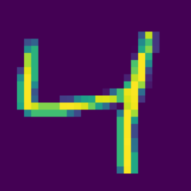
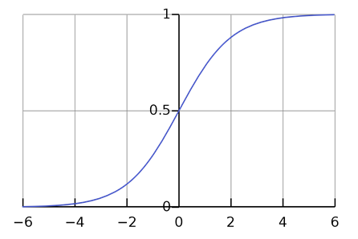

# Tensorflow

## Introduction

>TensorFlow makes it easy for beginners and experts to
>create machine learning models for desktop, mobile, web, and cloud.
>
>-- [Tensorflow.org (2023)][tflow-intro]

Tensorflow is a [Python][-py] library that was developed by Google for
[machine learning][-ml] (**ML**) that focuses on [deep neural networks][-nn] and
can be used to develop and train ML models.

## Install

To install tensorflow for python is easy.
To install the Tensorflow library on your local machine,
run the command below from the terminal.

```sh
pip install tensorflow
```

## Imports

A good place to start is to use a [jupyter notebook][-jnb] to
explore the tensorflow library.
Once the tensorflow library is installed,
you import the global module `tensorflow`, usually as `tf`.
In this case we'll also plot something with [matplotlib][-mpl] and
use [NumPy][-np] to create a dataset.

```python
import tensorflow as tf
from tensorflow import keras
import matplotlib.pyplot as plt
%matplotlib inline
import numpy as np
```

## MNIST Handwritten Digits Dataset Example

### Input Layer

For this example, we'll be working with an image of a handwritten digit.
Specifically the one below:



In this example we will use the built-in dataset for
images of handwritten numbers that can be used to feed to a neural network.
The images are 28x28 pixels in size and
each pixel is a grayscale value between 0 and 1 represented in floating points.

The first step is create the **input layer** to
to feed the pixels of these images into the neural network.

```python
(X_train, y_train), (X_test, y_test) = keras.datasets.mnist.load_data()
```

The `X_train` and `X_test` arrays contain 28x28 matrices of
values that represent the images' pixels.
These pictures will be fed into the neural network as input data.

```python
X_train.shape
```

```txt
(60000, 28, 28)
```

Note from the outputs that `X_test` is a NumPy array of 60,000 images of
28x28 pixels each.

Next the data needs to be normalized.
In this case, normalization means to scale down the values in
each cell to a value between 0 and 1.
Each cell has a value that represents the RGB code,
so you can normalize the cells by dividing each cell by 255
(which is the maximum RGB code minus the minimum RGB code):

```python
X_train = X_train / 255
X_test = X_test / 255
```

An input neuron has a value between 0 and 1,
so in order to feed a 28 x 28 image as input for the model,
first you must reshape the arrays.
You can flatten the 28 x 28 image to an array of 784 pixels so
that you end up with 784 input neurons.

You can experiment with the code below to test flattening or
reshaping the `X_train` and `X_test` arrays:

Input:

```python
X_train_flattened = X_train.reshape(len(X_train), 28*28)
X_train_flattened.shape
```

Output:

```txt
(60000, 784)
```

Note that now you have an array with 60,000 rows of 784 arrays each.

Input:

```python
X_test_flattened = X_test.reshape(len(X_test), 28*28)
X_test_flattened.shape
```

Output:

```txt
(10000, 784)
```

Note that now you have an array of 10,000 rows of 784 arrays each.

### Hidden Layers

A deep neural network often has several hidden layers,
though sometimes a simple model can be just as fast and effective.
The activation between the nodes in the hidden layer will have a weight and
a bias that the model needs to determine to optimize the model results.
Each neuron has a weight associated with it.
A weight is a value which acts as the coefficient to the equation.
Negative weights are possible,
as negative weighting will reduce the value of the output.

Each input layer node will send a value to
be run through each node in the hidden layer.
Each neuron first computes the weighted sum of inputs as follows:

$$
Y = Activation(\sum_{i=1}^{n} w_i x_i + b)
$$

Where:

* $Y$ is the weighted sum of inputs
* $w_i$ is the weight of the $i$th input
* $x_i$ is the $i$th input
* $b$ is the bias
* $Activation$ is the activation function

The weights are part of the neural network model where
the model will determine the optimal weights for the data being fed.
The bias is a constant value that is added to the weighted sum of inputs.
The activation function that transforms the output of the neuron.
Typically the activation function will involve some kind of normalization.

For example,
the sigmoid function is a common activation function that
transforms the output of the neuron to a value between 0 and 1:



The number of nodes in each hidden layer is arbitrary and
can be adjusted to improve model accuracy.
Nodes will have a function associated with them to
determine if they will be turned on or off.

### Forward and Back Propagation

In order to solve the image recognition problem,
the computer needs to learn the weights and biases.
Initially, random variables are assigned to the weights and biases and
the computer then applies them to the data.
This process is known as **forward-propagation**.
The neural network then reviews the results and
adjusts the weights and biases based on the accuracy of the results.
This process is known as **back-propagation**.
This process is completed several times until the desired level of
accuracy is reached.

***TODO:*** This needs a lot more detail, find some sources and note-take.
<!-- Sections needing work: general explanations of input, -->
<!-- hidden layers, output, forward and back propagation, weight updates.-->

### Output Layer

The output layer contains nodes that represent the results.
In the number recognition model,
the output layer consists of 10 nodes that represent the digits 0 through 9.

### Final Implementation

The python code to implement this model could be made as follows:

```python
from tensorflow import keras
model = keras.Sequential([
    keras.layers.Flatten(input_shape=(28, 28)),
    keras.layers.Dense(100, input_shape=(784,), activation='relu'),
    keras.layers.Dense(10, activation='sigmoid')
])

model.compile(
    optimizer='adam',
    loss='sparse_categorical_crossentropy',
    metrics=['accuracy']
)

model.fit(X_train, y_train, epochs=5)
```

Running this code, it quickly converges to an accuracy of 0.92,
after the first epoch.
By the fifth epoch, it's already at 0.98.

## References

### Web Links

* [Tensorflow.org - Introduction to TensorFlow][tflow-intro]

<!-- Hidden References -->
[tflow-intro]: https://www.tensorflow.org/learn "Tensorflow.org. 'Introduction to TensorFlow' Accessed 2023-06-14"

### Note Links

<!-- Hidden References -->
