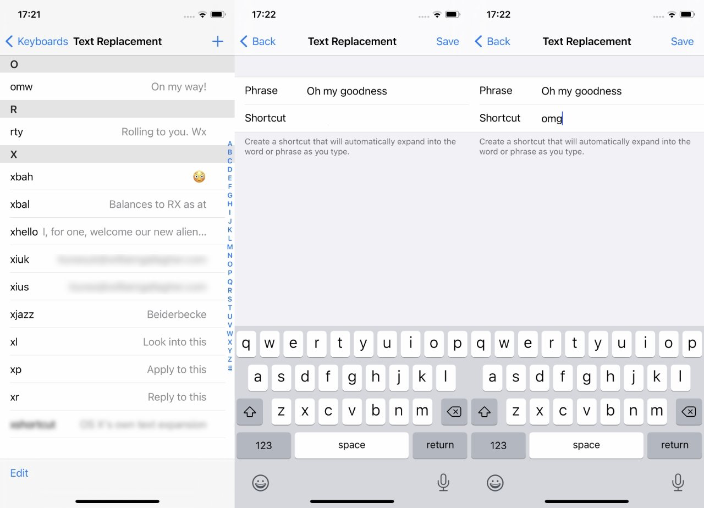

# Text Expansion Software

All modern operating systems these days have some text replacing features built in standard.
This is especially true in mobile OSes like iOS.
Essentially it allows the creation of lists of
[abbreviations][notes-abbreviations] and [shorthands][notes-shorthands] that
the operating system automatically expands to their long form after being typed.

## iOS

On iOS, text expansion can be especially important since
it's hard to type on that touch screen.

[According to Apple Insider][ios-text-expansion-ai]:

>It will speed up your work -
>and it will make certain that you never make a typing mistake again.

Many of the next few sections will be based off that article.

### Turn On the Feature

1. On your iPhone, or iPad, go to Settings
2. Choose General, then Keyboards
3. Tap Text Replacement
4. Tap on an existing line to edit it, or
5. Tap the + plus sign to add a new one

### Choosing the Trigger

The triggers should first of all
include all the most used shorthands during [notetaking](notetaking.md).
This way they get drilled into your mind more quickly.
Then add the triggers using those shorthands like the screenshots below:

There's no limit to the creativity here though.
Since iOS is primarily made for communication as an OS
there's likely [many shorthands][txting-abbrs-ionos] that are useful for communication.
Even ones to convey [complex emotions][list-emoticons-wiki].

<!-- TODO: Add MacOS notes and relate them to how simimlar to iOS they are -->
<!-- TODO: Add Linux methods of doing this -->

## Custom Zettelkasten Software

It's also possible to write custom software that handles this in different ways.
This will mainly focus on how to do this during the
[build/deploy/review phase](zk-deploy.md#the-build-phase) of
[the Zettelkasten Method](zk.md) where
custom [middleware scripts](zk-text-expansion.md) expand shorthand text to
their intended meaning.

## References

* [Notetaking Abbreviations Guide by Adelaide University][notes-abbreviations]
* [How to Write 225 Words Per Minute with a Pen][notes-shorthands]
* [How to Type Faster on iPhone with Built-In Text Expansion][ios-text-expansion-ai]
* [Texting Abbreviations: HTH! (by IONOS)][txting-abbrs-ionos]
* [List of Emoticons (from Wikipedia, the free encyclopedia)][list-emoticons-wiki]

<!-- Hidden Reference Links Below Here -->
[notes-abbreviations]: https://www.adelaide.edu.au/writingcentre/sites/default/files/docs/learningguide-notetakingabbreviations.pdf "Notetaking Abbreviations Guide by Adelaide University"
[notes-shorthands]: https://www.theatlantic.com/technology/archive/2014/06/yeah-i-still-use-shorthand-and-a-smartpen/373281/ "How to Write 225 Words Per Minute with a Pen"
[ios-text-expansion-ai]: https://appleinsider.com/articles/21/03/08/how-to-type-faster-on-iphone-with-built-in-text-expansion "How to Type Faster on iPhone with Built-In Text Expansion"
[txting-abbrs-ionos]: https://www.ionos.com/digitalguide/online-marketing/social-media/texting-abbreviations/ "Texting Abbreviations: HTH! (by IONOS)"
[list-emoticons-wiki]: https://en.wikipedia.org/wiki/List_of_emoticons "List of Emoticons (from Wikipedia, the free encyclopedia)"
