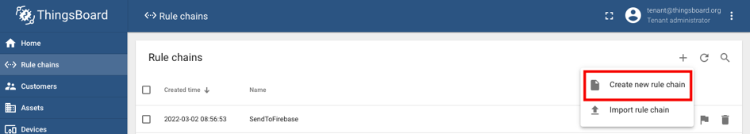
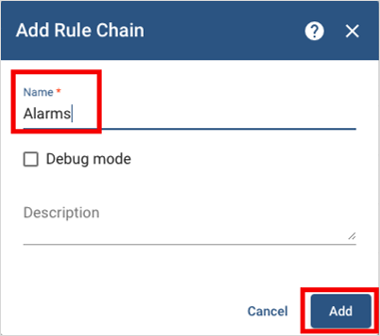
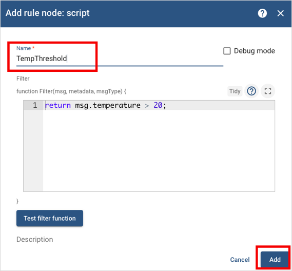
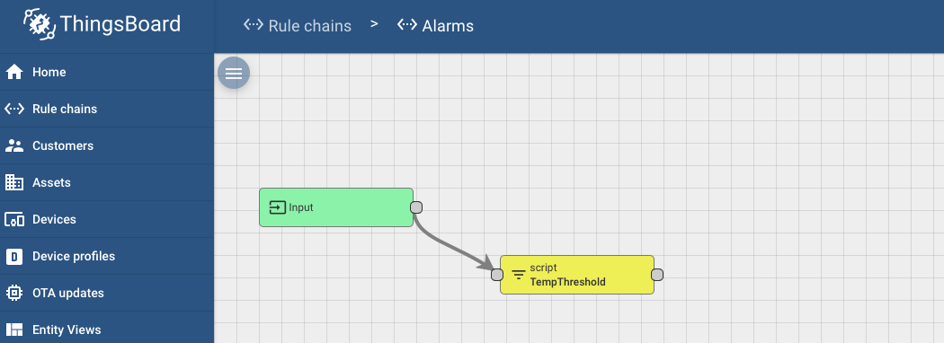
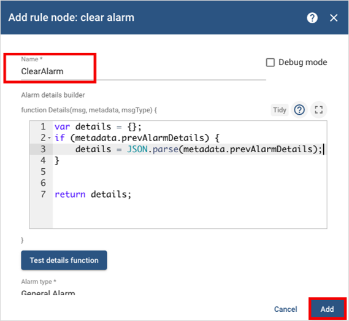
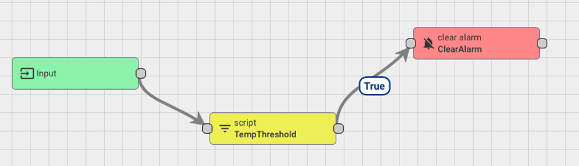
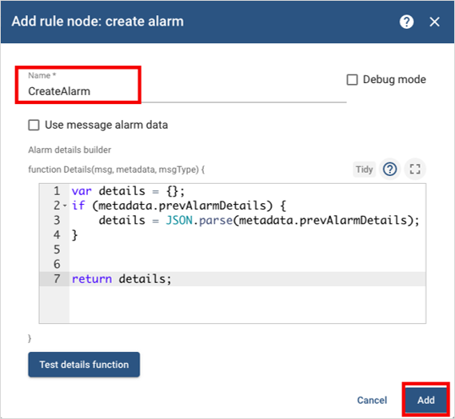
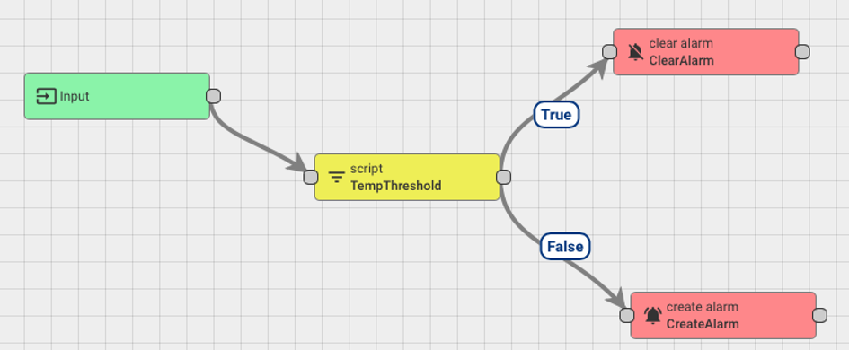

# ThingsBoard (IoT Platform)

## Introduction

>**ThingsBoard** is an [open-source][-foss] [IoT][-iot] platform for
>data collection, processing, visualization, and device management.
>
>--[(ThingsBoard 2023)][-tb-home]

## Capabilities

* Define *devices* and *assets* as well as relationships between them
* "Collect and visualize data from *devices* and
  *assets*". [(ThingsBoard Authors)][tb-docs-overview]
* "Analyze incoming telemetry and trigger *alarms* with complex *event* processing".
  [(ThingsBoard Authors 2023)][tb-docs-overview]

## Components

### Devices

A **device** is an abstract component that records and transmits the telemetry of data.
*Devices* are always contained in *assets*.
The name of a *device* can be chosen arbitrarily because it's only a label.
However, the name should reflect what type of data the *device* will
process (temperature, humidity, precipitation, etc.).

#### Add New Device

To add a new *device*, select `Devices` from the ThingsBoard navigation menu on
the left-hand side of the dashboard, *i.e.* the control panel.
Then, select the plus sign `+` in the top right corner of the control panel and
select `Add new device`.

Next, name the *device* and label it based on the data it will processing.
Then, select `Add` in the bottom right corner to finish adding the *device*.

### Assets

An *asset* is an abstract entity that may be related to other *asset*s or devices.
You can think of an *asset* as a container of devices.
Each device will send data to and from the *asset*.
The name of an *asset* can be chosen arbitrarily because it is only a label.
For example, you can set up a new *asset* titled “Building A” that
may be related to various devices, such as thermometers or other types of sensors.

To add a new *asset*, select “*asset*s” on
the ThingsBoard navigation menu on the left-hand side.
Then, select the plus sign (`+`) in the top-right corner and select `Add new asset`.

Next, name the *asset* and assign the *asset* type to
accurately describe the *asset*.
Then select `Add` on the bottom right corner of the dialog window to
finish adding the *asset*.

## Rule Engine

The "ThingsBoard Rule Engine is a highly customizatble and configurable system for
complex *event* processing" [(ThingsBoard Authors 2022)][tb-docs-rule-engine].
The Rule Engine enables users to filter and
transform incoming messages originated by your *devices* and related *assets*.

The Rule Engine is composed of rule nodes and rule node relations.
Rule nodes process an input message and produce an output.
Rule node relations are used to connect rule nodes.

### Root Rule Chain

A rule chain is a logical group of rule nodes and their relations
[(ThingsBoard Authors 2022)][tb-docs-rule-engine].
The **Root Rule Chain** is responsible for ingesting data,
handling all incoming messages, and forwarding the messages to
other rule chains for additional processing.
For example,
the Root Rule Chain may handle incoming temperatures and forward them to
an alarm rule chain, which is responsible for
sending a notification whenever the temperature gets too high.

## Deploy ThingsBoard

### Containers

One of the most convenient ways to install, configure and run ThingsBoard is with
a [Software Container][-container].
Below is an example using [Docker][-docker] with a [compose file][-cont-comp].

```yaml
version: "2.2"
services:
  thingsboard:
    restart: always
    image: "thingsboard/tb-postgres"
    ports:
      - "8080:9090"
      - "9883:1883"
      - "5683:5683/udp"
    environment:
      TB_QUEUE_TYPE: in-memory
    volumes:
      - ./data:/data
      - ./logs:/var/log/thingsboard
```

To summarize the configuration:

* `restart: always`:
  This specifies that the container should always be restarted if it stops.
* `image: "thingsboard/tb-postgres"`:
  This specifies the Docker image to use for the container.
* `ports`: This specifies the ports to expose on the host machine.
  * `"8080:9090"`:
    This maps port 9090 in the container toport 8080 on the host machine.
  * `"9883:1883"`:
    This maps port 1883 in the container to port 9883 on the host machine.
  * `"5683:5683/udp"`:
    This maps port 5683/udp in the container to port 5683/udp on the host machine.
* `environment`: This specifies environment variables to set in the container.
  * `TB_QUEUE_TYPE`:
    `in-memory`: This sets the `TB_QUEUE_TYPE` environment variable to in-memory.
* `volumes`: This specifies directories to mount as volumes in the container.
  * `./data:/data`:
    This mounts the `./data` directory on the host machine as `/data` in the container.
  * `./logs:/var/log/thingsboard`:
    This mounts the `./logs` directory on
    the host machine as `/var/log/thingsboard` in the container.

Now to spin up the service, simply type this command:

```sh
docker-compose up
```

To login, the default login is `sysadmin@thingsboard.org`,
the default password is `sysadmin`.
For more info on the demo users,
see the [ThingsBoard Documentation on Demo Users][tb-docs-demo].

## Alarms

Imagine an IoT device, such as a thermostat,
that sends temperature data to ThingsBoard.
Ideally, you would like to monitor your data so that
if the temperature gets too high or low, a notification is sent.
To achieve this, ThingsBoard provides the option to
set *alarms* to monitor data and notify users or *clients* when
the data reaches a certain threshold.

### Create Alarms

The easiest way to create an *alarm* in ThingsBoard is by
creating a custom rule chain that is able to trigger or clear *alarms* based on data.
To set up an *alarm* rule chain, navigate to Rule chains on
the left menu of the ThingsBoard home page.
Add a new rule by selecting the plus (`+`) icon in the top-right and
selecting `Create new rule chain`.



Name this rule chain `Alarms`, then select `Add` on the bottom right of
the dialog window opened for adding the Rule Chain.



Open the *Alarms* rule chain.
Add a `script` *node* and name it `TempThreshold`.
Notice this *node* allows to modify or add [Javascript code][-js] to
trigger the *alarm* when data reaches a certain value.
The default value triggers the *alarm* when the temperature is greater than 20.
This value can be modified as needed.
Select `Add` to add the `TempThreshold` *node* to the Rule Engine.



The rule chain will come with an `Input` *node* automatically set up.
Connect the `Input` and the `TempThreshold` *nodes*.
This will allow the *Alarms* rule chain to receive input data from *devices*.



Add a `clear alarm` *node* and name it `ClearAlarm`.
Modify the default Javascript code:

```javascript
var details  = {};
if (metadata.prevAlarmDetails) {
  details = JSON.parse(metadata.prevAlarmDetails);
} return details;
```

Select `Add` to add the `ClearAlarm` *node* to your Rule Engine.



Connect the `TempThreshold` & `ClearAlarm` *nodes* * add `True` as the link label.



Add a `create alarm` *node* and name it `CreateAlarm`.
Modify the default Javascript code:

```javascript
var details = {};
if (metadata.prevAlarmDetails) {
  details = JSON.parse(metadata.prevAlarmDetails);
} return details;
```

Select `Add` to add the `CreateAlarm` node to the rule Engine



Connect the `TempThreshold` and `CreateAlarm` *nodes*,
and add `False` as the link label.



Now the rule chain this has created is ready to be added to the Root Rule Chain.
Crucially it should be done using the typical `Save Timeseries`,
followed by this newly added alarm chain.

## References

### Web Links

* [ThingsBoard Authors. "ThingsBoard". thingsboard.io. June 29 2023][-tb-home]
* [The ThingsBoard Authors. "What is ThingsBoard?" Community Edition: ThingsBoard Documentation. 2022][tb-docs-overview]
* [The ThingsBoard Authors. "Rule Engine Overview". Community Edition: ThingsBoard Documentation. 2022][tb-docs-rule-engine]
* [The ThingsBoard Authors. "Demo Account". Community Edition: ThingsBoard Documentation. 2022][tb-docs-demo]

<!-- Hidden References -->
[-tb-home]: https://thingsboard.io "ThingsBoard Home"
[tb-docs-overview]: https://thingsboard.io/docs/getting-started-guides/what-is-thingsboard/ "What is ThingsBoard?"
[tb-docs-rule-engine]: https://thingsboard.io/docs/user-guide/rule-engine-2-0/overview/ "Rule Engine Overview"
[tb-docs-demo]: https://thingsboard.io/docs/samples/demo-account/ "ThingsBoard Demo Accounts"

### Note Links

* [Free Open-Source Software (FOSS)][-foss]
* [Internet of Things (IoT)][-iot]
* [Container (Software)][-container]
* [Docker (Container Runtime)][-docker]
* [Container Compose File Format][-cont-comp]
* [Javascript][-js]

<!-- Hidden References -->
[-foss]: foss.md "Free Open-Source Software (FOSS)"
[-iot]: iot.md "Internet of Things (IoT)"
[-container]: container.md "Container (Software)"
[-docker]: docker.md "Docker (Container Runtime)"
[-cont-comp]: container-compose.md "Container Compose File Format"
[-js]: javascript.md "Javascript"
