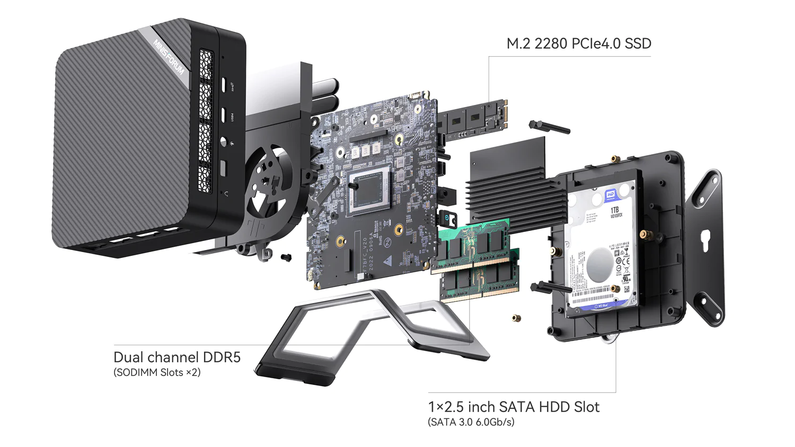
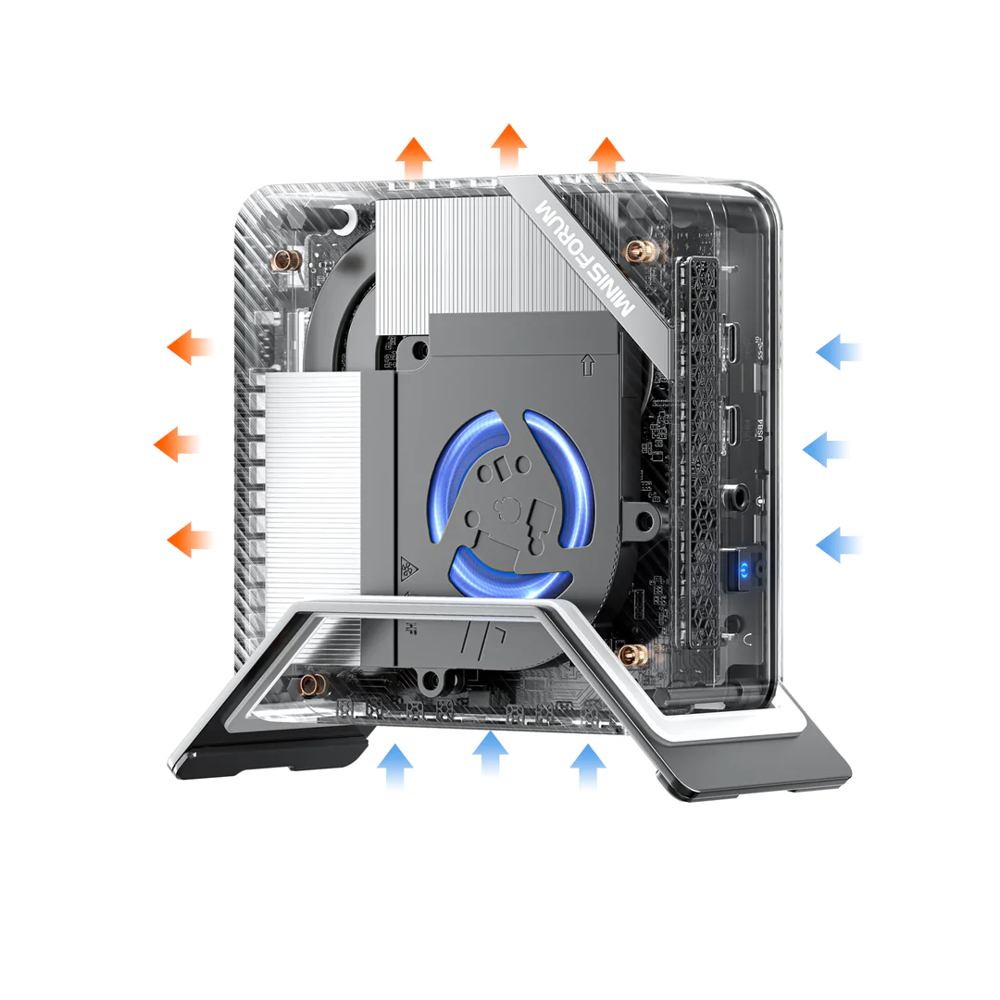
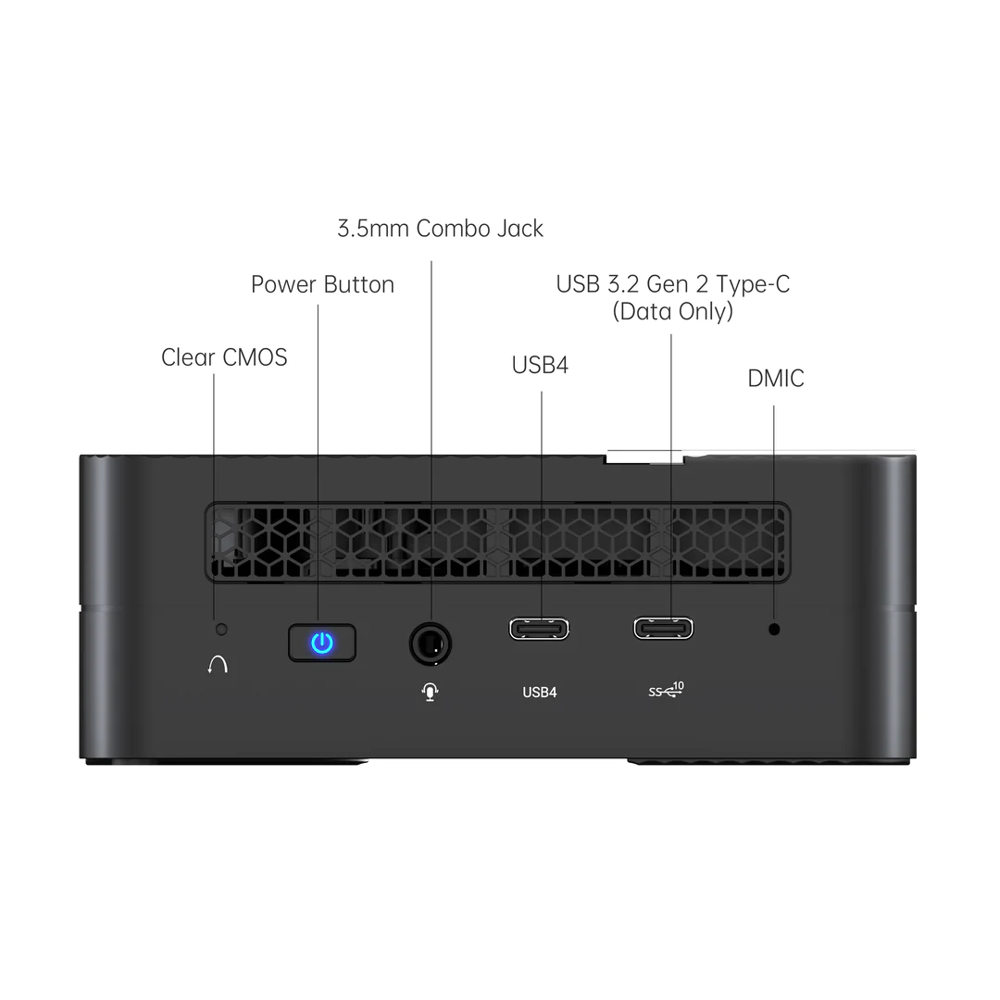
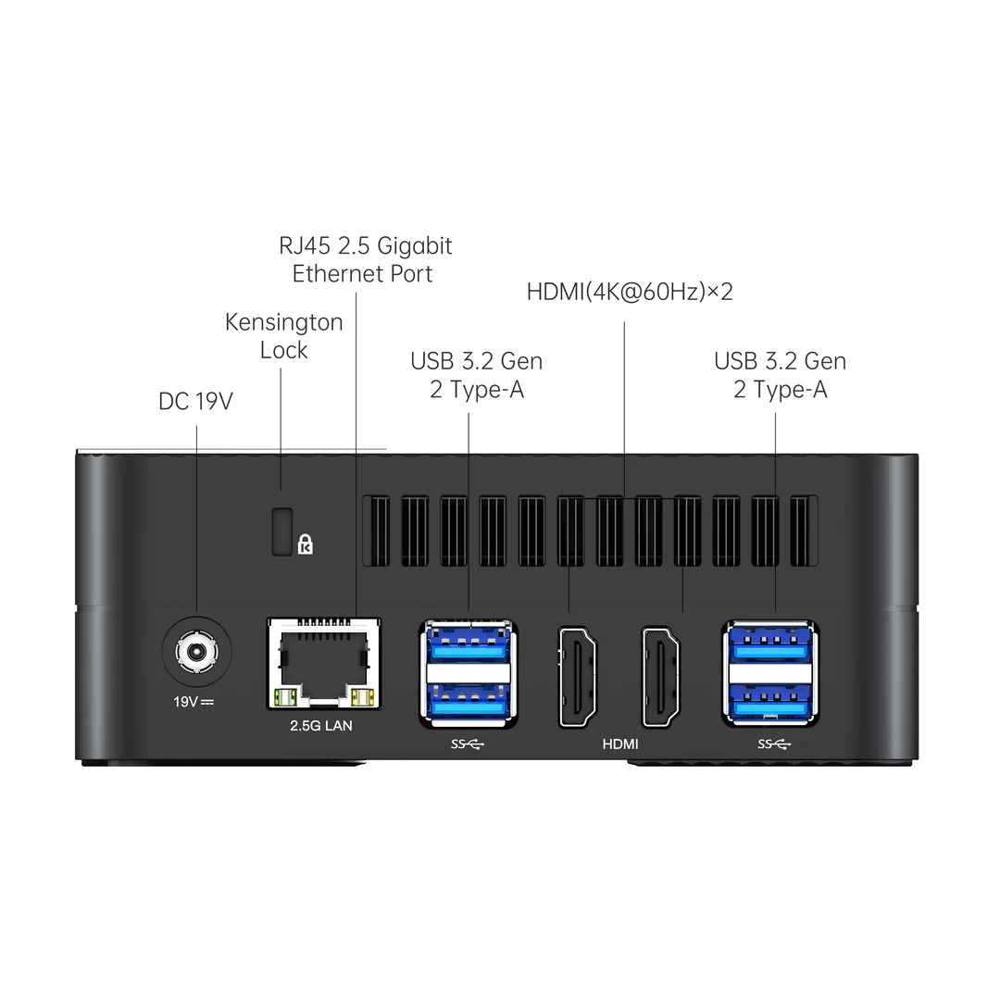

# Minisforum UM690

[[Mini PC Hardware|Mini PC]] based on AMD Ryzen 9 6900HX.

## Hardware

* Ryzen 9 6900HX
  * Rembrandt Zen3+ Turbo up to 4.9GHz
  * Radeon 680M up to 2400MHz
    * Basically any game at 1080p, some at 144fps
  * Dual Channel DDR5 up to 4800MHz in dual SODIMMs
* I/O
  * USB4 - Thunderbolt 4 compatible
  * M.2 2280 PCIe 4.0
  * 2.5gbps ethernet
  * M.2 2230 WiFi Support
  * 2.5" SATA slot
  * 2x 4k60 + 8K60 USB4
  * USB 3.2 Gen2 TypeC x1
  * USB 3.2 Gen2 TypeA x4
* Power, 19V (~125W Max, ~9W Idle)

## Photos

### Internals

### Ports

## Benchmarks of 680m

Taken from [notebookcheck][notebookcheck-680m-benchmarks]

| Game (Preset, Resolution)    | Fps |
| ---------------------------- | --- |
| Elden Ring  (Low, 1080)      | 53  |
| Elden Ring  (Med, 1080)      | 42  |
| Elden Ring  (Hi, 1080)       | 37  |
| Elden Ring  (Ult, 1080       | 32  |
| God of War  (Low, 1080)      | 38  |
| God of War  (Med, 1080)      | 31  |
| God of War  (Hi, 1080)       | 25  |
| God of War  (Ult, 1080)      | 18  |
| Halo Infinite  (Low, 1080)   | 75  |
| Halo Infinite  (Med, 1080)   | 38  |
| Halo Infinite  (Hi, 1080)    | 31  |
| Halo Infinite  (Ult, 1080)   | 29  |
| Forza 5  (Low, 720)          | 148 |
| Forza 5  (Med, 1080)         | 60  |
| Forza 5  (Hi, 1080)          | 53  |
| Forza 5  (Ult, 1080)         | 27  |
| Death Stranding  (Low, 720)  | 89  |
| Death Stranding  (Med, 1080) | 50  |
| Death Stranding  (Hi, 1080)  | 13  |
| Doom Eternal  (Low, 720)     | 293 |
| Doom Eternal  (Med, 1080)    | 161 |
| Doom Eternal  (Hi, 1080)     | 147 |
| Doom Eternal  (Ult, 1080)    | 146 |
| Dota 2 Reborn  (Low, 720)    | 111 |
| Dota 2 Reborn  (Med, 768)    | 93  |
| Dota 2 Reborn  (Hi, 1080)    | 69  |
| Dota 2 Reborn  (Ult, 1080)   | 59  |
| Dota 2 Reborn  (Ult, 2160)   | 10  |

CPU Benchmarks taken from [notebookcheck][notebookcheck-benchmarks-6900hx]
| Benchmark                 | Avg. Score |
| ------------------------- | ---------- |
| Geekbench 5 (Single)      | 1590       |
| Geekbench 5 (Multi)       | 10070      |
| Cinebench R11.5 (Single)  | 2.9        |
| Cinebench R11.5 (Multi)   | 26.4       |
| Cinebench R10 (Single)    | 12294      |
| Cinebench R110 (Multi)    | 77450      |
| 7Zip (Single)             | 5821 MIPS  |
| 7Zip (Multi)              | 63442 MIPS |
| Power Consumption (Bench) | 129 Watt   |
| Power Consumption (Idle)  | 8.4 Watt   |

## References

* [Minisforum Online Store: um690][minisforum-store-um690]
* [NotebookCheck Benchmarks: 680m][notebookcheck-680m-benchmarks]
* [Notebook Check CPU Benchmarks: 6900HX][notebookcheck-benchmarks-6900hx]

<!-- Hidden references -->
[minisforum-store-um690]: https://store.minisforum.com/collections/amd-®-ryzen-®/products/minisforum-um590?variant=43399608729845 "Minisforum Online Store: um690"
[notebookcheck-680m-benchmarks]: https://www.notebookcheck.net/AMD-Radeon-680M-GPU-Benchmarks-and-Specs.589860.0.html "NotebookCheck Benchmarks: 680m"
[notebookcheck-benchmarks-6900hx]: https://www.notebookcheck.net/AMD-Ryzen-9-6900HX-Processor-Benchmarks-and-Specs.589858.0.html "Notebook Check CPU Benchmarks: 6900HX"