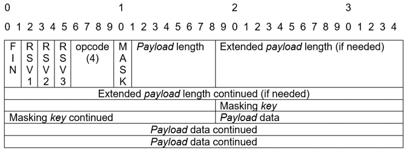

# Web Sockets

## Introduction

A **web socket** is a steady connection between a [client and server][-cl-srv].
Web sockets provide a bidirectional communications channel that
operates over [HTTP][-http] networks through
a single TCP or IP socketed connection. [(Sookocheff 2019)][sook19]
According to [Wikipedia][wiki-ws]:

>**WebSocket** is a computer communications protocol,
>providing full-duplex communication channels over a single [TCP][-tcp] connection.
>The WebSocket protocol was standardized by the IETF [RFC 6455][rfc6455].
>The current API specification allowing web applications to
>use this protocol is known as *WebSockets*.
>It is a living standard maintaining by the WHATWG and a successor to
>the WebSockets API from W3C.

## Why Web Sockets?

Web sockets were created in response to the limitations of HTTP-based technology.
"With HTTP, a *client requests* a resource,
and the *server* responds with the requested data.
HTTP is a strictly unidirectional protocol -
any data sent from the *server* to the *client* must first be requested by
the *client*" [(Sookocheff 2019)][sook19].
The unilateral communication of HTTP limits the functionality of this method.

However, a workaround for this limitation does exist.
Long polling allows a *client* to make an HTTP *request* with
a long timeout period so that the *client* connection can be held to
allow the server more time to push data to the *client* [(Sookocheff 2019)][sook19].
The data is pushed to the client as soon as it becomes available,
enabling real-time communications.
Long polling is effective,
but works most efficiently when communications from the server are infrequent.
A downside of long polling is that "resources on
the server are tied up throughout the length of the long poll,
even when no data is available to send" [(Sookocheff 2019)][sook19].

## How Do Web Sockets Work?

Web sockets allow developers to build real-time applications by
avoiding these long polling issues that exist in the HTTP request-response handshake.
Web sockets do use HTTP as a communication method.
However, instead of being a one-sided, one-time connection,
web sockets keep the TCP connection open after
the initial HTTP response is initiated by the *client* and received by
the *server* [(Sookocheff 2019)][sook19].
This allows the web socket connection between *client* and *server* to
remain open as a communication portal.
Data and communications continue through the web socket until
both parties decide that the connection should be closed [(Sookocheff 2019)][sook19].
Within the transmission control protocol (TCP),
data is exchanged in *packets* which are small *chunks* of data delivered between
the *server* and *client*.

There are some important points to understand about web socket connections.
Because web sockets do not follow HTTP protocols,
they follow the `ws://` or `wss://` protocol schema instead of
`http://` or `https://`.
The rest of the web socket URL is structured the same as an HTTP URL and
contains a "host, port, path, and any query parameters" [(Sookocheff 2019)][sook19].
For example,
a web socket URL may look something like these examples:

```text
"ws:" "//" host [ ":" port ] path [ "?" query ]
"wss:" "//" host [ ":" port ] path [ "?" query ]
```

This extension is the standard web socket communication design to
establish steady connection between the *client* and *server*.
Additionally, web sockets allow for connections between *clients* and *servers* to
be made between URLs that have the same extension or schema.

## Web Socket Protocol

Web socket protocol communicates using frames,
which include any information that is needed as well as the message that
you intend to send.
If a dataframe is too large, it is divided into smaller chunks to allow it to
be communicated over a web socket connection.
The data communication always includes a frame type, a payload length,
and a data portion [(Sookocheff 2019)][sook19].

Frames include different pieces of information and
"in its most basic form the web socket protocol has three non-control frames and
three control frames" [(Jameson 2017)][jameson17].
Non-control frames explain whether the information being communicated includes
raw bytes, encoded bytes,
or is a continuation of a message sent previously [(Jameson 2017)][jameson17].
Control frames can indicate whether a client or server wants to
close the connection or is responding to a close request from the other party.
Control frames can also consist of ping and pongs,
which are operation codes that you will learn about below.

The image below shows an example of the web socket framing protocol:



Every frame has an operation code that determines how to interpret and
use the requested frame's *payload* data.
Listed below are some opcode values and descriptions which enable you to
interpret what operations are being sent between
the *client* and the *server* through
web socket connections [(Fette & Melnikov 2011)][rfc6455].

### Operation Codes

* `0x0` - Continuation frame.
* `0x1` - Text frame, decoded by server.
* `0x2` - Binary frame, delivered to client without being edited by server.
* `0x3-7` - Reserved for further non-control frames.
* `0x8` - Close frame.
* `0x9` - Ping frame or heartbeat mechanism to check if connection is alive.
* `0xA` - Pong frame or heartbeat mechanism to check if connection is alive.
* `0xB-F` - Reserved for further control frames.

## Closing Web Socket Connections

Closing a web socket connection always initiates with a message from
the *client* or the *server* in which the frame contains a close operation code,
opcode `0x08`, and a description in the body of the message that
explains the reason for closing the connection.
Once the close communication is established and acknowledged between both parties,
then the web socket connection can be stopped and closed.

Now you have an understanding of web sockets and
how they differ from HTTP protocol.

## References

### Web Links

* [Wikipedia. "WebSocket". 20203-06-18][wiki-ws]
* [Fette, Ian, and Alexey Melnikov. "The WebSSocket Protocol". RFC 6455 2011-12][rfc6455]
* [Jameson, Mark. "A Brief Overview of the Web Socket Protocol." 2017][jameson17]
* [Sookocheff, Kevin. "How Do Web Sockets Work?" Kevin Sookocheff. 2019-04-04][sook19]

<!-- Hidden References -->
[rfc6455]: https://datatracker.ietf.org/doc/html/rfc6455 "RFC6455"
[wiki-ws]: https://en.wikipedia.org/wiki/WebSocket "Wikipedia. WebSocket"
[jameson17]: https://noio-ws.readthedocs.io/en/latest/overview_of_websockets.html "Jameson, Mark. A Brief Overview of the Web Socket Protocol"
[sook19]: https://sookocheff.com/post/networking/how-do-websockets-work/ "Sookocheff, Kevin. How Do Web Sockets Work?"

### Note Links

* [Client Server Architecture][-cl-srv]
* [Transmission Control Protocol (TCP)][-tcp]
* [Internet Protocol (IP)][-ip]
* [HyperText Transfer Protocol (HTTP)][-http]

<!-- Hidden References -->
[-cl-srv]: client-server.md "Client Server Architecture"
[-tcp]: transmission-control-protocol.md "Transmission Control Protocol (TCP)"
[-ip]: internet-protocol.md "Internet Protocol (IP)"
[-http]: http.md "HyperText Transfer Protocol (HTTP)"
